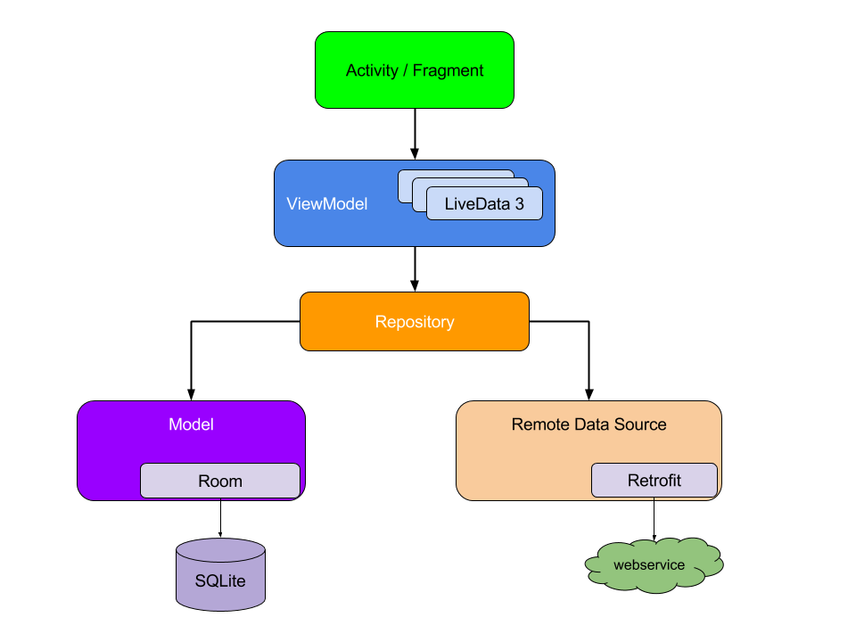

# Архитектура 2.0

В этой статье описана архитектура, на которой построены Android приложения "Лукойл", "Убрир", "Бспб", "ВТБ", "Криптонатор".

## ViewController

Один `ViewController` - один экран.

`ViewController` - обертка над Fragment. Каждый `ViewController` находится внутри `ViewControllerFragment`. `ViewController` создается в `onCreateView` и умирает в `onDestroyView` класса `ViewControllerFragment`. Данная конструкция гарантирует наличие non-null доступа к activity, к view и к fragmentManager. Конструктор `ViewController` используется для инициализации всех View-компонентов, что позволяет держать val ссылки на вьюхи.

У `ViewController` есть State - класс, который хранит данные, необходимые для инициализации экрана. Для сохранения данных используется `onSaveInstanceState` класса `ViewControllerFragment`.

`ViewController` и все дополнительные классы находятся в модуле Roboswag [navigation](https://github.com/TouchInstinct/RoboSwag/tree/master/navigation).

## BaseFragment или Архитектура 2.1.

Мы постепенно отказываемся от `ViewController`. 

Что делает `BaseFragment`? Сохранение State, прямой доступ к view и activity, инициализация Butterknife (позже перейдем на View Binding), упрощенный доступ к ресурсам через Compat.

`BaseFragment` и все дополнительные классы находятся в модуле Roboswag [navigation-new](https://github.com/TouchInstinct/RoboSwag/tree/master/navigation-new).

## Навигация

Текущая архитектура придерживается принципа [`SingleActivity`](https://habr.com/ru/company/redmadrobot/blog/426617/). Activity хранит ссылку на компонент навигации, с помощью которого происходит переходы на другие экраны.

За компонент навигации отвечает класс `FragmentNavigation`. Этот класс является оберткой над `FragmentManager`. Класс занимается созданием и проведением `FragmentTransactions`. Основные методы класса: setInitial, push, setAsTop и pushForResult. Описание методов можно прочитать [здесь](https://github.com/TouchInstinct/RoboSwag/blob/master/navigation-new/src/main/java/ru/touchin/roboswag/components/navigation_new/FragmentNavigation.kt#L35).

`ViewControllerNavigation` - расширяет `FragmentNavigation` для роутинга `ViewController`'ов.

## Model-View-ViewModel

За основу архитектуры взят рекомендованный [подход](https://developer.android.com/jetpack/docs/guide) от Google. 



У приложения 3 основных слоя:

### View

Слой, который отвечает за отображение данных. За этот слой отвечает сущность `ViewController` или `BaseFragment`. View - пассивная или тупая сущность. Во View слое не должно быть никакой логики. Все необходимые преобразования данных производятся на слоях выше. У View слоя должны быть свои модели.

Модели для View-слоя должны находится в отдельных файлах и в package экрана. Модели для View-слоя могут быть data-классом или sealed-классом.

### Model

Слой работы с данными. За слой отвечает сущность `Repository`. Репозиторий имеет ссылки на объекты DataSource: `Retrofit`-классы для связью с сетью, `SharedPreferences` для сохранения простых данных в постоянную память, `Dao`-классы для сохранения данных в БД и другие. Repository занимается преобразованием данных из разных DataSource, используя средства RxJava2.

### ViewModel

Прослойка между View и Model. Слой, который отвечает за presentaion-логику. `ViewModel` разжевывает данные из Model слоя для тупого View слоя. Мы используем [реализацию](https://developer.android.com/topic/libraries/architecture/viewmodel) `ViewModel` от Google. 

`ViewModel` держит в себе объекты [`LiveData`](https://developer.android.com/topic/libraries/architecture/livedata). `LiveData` реализует паттерн Observer. View слой подписывается на изменения данных. Подписка умирает в `onDestroyView`.

`ViewModel` преобразует Rx-сущности в `LiveData`. Для этого есть 3 способа:

1. **subscribe**. Традиционный метод из RxJava. В аргументах передается колбэки `onNext`, `onComplete`, `onSuccess`, `onError`. Возвращает disposable, который надо остановить в `onCleared`.
2. **untilDestroy**. Вызывает subscribe, указывает потоки — в `subscribeOn` проставляется `Schedulers.io`, в `observeOn` проставляется `AndroidSchedulers.mainThread` и сохраняет все Disposable. Список очищается в `onCleared`.
3. **dispatchTo**. Обертка над `untilDestroy`. Преобразует Rx-сущность в класс Event и прокидывает в `LiveData`, которая передется в аргументах данного метода.

Методы находятся в модуле Roboswag [lifecycle-rx](https://github.com/TouchInstinct/RoboSwag/tree/master/lifecycle-rx). 

Все `MutableLiveData` во `ViewModel` должны быть инкапсулированы по интерфейсу 'LiveData' для View-слоя. Пример реализации:
``` kotlin
private val _orders = MutableLiveData()
val orders : LiveData = _ordersLiveData
```

### UseCase (optional)

Слой, отвечающий за бизнес-логику. Находится между ViewModel и Repository. UseCase должен содержать только один публичный метод. Берет на себя всю бизнес-логику из ViewModel и Repository. Помогает увеличить переиспользуемость кода без использования наследования. Больше информации о UseCase можно прочитать [здесь](https://proandroiddev.com/why-you-need-use-cases-interactors-142e8a6fe576).

## Данные экрана

Данные, необходимые для работы экрана, можно поделить на три типа:

|Тип данных|Описание|Примеры данных|Где должны храниться|
|---|---|---|---|
| Init данные | Данные, необходимые для инициализации экрана. Данные из предыдущих экранов. | Экран деталей заказа. Для инициализации экрана необходим id заказа | State of ViewController |
| View State | Данные, введенные пользователем | Текст в EditText, выбранные флажки и свитчеры | У каждой View есть onSaveInstanceState() и onRestoreInstanceState() |
| Данные из data слоя | Данные из сети, БД, SharedPref, кэша | Список заказов на экране заказов | В Repository. В RxSubject/RxRelay |

**ВАЖНО**: State of ViewController должен хранить только init данные. И ничего больше!

## DI и Dagger 2

Для DI используется фреймворк [Dagger2](https://developer.android.com/training/dependency-injection/dagger-basics). В приложении чаще всего используется одна компонента, которая инициализируется в Application классе и живет в течение всего приложения. В этой компоненте хранятся все необходимые объекты, которые нужны для работы приложения: репозитории, `SharedPreferences`, DataSources.

Отдельного упоминания стоит работа с `ViewModel` через DI. В данной архитектуре для доставки `ViewModel` используется метод-обертка над традиционным `ViewModelProviders.of`. Метод называется `LifecycleViewModelProviders.of`. Он выполняет две функции:

- доставляет `ViewModel` в `Activity`, `Fragment` и `ViewController`
- [дружит](https://proandroiddev.com/viewmodel-with-dagger2-architecture-components-2e06f06c9455) `ViewModel` и Dagger для подставления зависимостей в конструктор `ViewModel` из Dagger

`LifecycleViewModelProviders` и другие описанные здесь классы находятся в модуле Roboswag [lifecycle](https://github.com/TouchInstinct/RoboSwag/tree/master/lifecycle).

## Feature-oriented packaging

На проектах при разбиении файлов по папкам должен использоваться подход [`Package by feature`](https://proandroiddev.com/package-by-type-by-layer-by-feature-vs-package-by-layered-feature-e59921a4dffa). Пример разбиения:
```
 |- di
 |- view
 |- utils
 |- extensions
 |- network
 |- db
 |- smth_base
 |- smth_core
 |- features
 \
  |- feature1
  |- feature2
  \
   |- usecases
   |- repositories
   |- models
   |- screen1
   |- screen2
   \
     |- viewcontroller
     |- viewmodel
     |- state
     |- viewholder
     |- adapter
```
