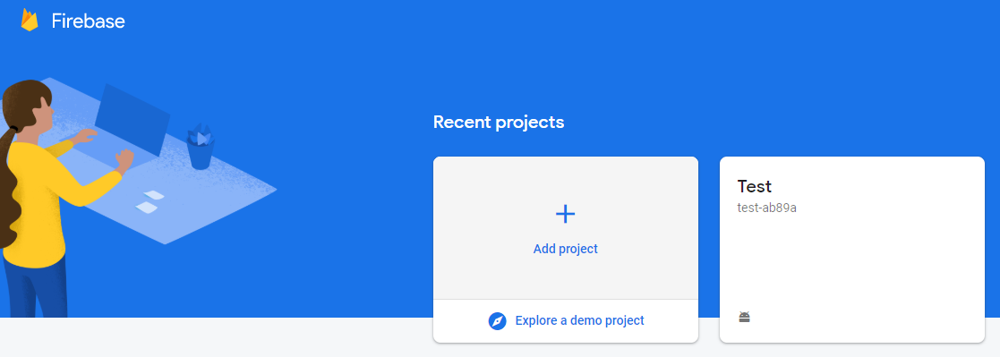
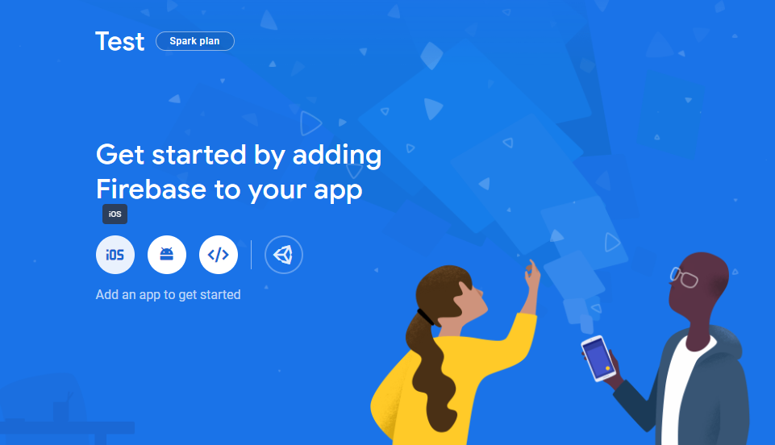
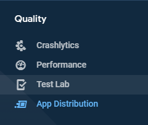
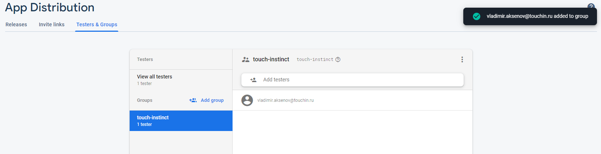
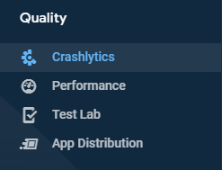

# Создание проекта на Koltin

1. Склонируй пустой репозиторий, который создаст Сева в Github.

2. Настройка проекта

    * Скачать шаблонный проект [шаблонный проект](https://github.com/TouchInstinct/android-project-template) архивом, разархивировать и скопировать содержимое в вашего проекта

    * Для подключения common сабмодуля в файле ".gitmodules" заменяем в первых трёх строках "Template" на название вашего проекта, к примеру “git@github.com:TouchInstinct/VTBAccounting-common.git” 
    
3. Адаптируем шаблон под свой проект

    *  В файле “app/build.gradle”:

    * Заменить (Ctrl/Cmd + R) applicationId с “ru.touchin.template” на тот, что вам назовёт менеджер, иначе на “ru.touchin.%project_name%”.

    * Обновить minSdkVersion, если отличается от 21

    * Заменить (Ctrl/Cmd + R) название common-модуля с “Template-common” на подключенный в предыдущем пункте

    * Заменить “API_URL“ для флейворов.

    *  Заменить TemplateApplication на %project_name%Application
    
4.  Добавляем Signing Keys проекта:

    * если проект уже выложен в маркет, просим у заказчика;
    
    * если проект в маркете будет лежать под другим package-name, то генерируем ключи http://developer.android.com/intl/ru/tools/publishing/app-signing.html#studio
    
    * кладем сгенерированный ключ в папку `project/app/keystore/`;
    
    * добавляем код в файл `build.gradle` **модуля**, где `YOUR_KEY_NAME` - имя созданного или полученного ключика, а поля `***` - соответствующие данные из ключика:

        ```groovy
        android {
            ...
            signingConfigs {
                releaseConfig {
                    storeFile file("keystore/YOUR_KEY_NAME.jks")
                    storePassword "***"
                    keyAlias "***"
                    keyPassword "***"
                }
            }
        }
        ```
       
## Подключение Firebase   

1. Заходим через it.touchin@gmail.com в https://console.firebase.google.com/. 

2. Создаем проект в firebase консоли с дефолтными настройками Google Analytics (Они сами предлагаются в процессе создания проекта).

  

3. Добавляем Android-приложение через `Add Firebase to your Android app` и выполняем инструкции. В итоге в корне app модуля должен лежать файл google-services.json

   
   
4. Переходим в раздел app distribution в боковой панели. Выбираем вкладку Testers and Groups. Создаем группу touch-instinct. Добавляем почты touchin.test@gmail.com и qa@touchin.ru

  
  

5. Для работы крашлитики, необходимо перейти в раздел crashlytics в боковой панели в firebase и выполнить инструкции.
Чтобы проверить работоспособность, надо:

   -Собрать релиз сборку с крашем 
   
   -Открыть приложение 
   
   -Дойти до краша
   
   -Еще раз открыть приложение, чтобы ошибка отправилась на сервер
   
   -Проверить ее наличие в firebase консоли

   

6. Чтобы убедиться, что app distribution работает, надо попросить ответственного за CI обновить firebase token и собрать сборку с UPLOAD_TO_FABRIC. Если все правильно, то в консоли firebase появится сборка, а тестерам из группы `touch-instinct` придут письма на указанные почты. Если на CI сборка упала на попытке отправить сборку в firebase, то проблема на стороне сервера т.к в приложении для app distribution ничего делать не нужно. Если вышла ошибка 403, то нужно обновить токен.
