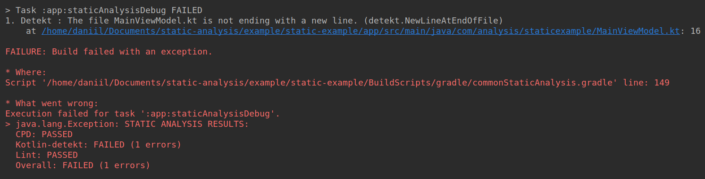
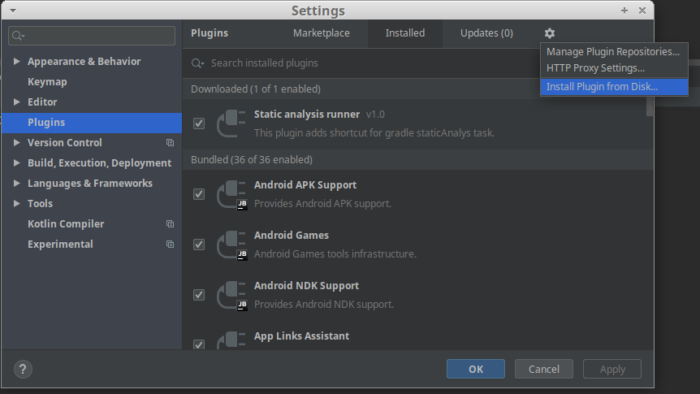

# Static Analysis

## Статический анализ

Статический анализатор кода позволяет проверять код программы до её выполнения. Код проверяется не только на ошибки, но и на соответствие [код стайлу](https://github.com/RedMadRobot/kotlin-style-guide).

StaticAnalysis - это gradle-задача, которая запускает несколько инструментов для анализа кода, а именно:

| Анализатор | Описание | Правила |
| :-------------------------------------------------------------- | :--------------------------------------------- | :--------------------------------------------------- |
| [Android Lint](http://www.androiddocs.com/tools/help/lint.html) | Cтатический анализатор с правилами для Android проектов | [Правила](http://tools.android.com/tips/lint-checks) |
| [Detekt](https://github.com/arturbosch/detekt) | Cтатический анализатор для Kotlin кода | [Правила (В разделе Rule Sets)](https://arturbosch.github.io/detekt/index.html) |
| [CPD](https://github.com/aaschmid/gradle-cpd-plugin) | PMD’s Copy/Paste Detector, инструмент для поиска копипасты в коде | [Правила (В разделе Rule Reference)](https://pmd.github.io/latest/pmd_userdocs_cpd.html) |

Во время сборки на CI запускается статический анализ. Если код его не проходит, сборка падает. Поэтому надо не забывать проверять свой код анализатором на своем компьютере перед созданием мердж реквеста.

## Пример отчета staticAnalysis

Если какой-то из анализаторов выявил ошибки, то в логе появится сообщение такого вида:



Тут можем видеть, что в MainViewModel забыли добавить новую строку в конец файла, по ссылке можно сразу попасть в нужное место в коде.
Также каждый анализатор сохраняет подробный отчёт по пути, указанному в конфигах. По умолчанию $projectDir/app/build/reports/

## Подключение staticAnalysis в проект с нуля

1. Добавить сабмодуль buildscripts, который содержит gradle задачу и конфиги анализатора

    ```git submodule add https://github.com/TouchInstinct/BuildScripts BuildScripts```

1. Новые версии гита делают это автоматически, но если директория BuildScripts оказалась пустая, нужно выполнить команду

    ```git submodule update --init --recursive```

1. Чтобы подключить статический анализатор в проект, в build.gradle файле основного модуля нужно добавить следующую строку:

    ```apply from: "$buildScriptsDir/gradle/staticAnalysis.gradle"```

1. Для его работы надо определить переменную в блок buildscript. Следует использовать то имя директории, которое было использовано на первом шаге.

    ```ext.buildScriptsDir = "$rootProject.projectDir/BuildScripts"```

1. Также нужно подключить плагины cpd и detekt в build.gradle файле проекта:

        plugins {
            id "de.aaschmid.cpd" version "3.1"
            id "io.gitlab.arturbosch.detekt" version "1.1.1"
        }

## Установка плагина в Android Studio

1. Склонировать проект StAnalysisKotlin с [репозитория](https://github.com/TouchInstinct/StAnalysisKotlin)
1. В Android Studio выбрать File -> Settings (ctrl/cmd+alt+s)
1. В настройках выбрать пункт Plugins
1. Кликнуть на иконку шестеренки в правом-верхнем углу, выбрать там Install Plugin from Disk



1. В появившемся диалоге выбрать путь к файлу StAnalysisKotlin.jar, который лежит в корне проекта
1. Перезапустить Android Studio

## Использование плагина

После успешного подключения плагина, на панели появится замечательный логотип тача


По нажатию на эту иконку запускается gradle задача статического анализа. Если возникла какая-то проблема, может показать такую ошибку:


В этом случае надо попробовать запустить задачу вручную, либо из консоли с помощью команды такого вида:

```./gradlew staticAnalysis```

либо через интерфейс gradle:


В появившемся окне можно воспользоваться поиском для того, чтобы определить название нужной задачи


