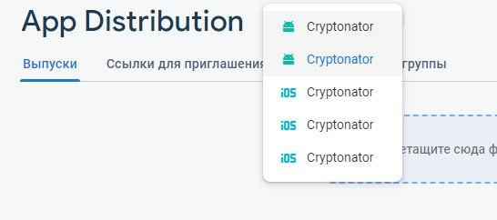

# Миграция с Fabric в Firebase

Т.к с марта 2020 года Fabric перестает работать, мы переходим на Firebase. Firebase мы теперь используем как для крашлитики, так и для App Distribution (Сборка на CI + отправка тестировщикам нового билда).

## Аккаунты и проекты
Для начала нужно правильно настроить аккаунты и проекты Firebase. 

**Что такое проекты?** На одном аккаунте может быть несколько проектов. Один проект для одного приложения.

Определите, есть ли в приложении другие firebase сервисы (пуши, аналитика, auth, ml kit). **Как проверить?** Через наличие файла google-services.json или gradle-зависимостей firebase'а.

### Что делать, если есть другие firebase сервисы?

Попросить менеджеров, чтобы заказчик дал права на управление проектом, на котором лежат используемые сервисы, аккаунту it.touchin@gmail.com.

### Что делать, если нет других firebase сервисов?

Проект для вашего приложения уже создан на аккаунте it.touchin@gmail.com. Дополнительно ничего делать не надо. 

## В начале

1. Перейти в https://console.firebase.google.com через аккаунт it.touchin@gmail.com/ JceBnH48ogboGJ
2. Найти свой проект
3. Скачать в firebase JSON файл конфигурации (Настройки проекта(шестеренка)-> Ваши проекты) и положить его в корень app модуля. Если файл там уже есть, то заменить содержимое 

4. Обновить или добавить в проект `classpath 'com.google.gms:google-services:4.3.3'`
5. В build.gradle app модуля добавить строчки
```
apply plugin: 'com.google.gms.google-services'
```

## Настройка Crashlytics

1. Добавьте в проект зависимость firebase-analytics
2. Обновите версию плагина io.fabric до актуальной в проектном build.gradle
3. Обновите версию библиотеки 'com.crashlytics.sdk.android:crashlytics:2.10.1' до актуальной

Чтобы проверить работоспособность, надо собирать релиз сборку с крашем.
1. Открыть приложение. Дойти до краша. В качестве краша используйте `Crashlytics.getInstance().crash()`
2. Еще раз открыть приложение, чтобы ошибка отправилась на сервер
3. Найти свой проект в firebase
4. Открыть раздел Crashlytics (Если видим приветственный экран надо нажать начать)
5. Убедиться что краш тут (будьте внимательны с выбранным приложением. Его надо выбрать в выпадающем списке)



## Настройка App Distribution

AppDistribution почти уже настроен на ci. На ci используется firebase cli для отправки билдов в firebase. На стороне клиента нужно удалить все, что связано с fabric app distribution, настроить проект в firebase console и попросить Сашу Бунтакова внедрить изменения на ci.


2. Удалить 
```
ext.betaDistributionGroupAliases = "touch-instinct"
ext.betaDistributionReleaseNotesFilePath = file("release-notes.txt")
```
3. Создать группу тестировщиков в firebase с именем `touch-instinct` в разделе app distribution
4. Написать Саше Бунтакову, чтобы он поменял Fabric на Firebase на N-ном проекте.
5. Как только он это сделал. Попробовать собрать релизную сборку на билд сервере с галочкой upload_to_fabric. В firebase в разделе app distribution будет виден билд. Если в группе есть тестировщики, то на указанные мейлы придут письма с билдом.

## Проверка других firebase сервисов

**ВАЖНО:** если у вас до этого уже были firebase сервисы на проекте, то проверьте, что они не сломались. Пуши, аналитика итд.
