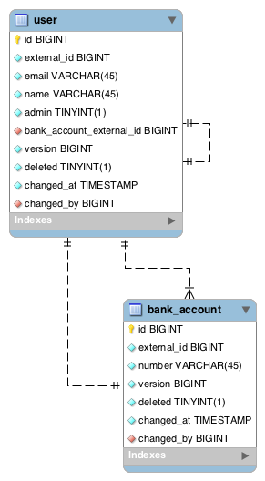
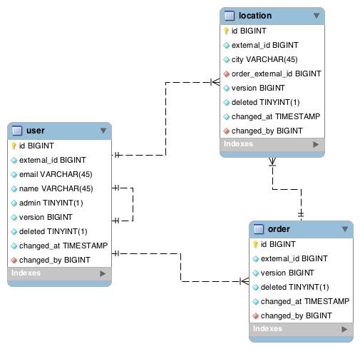
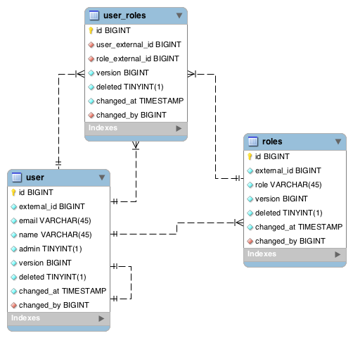

# Версионирование сущностей в БД
## Структура документа

* [Введение](#Введение)
     * [Структура версионируемой сущности](#Структура-версионируемой-сущности)
        * [Обязательные поля](#Обязательные-поля)
        * [Необязательные поля](#Необязательные-поля)
     * [Хранение изменений](#Хранение-изменений)
     * [Связи между сущностями](#Связи-между-сущностями)
        * [Правила связи сущностей:](#Правила-связи-сущностей)
        * [Связь один-к-одному](#Связь-один-к-одному)
        * [Связь один-ко-многим](#Связь-один-ко-многим)
        * [Связь многие-ко-многим](#Связь-многие-ко-многим)
     * [Операции CRUD](#Операции-crud)
        * [Создание сущности](#Создание-сущности)
        * [Изменение сущности](#Изменение-сущности)
        * [Удаление сущности](#Удаление-сущности)
        * [Получение актуальной сущности](#Получение-актуальной-сущности)
     * [История изменений](#История-изменений)
     * [Откат изменений](#Откат-изменений)

### Введение
Версионирование БД преследует 3 основные цели:

- Логирование всех изменений, сделанных пользователями
- Предотвращение физического удаления объектов из БД
- Возможность откатить изменения объектов к предыдущему состоянию


Данный документ содержит описание структуры БД, сущностей подлежащих версионированию и алгоритмы для работы с такими сущностями.

### Структура версионируемой сущности

#### Обязательные поля
В любой сущности, которая будет версионироваться, должен присутвовать следующий набор полей:

|Поле|Описание|
|:-:|---|
|id|Уникальный идентификатор для записи в таблице. Является первичным ключём.|
|version|Уникальная версия для версионируемой сущности.|
|changed_at|Отметка времени (timestamp) внесения изменений.|
|deleted|Флаг, показывающий был ли объект удалён.|

#### Необязательные поля
Если в БД присуствую сущности, которые будут ссылаться на текущую, то к ней необходимо добавить следующие поля:

- `external_id` - идентификатор самой сущности. Идентификатор не является уникальным и будет использоваться до момента логического удаления сущности.

В дополнение к этому, в таблице может присутствовать поле `changed_by_external_id` для привязки пользователей к изменениям:

- `changed_by_external_id` - идентификатор пользователя, внесшего изменения.


### Хранение изменений
Вся история изменений вносящихся в сущность хранится в той же таблице, что и сама сущность.

История изменений представляет собой состояния записи на определённые моменты времени.

Каждое состояние имеет свою уникальную версию (поле `version`).

### Связи между сущностями
Версионирование никак не влияет на кардинальность связей между сущностями, однако вносит свои особенности в правила создания внешних ключей.

#### Правила связи сущностей:
- В сущности, поддерживающей версионирование, должно быть поле с именем `external_id`. Это поле не должно быть первичным ключём и на нём не должно быть ограничений на уникальность.
- Сущность, ссылающаяся на другую сущность, дожна ссылаться на поле `external_id`, а не на первичный ключ этой таблицы.


#### Связь один-к-одному
В приведённой ниже схеме БД есть две таблицы: `user` (пользователь), `bank_account` (банковский счёт).

Пользователь связан со своим банковским счётом связью один-к-одному. Внешний ключ ссылается на поле `external_id` в таблице `bank_account`. Таким образом пользователь ссылается не на конкретное состояние своего банковского счёта, а только на его внешний идентификатор.



#### Связь один-ко-многим
Связь один-ко-многим мало чем отличается от связи один-к-одному. В приведённом ниже примере у заказа (`order`) есть несколько объектов (`location`). Внешний ключ для сущности `location` ссылается на поле `external_id` у объекта `order`.



#### Связь многие-ко-многим
Для связи многие-ко-многим вводится дополнительная таблица, которая тоже является [версионируемой сущностью](#Структура-версионируемой-сущности). 

В приведённом ниже примере у пользователя (`user`) есть роли (`roles`). У одного пользователя может быть много ролей. И одна роль может принадлежать многим пользователям.



Пользователю можно добавить новую роль или снять с него роль. В таблице пользовательских ролей (`user_roles`) сохранятся все изменения, которые были применены к ролевой модели пользователя.


### Операции CRUD

#### Создание сущности
Пример на псевдокоде:

```
Новая запись:
    increment id
    increment external_id
    version = 1
    deleted = false
    changed_at = CURRENT_TIMESTAMP
    changed_by_external_id = user_id
```

#### Изменение сущности
Пример на псевдокоде:

```
Новая запись:
    increment id
    external_id = previous_external_id()
    version = previous_version() + 1
    deleted = false
    changed_at = CURRENT_TIMESTAMP
    changed_by_external_id = user_id
```

#### Удаление сущности
Пример на псевдокоде:

```
Новая запись:
    increment id
    external_id = previous_external_id()
    version = previous_version() + 1
    deleted = true
    changed_at = CURRENT_TIMESTAMP
    changed_by_external_id = user_id
```

#### Получение актуальной сущности
Для получения последней актуальной версии сущности нужно:

- сгруппировать записи по полю `external_id` выбрав максимальную версию  (поле `version`)
- по полученной версии можно получить последнюю актуальную запись и информацию статусе записи (удалена или нет).


### История изменений
Для получения полной истории изменений для какой-либо сущности необходимо получить все изменения для самой сущности и для всех сущностей, на которые она ссылается. Эту операцию нужно повторить рекурсивно.

В примере [связи один-ко-многим](#один-ко-многим) у нас есть объекты, которые привязаны к заказу. Если мы хотим получить историю по какому-нибудь объекту, то нам нужно выбрать все записи с определённым идентификатором объекта (`external_id`).

Если же нам нужна вся история изменений по заказу, то для каждого объекта ссылающегося на данный заказ нужно получить всю историю изменений и вывести её в порядке внесения изменений (поле `changed_at`).


### Откат изменений
Для отката объекта к предыдущей версии необходимо удалить актуальную запись в таблице сущности. Таким образом, актуальным состоянием объекта окажется его предыдущее состояние.
