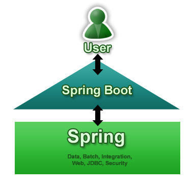
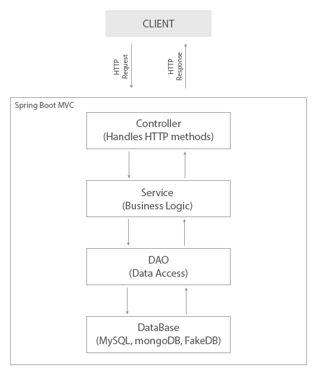

## Что такое Spring Boot?

[Spring Boot](http://projects.spring.io/spring-boot/) - это набор готовых библиотек написанных на Java, которые упрощают создание Spring приложений (сервлетов).

Компоненты Spring Boot:
* [Spring Framework](https://projects.spring.io/spring-framework/) - универсальный фреймворк с открытым исходным кодом для Java-платформы, предназначенный для создания информационных систем
* [Apache Tomcat®](https://tomcat.apache.org/) - проект с открытым исходным кодом, реализующий спецификации сервлетов, JavaServer Pages (JSP) и JavaServer Faces (JSF). Написан на языке Java
* [Hibernate](http://hibernate.org/) - библиотека для языка Java, предназначенная для создания связей Java классов с таблицами базы данных, а также для автоматического построения запросов
* [JDBC](http://www.oracle.com/technetwork/java/overview-141217.html) - платформенно-независимый промышленный стандарт взаимодействия Java-приложений с различными СУБД, входящего в состав Java SE
* и другие

### Схема Spring Boot MVC

* Controller - занимается обработкой HTTP-запросов

* Service - реализует бизнес-логику

* DAO - обеспечивает доступ к данным

* DataBase - база данных

Архитектура __Spring REST__ базируется на Spring MVC, но в ответе на http-запрос отдает модель, а не view.

При возникновении какой-то проблемы и поиске решений в Интеренте лучше указывать в строке поиска "spring rest". При указании просто "spring" большинство ответов будут про Spring MVC.

#### Полезные сайты
Помимо документации к Spring (https://spring.io/docs), хорошие инструкции можно найти на сайтах http://www.baeldung.com/ и https://www.mkyong.com/spring/ 
