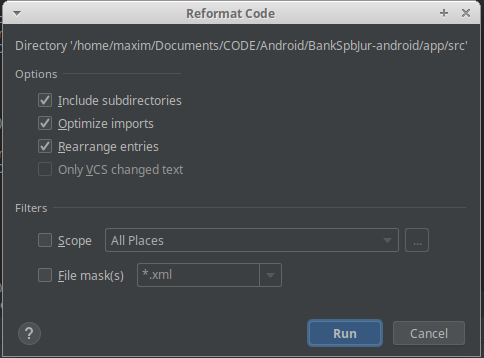

# Code Review

### Прочитайте сначала общую [статью](/general/gitGuide.md) по гиту и [статью](/general/commitNamingGuide.md) про именование коммитов.

## Общий процесс

Чтобы слить свои изменения в master или develop ветку, создается pull request. Cсылку на этот пулл надо отправить в чат разработчиков соответствующего проекта, в котором также находятся лид и основные и запасные ревьюеры.
На каждый пулл можно получить от ревьюера:

- comment: Комментарий к коду, неблокирующий слияние ветки
- request changes: Коментарий к коду, блокирующий слияние ветки
- approve: Разрешение на слияние ветки

В основном для каждого PR требуется получить один approve от любого ревьюера, если нет других договоренностей для данного проекта.  

**ВАЖНО:** Не каждый участник чата является ревьером. Ребята-новички могут смотреть пуллы, однако должны оставлять только неблокирующие комменты. Если ваш пулл посмотрели более одного ревьера, нужно получить аппрув от них всех.

**ВАЖНО:** Если вы чувствуете, что много или мало занимаетесь код ревью, обращайтесь к лиду. Он примет меры.

## Правила для автора пулл-реквеста

* **Ограничение длины пулл-реквеста.**   
  - Для Android: 300 строк.  
  - Для iOS: 600 строк   
  
 Если пулл содержит большее кол-во строк, то следует создать feature branch, и разбить свой большой пулл на несколько мелких. Мелкие пуллы должны сливаться в эту featureBranch и быть разделены на логические блоки, например: пулл с логикой, с версткой.  
После можно слить feature branch в develop без ревью, тк оно уже было пройдено по частям.
Ревьюер имеет право потребовать разбить пулл на мелкие или отложить ревью на долгий срок.

* **Пулл-реквесты должны быть атомарными.**  
Пулл должен включать одну фичу, таску.  
Если есть несколько мелких фиксов, можно объединить их в один пулл. Каждый фикс нужно отделить коммитом.

* **У пулл-реквеста должно быть описание**.   
К каждому пуллу в описании нужно приложить тикет из JIRA. Если его нет, то обязательно нужно добавить текстовое описание того, что было сделано в данном пуле. Описание должно быть длиной не более одного абзаца.     
Также к каждому пуллу нужно приложить скриншот макетов, либо ссылку на **конкретный экран**. Обычной ссылки на макет Figmа недостаточно. Найти неизвестный экран в незнакомых макетах очень тяжело!

* **Почитай свой код**   
Перед тем, как отправить ссылку на пулл, проверь свои изменения. Спасет от глупых ошибок и стыда.

* **Static analysis для Android**.  
Обязателен локальный static analysis перед пулл-реквестом. [Как пользоваться статиком](../Android/guides/static/StaticAnalysisPlugin.md). Чтобы не пропустить нарушения codestyle в код ревью, запусти в студии Reformat code для папки src.

  

## Правила для ревьюера

* Ревьюеру желательно проверить пулл в течении одного рабочего дня. Если ревью может затянуться, нужно отписать об этом в чат и назвать сроки ревью.

* Цель ревьюера - проверить логику, реализацию и кодстайл.

## Правила общения внутри код-ревью

* **ВАЖНО:** Комменты к пуллу резолвит тот, кто их открыл.

* Если возникли мелкие вопросы по оставленным к пуллу замечаниям, то напишите коммент в гите или можно подойти и спросить лично.

* Если вопрос по замечанию крупный, то нужно его обсудить в чате разработчиков в телеграмме, чтобы можно было отследить историю и узнать мнение других разработчиков.  
**ВАЖНО:** Не надо писать в личные сообщения.  

* При возникновении спора стараемся решить все конструктивно и быстро. Если разрешение спора идет тяжело, привлекаем третью сторону - лида или запасное лицо. Когда привлекаете третью сторону, все свои мысли нужно объяснить кратко, понятно, аргументированно.  
**ВАЖНО:** Решение третьей стороны является окончательным и безоговорочным.
