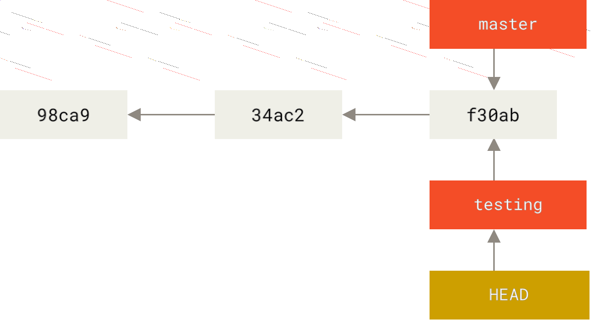

# Скилы по git

Привет! Сдесь собраны некоторые трюки git-a, вошедшие в нашу табличку грейдов.

## Разделы

- [Junior-1](#Junior-1)
    - [Clone](#Clone)
    - [Add](#Add)
    - [Status](#Status)  
    - [Commit](#Commit)
    - [Push](#Push)
    - [Branch](#Branch)

- [Junior-2](#Junior-2)
    - [Diff](#Diff)
    - [Stash](#Stash)
    - [Checkout](#Checkout)  
    - [Merge](#Merge)
    - [Submodule](#Submodule)
    - [Log](#Log)
    
- [Middle-1](#Middle-1)
    - [Gitignore](#Gitignore)
    - [Reset](#Reset)
    - [Tag](#Tag)  
    - [Cherry-pick](#Cherry-pick)
    - [Git-flow](#Git-flow)

- [Middle-2](#Middle-2)
    - [Rebase](#Rebase)
    - [Orphan](#Orphan)
    - [Remote](#Remote)  
    - [Получение изменений из удалённого репозитория — Fetch и Pull](#получение-изменений-из-удалённого-репозитория-Fetch-и-Pull)
    - [Config](#Config)

- [Middle-3](#Middle-3)
    - [Apply](#Apply)
    - [Fetch](#Fetch)
    - [Githooks](#Githooks)  
    - [Gitmodules](#Gitmodules)
    - [Gitattributes](#Gitattributes)
    - [Revert](#Revert)
    - [Archive](#Archive)

- [Senior](#Senior)
    - [Reflog](#Reflog)
    - [Bisect](#Bisect)
    - [Merge-base](#Merge-base) 
        
        ## Junior-1

### Clone 
Клонирование существующего репозитория

#### git clone
git clone работает как обёртка над некоторыми другими командами. Она создаёт новую директорию, переходит внутрь и выполняет git init для создания пустого репозитория, затем она добавляет новый удалённый репозиторий (git remote add) для указанного URL (по умолчанию он получит имя origin), выполняет git fetch для этого репозитория и, наконец, обновляет вашу рабочую директорию до последнего коммита, используя git checkout.

Для получения копии существующего Git-репозитория, например, проекта, в который вы хотите внести свой вклад, необходимо использовать команду git clone. Если вы знакомы с другими системами контроля версий, такими как Subversion, то заметите, что команда называется "clone", а не "checkout". Это важное различие – вместо того, чтобы просто получить рабочую копию, Git получает копию практически всех данных, которые есть на сервере. При выполнении git clone с сервера забирается (pulled) каждая версия каждого файла из истории проекта. Фактически, если серверный диск выйдет из строя, вы можете использовать любой из клонов на любом из клиентов, для того, чтобы вернуть сервер в то состояние, в котором он находился в момент клонирования (вы можете потерять часть серверных хуков (server-side hooks) и т.п., но все данные, помещённые под версионный контроль, будут сохранены. Клонирование репозитория осуществляется командой git clone <url>. Например, если вы хотите клонировать библиотеку someLib, вы можете сделать это следующим образом:
```
$ git clone https://github.com/someLib/
```
Эта команда создаёт директорию someLib, инициализирует в ней поддиректорию .git, скачивает все данные для этого репозитория и извлекает рабочую копию последней версии. Если вы зайдёте в новую директорию someLib, то увидите в ней файлы проекта, готовые для работы или использования. Для того, чтобы клонировать репозиторий в директорию с именем, отличающимся от someLib, необходимо указать желаемое имя, как параметр командной строки:
```
$ git clone https://github.com/someLib mylibgit
```
Эта команда делает всё то же самое, что и предыдущая, только результирующий каталог будет назван mylibgit. 
В Git реализовано несколько транспортных протоколов, которые вы можете использовать. В предыдущем примере использовался протокол https://, вы также можете встретить git:// или user@server:path/to/repo.git, использующий протокол передачи SSH. 

#### Запись изменений в репозиторий
Итак, у вас имеется настоящий Git-репозиторий и рабочая копия файлов для некоторого проекта. Вам нужно делать некоторые изменения и фиксировать “снимки” состояния (snapshots) этих изменений в вашем репозитории каждый раз, когда проект достигает состояния, которое вам хотелось бы сохранить. Каждый файл в вашем рабочем каталоге может находиться в одном из двух состояний: под версионным контролем (отслеживаемые) и нет (неотслеживаемые). Отслеживаемые файлы — это те файлы, которые были в последнем снимке состояния проекта; они могут быть неизменёнными, изменёнными или подготовленными к коммиту. Если кратко, то отслеживаемые файлы — это те файлы, о которых знает Git. Неотслеживаемые файлы — это всё остальное, любые файлы в вашем рабочем каталоге, которые не входили в ваш последний снимок состояния и не подготовлены к коммиту. Когда вы впервые клонируете репозиторий, все файлы будут отслеживаемыми и неизменёнными, потому что Git только что их извлек и вы ничего пока не редактировали. Как только вы отредактируете файлы, Git будет рассматривать их как изменённые, так как вы изменили их с момента последнего коммита. Вы индексируете эти изменения, затем фиксируете все проиндексированные изменения, а затем цикл повторяется.


Жизненный цикл состояний файлов.

### Add 
Отслеживание новых файлов

#### git add
Команда git add добавляет содержимое рабочей директории в индекс (staging area) для последующего коммита. По умолчанию git commit использует лишь этот индекс, так что вы можете использовать git add для сборки слепка вашего следующего коммита.

Для того чтобы начать отслеживать (добавить под версионный контроль) новый файл,
используется команда git add. Чтобы начать отслеживание файла README, вы можете выполнить следующее:
```
$ git add README
```
Если вы выполните команду status, то увидите, что файл README теперь отслеживаемый и добавлен в индекс:
```
$ git status
On branch master
Your branch is up-to-date with 'origin/master'.
Changes to be committed:
    (use "git restore --staged <file>..." to unstage)
    new file:    README
```
Вы можете видеть, что файл проиндексирован, так как он находится в секции “Changes to be
committed”. Если вы выполните коммит в этот момент, то версия файла, существовавшая на момент выполнения вами команды git add, будет добавлена в историю снимков состояния. Команда git add принимает параметром путь к файлу или каталогу, если это каталог, команда рекурсивно добавляет все файлы из указанного каталога в индекс.

### Status 
Определение состояния файлов

#### git status
Команда git status показывает состояния файлов в рабочей директории и индексе: какие файлы изменены, но не добавлены в индекс; какие ожидают коммита в индексе. Выводятся подсказки о том, как изменить состояние файлов.

Основной инструмент, используемый для определения, какие файлы в каком состоянии находятся — это команда git status. Если вы выполните эту команду сразу после клонирования, вы увидите что-то вроде этого:
```
$ git status

On branch master
Your branch is up-to-date with 'origin/master'.
nothing to commit, working directory clean
```
Это означает, что у вас чистый рабочий каталог, другими словами — в нем нет отслеживаемых измененных файлов. Команда сообщает на какой ветке вы находитесь и сообщает, что она не расходится с веткой на сервере. 
Предположим, вы добавили в свой проект новый файл, простой файл README. Если этого файла раньше не было, и вы выполните git status, вы увидите свой неотслеживаемый файл вот так:
```
$ echo 'My Project' > README
$ git status
On branch master
Your branch is up-to-date with 'origin/master'.
Untracked files:
    (use "git add <file>..." to include in what will be committed)
    README
nothing added to commit but untracked files present (use "git add" to track)
```
Понять, что новый файл README неотслеживаемый можно по тому, что он находится в секции “Untracked files” в выводе команды status. Статус Untracked означает, что Git видит файл, которого не было в предыдущем снимке состояния (коммите); Git не станет добавлять его в ваши коммиты, пока вы его явно об этом не попросите. Это предохранит вас от случайного добавления в репозиторий сгенерированных бинарных файлов или каких-либо других, которые вы и не думали добавлять. 

#### Сокращенный вывод статуса
Вывод команды git status довольно всеобъемлющий и многословный. Git также имеет флаг вывода сокращенного статуса, так что вы можете увидеть изменения в более компактном виде. Если вы выполните git status -s или git status --short вы получите гораздо более упрощенный вывод:
```
$ git status  -s
M    README
MM    Rakefile
A    lib/git.rb
M    lib/simplegit.rb
??    LICENSE.txt
```
Новые неотслеживаемые файлы помечены ?? слева от них, файлы добавленные в отслеживаемые помечены A, отредактированные файлы помечены M и так далее. В выводе содержится два столбца — в левом указывается статус файла, а в правом модифицирован ли он после этого. К примеру в нашем выводе, файл README модифицирован в рабочей директории и не проиндексирован, файл lib/simplegit.rb модифицирован и проиндексирован. Файл Rakefile  модифицирован проиндексирован и ещё раз модифицирован, таким образом на данный момент у него есть изменения которые попадут в коммит и те которые не попадут.

### Commit 
Коммит изменений

#### git commit
Команда git commit берёт все данные, добавленные в индекс с помощью git add, и сохраняет
их слепок во внутренней базе данных, а затем сдвигает указатель текущей ветки на этот слепок.
    
Теперь, когда ваш индекс находится в таком состоянии, как вам и хотелось, вы можете зафиксировать свои изменения. Всё, что до сих пор не проиндексировано — любые файлы, созданные или изменённые вами, и для которых вы не выполнили git add после редактирования — не войдут в этот коммит. Они останутся изменёнными файлами на вашем диске. Простейший способ зафиксировать изменения — это набрать git commit:
```
$ git commit
```
Эта команда откроет выбранный вами текстовый редактор. 

Замечание: Редактор устанавливается переменной окружения EDITOR — обычно это vim или emacs, хотя вы можете установить любой другой с помощью команды git config --global core.editor, как было показано в главе Введение).

В редакторе будет отображён следующий текст (это пример окна Vim’а):
```
# Please enter the commit message for your changes. Lines starting
# with '#' will be ignored, and an empty message aborts the commit.
# On branch master
# Your branch is up-to-date with 'origin/master'.
#
# Changes to be committed:
# new file:    README
# modified:    CONTRIBUTING.md
#
~
~
~
".git/COMMIT_EDITMSG" 9L, 283C
```
Можно видеть, что комментарий по умолчанию для коммита содержит закомментированный результат работы команды git status и ещё одну пустую строку сверху. Вы можете удалить эти комментарии и набрать своё сообщение или же оставить их для напоминания о том, что вы фиксируете.

Замечание: Для ещё более подробного напоминания, что же именно вы поменяли, можете передать аргумент -v в команду git commit. Это приведёт к тому, что в комментарий будет также помещена дельта/diff изменений, таким образом вы сможете точно увидеть все изменения которые вы совершили.

Когда вы выходите из редактора, Git создаёт для вас коммит с этим сообщением, удаляя комментарии и вывод команды diff. Есть и другой способ — вы можете набрать свой комментарий к коммиту в командной строке вместе с командой commit указав его после параметра -m, как в следующем примере:
```
$ git commit -m "ABC-182: Fix benchmarks for speed"
[master 463dc4f] ABC-182: Fix benchmarks for speed
2 files changed, 2 insertions(+)
create mode 100644 README
``` 
Можно видеть, что коммит вывел немного информации о себе: на какую ветку вы выполнили коммит (master), какая контрольная сумма SHA-1 у этого коммита (463dc4f), сколько файлов было изменено, а также статистику по добавленным/удалённым строкам в этом коммите. 
Коммит сохраняет снимок состояния вашего индекса. Всё, что вы не проиндексировали, так и висит в рабочем каталоге как изменённое; вы можете сделать ещё один коммит, чтобы добавить эти изменения в репозиторий. Каждый раз, когда вы делаете коммит, вы сохраняете снимок состояния вашего проекта, который позже вы можете восстановить или с которым можно сравнить текущее состояние.

### Push 

#### git push
Команда git push используется для установления связи с удалённым репозиторием, вычисления локальных изменений отсутствующих в нём, и собственно их передачи в вышеупомянутый репозиторий. Этой команде нужно право на запись в репозиторий, поэтому она использует аутентификацию.
    
Когда вы хотите поделиться веткой, вам необходимо отправить её на удалённый сервер, где у вас есть права на запись. Ваши локальные ветки автоматически не синхронизируются с удалёнными при отправке — вам нужно явно указать те ветки, которые вы хотите отправить. Таким образом, вы можете использовать свои личные ветки для работы, которую не хотите показывать, а отправлять только те тематические ветки, над которыми вы хотите работать с кем-то совместно. Если у вас есть ветка serverfix, над которой вы хотите работать с кем-то ещё, вы можете отправить её, выполнив команду git push <remote> <branch>:
```
$ git push origin fix/ABC-123_remove_some
Counting objects: 24, done.
Delta compression using up to 8 threads.
Compressing objects: 100% (15/15), done.
Writing objects: 100% (24/24), 1.91 KiB | 0 bytes/s, done.
Total 24 (delta 2), reused 0 (delta 0)
To https://github.com/schacon/simplegit
* [new branch]     fix/ABC-123_remove_some ->  fix/ABC-123_remove_some
```
Git автоматически разворачивает имя ветки fix/ABC-123_remove_some до refs/heads/serverfix:refs/heads/fix/ABC-123_remove_some, что означает “возьми мою локальную ветку fix/ABC-123_remove_some и обнови ей удалённую ветку fix/ABC-123_remove_some”. Также можно выполнить git push origin fix/ABC-123_remove_some:fix/ABC-123_remove_some — здесь говорится “возьми мою ветку fix/ABC-123_remove_some и сделай её удалённой веткой fix/ABC-123_remove_some”. Можно использовать этот формат для отправки локальной ветки в удалённую ветку с другим именем. Если вы не хотите, чтобы на удалённом сервере ветка называлась fix/ABC-123_remove_some, то вместо предыдущей команды выполните git push origin fix/ABC-123_remove_some:awesomebranch, которая отправит локальную ветку fix/ABC-123_remove_some в ветку awesomebranch удалённого репозитория.

Замечание: Не вводите каждый раз свой пароль
Если вы используете HTTPS URL для отправки изменений, Git-сервер будет спрашивать имя пользователя и пароль для аутентификации. По умолчанию вам будет предложено ввести эти данные в терминале, чтобы сервер мог определить разрешена ли вам отправка изменений. Если вы не хотите вводить свои данные каждый раз при отправке изменений, вы можете настроить “credential cache”. Проще всего держать их в памяти несколько минут, это легко настроить с помощью команды git config --global credential.helper cache.

### Branch
Создание новой ветки

#### git branch
Команда git branch — это своего рода "менеджер веток". Она умеет перечислять ваши ветки, создавать новые, удалять и переименовывать их.

Допустим вы хотите создать новую ветку с именем testing. Вы можете это сделать командой git branch :
```
$ git branch testing
```
В результате создаётся новый указатель на текущий коммит.


Две ветки указывают на одну и ту же последовательность коммитов

Как Git определяет, в какой ветке вы находитесь? Он хранит специальный указатель HEAD.
В Git — это указатель на текущую локальную ветку. В нашем случае мы все еще находимся в ветке master. Команда git branch только создаёт новую ветку, но не переключает на неё.


HEAD указывает на ветку

Вы можете легко это увидеть при помощи простой команды git log, которая покажет вам
куда указывают указатели веток. Эта опция называется —decorate.
```
$ git log --oneline --decorate
f30ab (HEAD, master, testing)ABC-32: add some feature 
4ac2 ABC-214: fixed bug - stack overflow under certain conditions
98ca9 initial commit of my project
```
Здесь можно увидеть указывающие на коммит f30ab ветки: master и testing.

Если у вас уже есть локальная ветка и вы хотите настроить ее на слежение за удалённой веткой, которую вы только что получили, или хотите изменить используемую upstream-ветку, то воспользуйтесь параметрами -u или --set-upstream-to для команды git branch, чтобы явно установить новое значение.
```
$ git branch -u origin/serverfix
Branch serverfix set up to track remote branch serverfix from origin.
```
Если вы хотите посмотреть как у вас настроены ветки слежения, воспользуйтесь опцией -vv
для команды git branch. Это выведет список локальных веток и дополнительную информацию о том, какая из веток отслеживается, отстаёт, опережает или всё сразу относительно отслеживаемой.
```
$ git branch -vv
iss53        7e424c3    [origin/iss53: ahead 2] forgot the brackets
master        1ae2a45    [origin/master] deploying index fix
* serverfix    f8674d9    [teamone/server-fix-good: ahead 3, behind 1] this should do it
testing        5ea463a    trying something new
```
*Когда выполняется команда git branch (имя ветки), Git, по сути, выполняет update-ref для добавления хеша последнего коммита текущей ветки под указанным именем в виде новой ссылки.


## Junior-2

### Diff 

#### git diff
Команда git diff используется для вычисления разницы между любыми двумя Git деревьями. Это может быть разница между вашей рабочей директорией и индексом (собственно git diff), разница между индексом и последним коммитом (git diff —staged), или между любыми двумя коммитами (git diff master branchB).

Если результат работы команды git status недостаточно информативен для вас — вам хочется знать, что конкретно поменялось, а не только какие файлы были изменены — вы можете использовать команду git diff. 
Допустим, вы изменили и проиндексировали файл README, а затем изменили файл CONTRIBUTING.md без индексирования. Если вы выполните команду git status, вы увидите что-то вроде:
```
$ git status
On branch master
Your branch is up-to-date with 'origin/master'.
Changes to be committed:
    (use "git reset HEAD <file>..." to unstage)
    modified:    README
Changes not staged for commit:
    (use "git add <file>..." to update what will be committed)
    (use "git checkout -- <file>..." to discard changes in working directory)
    modified:    CONTRIBUTING.md
```
Чтобы увидеть, что же вы изменили, но пока не проиндексировали, наберите git diff без аргументов:
```
$ git diff
diff --git a/CONTRIBUTING.md b/CONTRIBUTING.md
index 8ebb991..643e24f 100644
--- a/CONTRIBUTING.md
+++ b/CONTRIBUTING.md
@@ -65,7 +65,8 @@ branch directly, things can get messy.
Please include a nice description of your changes when you submit your PR;
if we have to read the whole diff to figure out why you're contributing
in the first place, you're less likely to get feedback and have your change
-merged in.
+merged in. Also, split your changes into comprehensive chunks if you patch is
+longer than a dozen lines.

If you are starting to work on a particular area, feel free to submit a PR
that highlights your work in progress (and note in the PR title that it's
```
Эта команда сравнивает содержимое вашего рабочего каталога с содержимым индекса. Результат показывает ещё не проиндексированные изменения.
Если вы хотите посмотреть, что вы проиндексировали и что войдёт в следующий коммит, вы
можете выполнить git diff—staged. Эта команда сравнивает ваши проиндексированные изменения с последним коммитом:
```
$ git diff --staged
diff --git a/README b/README
new file mode 100644
index 0000000..03902a1
--- /dev/null
+++ b/README
@@ -0,0 +1 @@
+My Project
```
git diff сама по себе не показывает все изменения сделанные с последнего коммита — только те, что ещё не проиндексированы. 
Другой пример: вы проиндексировали файл CONTRIBUTING.md и затем изменили его, вы можете использовать git diff для просмотра как проиндексированных изменений в этом файле, так и тех, что пока не проиндексированы. Если наше окружение выглядит вот так:
```
$ git add CONTRIBUTING.md
$ echo '# test line' >> CONTRIBUTING.md
$ git status
On branch master
Your branch is up-to-date with 'origin/master'.
Changes to be committed:
    (use "git reset HEAD <file>..." to unstage)
    modified:    CONTRIBUTING.md
Changes not staged for commit:
    (use "git add <file>..." to update what will be committed)
    (use "git checkout -- <file>..." to discard changes in working directory)
    modified:    CONTRIBUTING.md
```
Используйте git diff для посмотра непроиндексированных изменений
```
$ git diff
diff --git a/CONTRIBUTING.md b/CONTRIBUTING.md
index 643e24f..87f08c8 100644
--- a/CONTRIBUTING.md
+++ b/CONTRIBUTING.md
@@ -119,3 +119,4 @@ at the
## Starter Projects

See our [projects
list](https://github.com/libgit2/libgit2/blob/development/PROJECTS.md).
+# test line
```
а так же git diff --cached для просмотра проиндексированных изменений (--staged и --cached синонимы):
```
$ git diff --cached
diff --git a/CONTRIBUTING.md b/CONTRIBUTING.md
index 8ebb991..643e24f 100644
--- a/CONTRIBUTING.md
+++ b/CONTRIBUTING.md
@@ -65,7 +65,8 @@ branch directly, things can get messy.
Please include a nice description of your changes when you submit your PR;
if we have to read the whole diff to figure out why you're contributing
in the first place, you're less likely to get feedback and have your change
-merged in.
+merged in. Also, split your changes into comprehensive chunks if you patch is
+longer than a dozen lines.

If you are starting to work on a particular area, feel free to submit a PR
that highlights your work in progress (and note in the PR title that it's
```

NOTE  Git Diff во внешних инструментах
Существует еще один способ просматривать эти изменения, если вы предпочитаете графический просмотр или внешнюю программу просмотра различий, вместо консоли. Выполнив команду git difftool вместо git diff, вы сможете просмотреть изменения в файле с помощью таких программ как emerge, vimdiff и других. 

#### Определение применяемых изменений
Для просмотра полной разницы того, что произойдёт если вы сольёте изменения в другую ветку, вам понадобится использовать эту команду ( она может вводить в заблуждение, но точно покажет разницу):
```
$ git diff master
```
Если ваша master ветка продвинулась вперед с тех пор как вы создали тематическую ветку, то вы получите на первый взгляд странные результаты. Это происходит потому, что Git непосредственно сравнивает снимки последних коммитов текущей и master веток. Например, если вы добавили строку в файл в ветке master, то прямое сравнение снимков будет выглядеть как будто тематическая ветка собирается удалить эту строку.
Это не проблема, если ветка master является непосредственным родителем вашей тематической ветки, но если история обоих веток изменилась, то разница будет выглядеть как добавление всех изменений из тематической ветки и удаление всего нового из master ветки.
Что действительно нужно видеть, так это изменения тематической ветки, которые предстоит слить в master ветку. Это можно сделать, сказав Git сравнивать последний коммит тематической ветки с первым общим родителем для обоих веток.
Технически это делается за счёт явного указания общего коммита и применения разницы к нему:
```
$ git merge-base contrib master
36c7dba2c95e6bbb78dfa822519ecfec6e1ca649
$ git diff 36c7db
```
или более кратко:
```
161$ git diff $(git merge-base contrib master)
```
Однако это не удобно, поэтому Git предоставляет более короткий способ: синтаксис троеточия. При выполнении команды diff, следует поставить три точки после имени ветки для получения разницы между ней и текущей веткой, относительно общего родителя с другой веткой:
```
$ git diff master...contrib
```
Данная команда отобразит проделанную работу только из тематической ветки, относительно общего родителя с веткой master. 

### Stash 
Прибережение и очистка

#### git stash
Команда git stash используется для временного сохранения всех незакоммиченных изменений для очистки рабочей директории без необходимости коммитить незавершённую работу в новую ветку.

Часто пока вы работаете над одной частью вашего проекта и всё находится в беспорядке, у вас возникает желание сменить ветку и поработать над чем-то ещё. Сложность при этом заключается в том, что вы не хотите фиксировать наполовину сделанную работу только для того, чтобы иметь возможность вернуться к ней позже. Справиться с ней помогает команда git stash.
Операция stash берет изменённое состояние вашей рабочей директории, то есть изменённые отслеживаемые файлы и проиндексированные изменения, и сохраняет их в хранилище незавершённых изменений, которые вы можете в любое время применить обратно.
Для примера, предположим, что вы перешли в свой проект, начали работать над несколькими файлами и, возможно, добавили в индекс изменения одного из них. Если вы выполните git status, то увидите ваше изменённое состояние:
```
$ git status
Changes to be committed:
(use "git reset HEAD <file>..." to unstage)
    modified:    index.html
Changes not staged for commit:
    (use "git add <file>..." to update what will be committed)
    (use "git checkout -- <file>..." to discard changes in working directory)
    modified:    lib/simplegit.rb
```
Теперь вы хотите сменить ветку, но пока не хотите фиксировать ваши текущие наработки; поэтому вы спрячете эти изменения. Для того, чтобы спрятать изменение в выделенное для этого специальное хранилище, выполните git stash или git stash save:
```
$ git stash
Saved working directory and index state \
    "WIP on master: 049d078 added the index file"
HEAD is now at 049d078 added the index file
(To restore them type "git stash apply")

Теперь ваша рабочая директория не содержит изменений:

$ git status
# On branch master
nothing to commit, working directory clean
```
В данный момент вы можете легко переключать ветки и работать в любой; ваши изменения сохранены. Чтобы посмотреть список спрятанных изменений, вы можете использовать git stash list:
```
$ git stash list
stash@{0}: WIP on master: 049d078 added the index file
stash@{1}: WIP on master: c264051 Revert "added file_size"
stash@{2}: WIP on master: 21d80a5 added number to log
```
В данном примере, предварительно были припасены два изменения, поэтому теперь вам доступны три различных отложенных наработки. Вы можете применить только что спрятанные изменения, используя команду, указанную в выводе исходной команды: git stash apply. Если вы хотите применить одно из предыдущих спрятанных изменений, вы можете сделать это, используя его имя, вот так: git stash apply stash@{2}. Если вы не укажете имя, то Git попытается восстановить самое последнее спрятанное изменение:
```
$ git stash apply
# On branch master
# Changed but not updated:
#    (use "git add <file>..." to update what will be committed)
#
#    modified:    index.html
# modified:    lib/simplegit.rb
#
```
Git восстановил в файлах изменения, которые вы отменили ранее, когда прятали свои наработки. Вы можете спрятать изменения, находясь в одной ветке, а затем переключиться на другую и попробовать восстановить эти изменения. Также при восстановлении спрятанных наработок в вашей рабочей директории могут присутствовать изменённые и незафиксированные файлы — Git выдаст конфликты слияния, если не сможет восстановить какие-то наработки.
Спрятанные изменения будут применены к вашим файлам, но файлы, которые вы ранее добавляли в индекс, не будут добавлены туда снова. Для того, чтобы это было сделано, вы должны запустить git stash apply с опцией --index, при которой команда попытается восстановить изменения в индексе. Если вы выполните команду таким образом, то полностью восстановите ваше исходное состояние:
```
$ git stash apply --index
# On branch master
# Changes to be committed:
#    (use "git reset HEAD <file>..." to unstage)
#
#    modified:    index.html
#
# Changed but not updated:
#    (use "git add <file>..." to update what will be committed)
#
#    modified:    lib/simplegit.rb
#
```
Команда apply только пытается восстановить спрятанные наработки — при этом они останутся в хранилище. Для того, чтобы удалить их, вы можете выполнить git stash drop, указав имя удаляемых изменений:
```
$ git stash list
stash@{0}: WIP on master: 049d078 added the index file
stash@{1}: WIP on master: c264051 Revert "added file_size"
stash@{2}: WIP on master: 21d80a5 added number to log
$ git stash drop stash@{0}
Dropped stash@{0} (364e91f3f268f0900bc3ee613f9f733e82aaed43)
```
Вы также можете выполнить git stash pop, чтобы применить спрятанные изменения и тут же удалить их из хранилища.
По умолчанию git stash будет сохранять только файлы, которые уже добавлены в индекс. Если вы укажете --include-untracked или -u, Git также спрячет все неотслеживаемые файлы, которые вы создали.

### Checkout 

#### git checkout
Команда git checkout используется для переключения веток и выгрузки их содержимого в рабочую директорию.

Для переключения на существующую ветку выполните команду git checkout. Давайте переключимся на ветку testing:
```
$ git checkout testing
```
В результате указатель HEAD переместится на ветку testing.



HEAD указывает на текущую ветку

Какой в этом смысл? Давайте сделаем ещё один коммит:
```
...
$ git commit -a -m 'made a change'
```


Указатель на ветку HEAD переместился вперёд после коммита

Интересная ситуация: указатель на ветку testing переместился вперёд, а master указывает
на тот же коммит, где вы были до переключения веток командой git checkout. Давайте
переключимся назад на ветку master:
```
$ git checkout master
```
NOTE git log не показывает все ветки по умолчанию
Если выполнить команду git log прямо сейчас, то в её выводе только что созданная ветка "testing" фигурировать не будет. Ветка никуда не исчезла; просто Git не знает, что именно она вас интересует, и выводит наиболее полезную по его мнению информацию. Другими словами, по умолчанию git log отобразит историю коммитов только для текущей ветки. Для просмотра истории коммитов другой ветки необходимо явно указать её имя: git log testing Чтобы посмотреть историю по всем веткам — выполните команду с дополнительным флагом: git log —all.

NOTE Одновременное создание новой ветки и переключение на неё
Как правило, при создании новой ветки вы хотите сразу на неё переключиться — это можно сделать используя команду git checkout -b <newbranchname>.

#### Отслеживание веток
При клонировании репозитория, как правило, автоматически создаётся ветка master, которая следит за origin/master. Однако, при желании вы можете настроить отслеживание и других веток — следить за ветками на других серверах или отключить слежение за веткой master. Сделать это можно с помощью команды git checkout -b <branch> <remote>/<branch>. Это часто используемая команда, поэтому Git предоставляет сокращённую форму записи в виде флага —track:
```
$ git checkout --track origin/serverfix
Branch serverfix set up to track remote branch serverfix from origin.
Switched to a new branch 'serverfix'
```
Если вы пытаетесь извлечь ветку, которая не существует, но существует только одна удалённая ветка с точно таким же именем, то Git автоматически создаст ветку слежения:
```
$ git checkout serverfix
Branch serverfix set up to track remote branch serverfix from origin.
Switched to a new branch 'serverfix'
```
Чтобы создать локальную ветку с именем, отличным от имени удалённой ветки, просто укажите другое имя:
```
$ git checkout -b sf origin/serverfix
Branch sf set up to track remote branch serverfix from origin.
Switched to a new branch 'sf'
```
Теперь ваша локальная ветка sf будет автоматически получать изменения из origin/serverfix.

#### Использование checkout в конфликтах
Возможно, нас по каким-то причинам не устраивает необходимость выполнения слияния в текущий момент, или мы не можем хорошо исправить конфликт и нам необходимо больше информации.
Предположим, что у нас есть две долгоживущих ветки, каждая из которых имеет несколько коммитов, что при слиянии приводит к справедливому конфликту.
```
$ git log --graph --oneline --decorate --all
* f1270f7 (HEAD, master) update README
* 9af9d3b add a README
* 694971d update phrase to hola world
| * e3eb223 (mundo) add more tests
| * 7cff591 add testing script
| * c3ffff1 changed text to hello mundo
|/
* b7dcc89 initial hello world code
```
У нас есть три уникальных коммита, которые присутствуют только в ветке master и три других, которые присутствуют в ветке mundo. Если мы попытаемся слить ветку mundo, то получим конфликт.
```
$ git merge mundo
Auto-merging hello.rb
CONFLICT (content): Merge conflict in hello.rb
Automatic merge failed; fix conflicts and then commit the result.
```
Мы хотели бы увидеть в чем состоит данный конфликт. Если мы откроем конфликтующий файл, то увидим нечто подобное:
```
#! /usr/bin/env ruby
def hello
<<<<<<< HEAD
echo 'hola world'
=======
echo 'hello mundo'
>>>>>>> mundo
end
hello()
```
В обеих сливаемых ветках в этот файл было добавлено содержимое, но в некоторых коммитах изменялись одни и те же строки, что и привело к конфликту.
Полезным в данном случае инструментом является команда git checkout с опцией ‘--conflict’. Она заново выкачает файл и заменит маркеры конфликта. Это может быть полезно, если вы хотите восстановить маркеры конфликта и попробовать разрешить его снова. В качестве значения опции --conflict вы можете указывать diff3 или merge (последнее значение используется по умолчанию). Если вы укажете diff3, Git будет использовать немного другую версию маркеров конфликта — помимо “нашей” и “их” версий файлов будет также отображена “базовая” версия, и таким образом вы получите больше информации.
```
$ git checkout --conflict=diff3 hello.rb
```
После того, как вы выполните эту команду, файл будет выглядеть так:
```
289#! /usr/bin/env ruby
def hello
<<<<<<< ours
echo 'hola world'
||||||| base
echo 'hello world'
=======
echo 'hello mundo'
>>>>>>> theirs
end
hello()
```
Если вам нравится такой формат вывода, то вы можете использовать его по умолчанию для будущих конфликтов слияния, установив параметру merge.conflictstyle значение diff3.
```
$ git config --global merge.conflictstyle diff3
```
Команде git checkout также можно передать опции --ours и --theirs, которые позволяют действительно быстро выбрать одну из версий файлов, не выполняя слияния совсем.
Это может быть действительно полезным при возникновении конфликтов в бинарных файлах (в этом случае вы можете просто выбрать одну из версий), или при необходимости слить из другой ветки только некоторые файлы (в этом случае вы можете выполнить слияние, а затем перед коммитом переключить нужные файлы на требуемые версии).
Ссылки на удалённые ветки отличаются от веток (ссылки в refs/heads) тем, что они считаются неизменяемыми. Это означает, что вы можете переключится на любую из таких ссылок с помощью git checkout, но Git не установит HEAD на такую ссылку, а значит вы не сможете фиксировать свои изменения с помощью git commit. Git поддерживает удалённые ветки в качестве закладок на определённые состояния в удалённом репозитории во время последнего контакта с сервером.

### Merge 

#### git merge
Команда git merge используется для слияния одной или нескольких веток в текущую. Затем
она устанавливает указатель текущей ветки на результирующий коммит.
```
$ git checkout master
$ git merge hotfix
Updating f42c576..3a0874c
Fast-forward
    index.html | 2 ++
    1 file changed, 2 insertions(+)
```
Если коммит сливается с тем, до которого можно добраться двигаясь по истории прямо, Git упрощает слияние просто перенося указатель ветки вперед, так как нет расхождений в изменениях. Это называется “fast-forward”.
Теперь ваши изменения включены в коммит, на который указывает ветка master, и исправление можно внедрять.

#### Основы слияния
Предположим, вы решили, что работа по проблеме ABC-123 закончена и её можно влить в ветку master. Для этого нужно выполнить слияние ветки hotfix/ABC-123, выполнив команду git merge:

```
$ git checkout master
Switched to branch 'master'
$ git merge hotfix/ABC-123
Merge made by the 'recursive' strategy.
index.html |    1 +
1 file changed, 1 insertion(+)
```
Результат этой операции отличается от результата слияния ветки hotfix. В данном случае процесс разработки ответвился в более ранней точке. Так как коммит, на котором мы находимся, не является прямым родителем ветки, с которой мы выполняем слияние, Git выполняет простое трёхстороннее слияние используя последние коммиты объединяемых веток и общего для них родительского коммита.

### Submodule 
Управление вложенными репозиториями

#### git submodule 
Команда используется для управления вложенными репозиториями. Например, это могут быть библиотеки или другие, используемые не только в этом проекте ресурсы. У команды submodule есть несколько под-команд — add, update, sync и др. — для управления такими репозиториями.

#### Начало работы с подмодулями
Начнём с добавления существующего Git-репозитория, в качестве подмодуля репозитория, в котором мы работаем. Для добавления нового подмодуля используйте команду git submodule add с URL проекта, который вы хотите начать отслеживать. В данном примере мы добавим библиотеку “DbConnector”.
```
$ git submodule add https://github.com/chaconinc/DbConnector
Cloning into 'DbConnector'...
remote: Counting objects: 11, done.
remote: Compressing objects: 100% (10/10), done.
remote: Total 11 (delta 0), reused 11 (delta 0)
Unpacking objects: 100% (11/11), done.
Checking connectivity... done.
```
По умолчанию подмодули добавляют подпроекты в директории, называемые так же, как и соответствующие репозитории, в нашем примере — “DbConnector”.

#### Клонирование проекта с подмодулями
Когда вы клонируете такой проект, по умолчанию вы получите директории, содержащие подмодули, но ни одного файла в них не будет:
```
$ git clone https://github.com/chaconinc/MainProject
Cloning into 'MainProject'...
remote: Counting objects: 14, done.
remote: Compressing objects: 100% (13/13), done.
remote: Total 14 (delta 1), reused 13 (delta 0)
Unpacking objects: 100% (14/14), done.
Checking connectivity... done.
$ cd MainProject
$ ls -la
total 16
drwxr-xr-x    9 schacon staff 306 Sep 17 15:21 .
drwxr-xr-x    7 schacon staff 238 Sep 17 15:21 ..
drwxr-xr-x    13 schacon staff 442 Sep 17 15:21 .git
-rw-r—r--    1 schacon staff 92 Sep 17 15:21 .gitmodules
drwxr-xr-x    2 schacon staff 68 Sep 17 15:21 DbConnector
-rw-r—r--    1 schacon staff 756 Sep 17 15:21 Makefile
drwxr-xr-x    3 schacon staff 102 Sep 17 15:21 includes
drwxr-xr-x    4 schacon staff 136 Sep 17 15:21 scripts
drwxr-xr-x    4 schacon staff 136 Sep 17 15:21 src
$ cd DbConnector/
$ ls
$
```
Директория DbConnector присутствует, но она пустая. Вы должны выполнить две команды: git submodule init — для инициализации локального конфигурационного файла, и git submodule update — для извлечения всех данных этого проекта и переключения на соответствующий коммит, указанный в вашем основном проекте.
```
$ git submodule init
Submodule 'DbConnector' (https://github.com/chaconinc/DbConnector) registered for path
'DbConnector'
$ git submodule update
Cloning into 'DbConnector'...
remote: Counting objects: 11, done.
remote: Compressing objects: 100% (10/10), done.
remote: Total 11 (delta 0), reused 11 (delta 0)
Unpacking objects: 100% (11/11), done.
Checking connectivity... done.
Submodule path 'DbConnector': checked out 'c3f01dc8862123d317dd46284b05b6892c7b29bc'
```
Теперь ваша директория DbConnector находятся в точно таком же состоянии, как и ранее при выполнении коммита.

#### Работа над проектом с подмодулями
 Получение изменений из вышестоящего репозитория 
Простейший вариант использования подмодулей в проекте состоит в том, что вы  получаете сам подпроект и хотите периодически получать обновления, но в своей копии проекта ничего не изменяете. 
Если вы хотите проверить наличие изменений в подмодуле, вы можете перейти в его директорию, выполнить git fetch и затем git merge для обновления локальной версии из вышестоящего репозитория.
```
$ git fetch
From https://github.com/chaconinc/DbConnector
    c3f01dc..d0354fc master
-> origin/master
$ git merge origin/master
Updating c3f01dc..d0354fc
Fast-forward
    scripts/connect.sh     | 1 +
    src/db.c         | 1 +
2 files changed, 2 insertions(+)
```
Теперь если вы вернётесь в основной проект и выполните git diff --submodule, то сможете увидеть, что подмодуль обновился, и получить список новых коммитов. Если вы не хотите каждый раз при вызове git diff указывать опцию --submodule, то можете установить такой формат вывода по умолчанию, задав параметру diff.submodule значение “log”.
```
$ git config —global diff.submodule log
$ git diff
Submodule DbConnector c3f01dc..d0354fc:
> more efficient db routine
> better connection routine
```
Если в данный момент вы создадите коммит, то таким образом сделаете доступным новый код в подмодуле для других людей.
Если вы не хотите вручную извлекать и сливать изменения в поддиректорию, выполните git submodule update --remote, тогда Git сам перейдёт в ваши подмодули, заберёт изменения и обновит их.
```
$ git submodule update --remote DbConnector
remote: Counting objects: 4, done.
remote: Compressing objects: 100% (2/2), done.
remote: Total 4 (delta 2), reused 4 (delta 2)
Unpacking objects: 100% (4/4), done.
From https://github.com/chaconinc/DbConnector
    3f19983..d0354fc master    -> origin/master
Submodule path 'DbConnector': checked out 'd0354fc054692d3906c85c3af05ddce39a1c0644'
```
Эта команда по умолчанию предполагает, что вы хотите обновить локальную копию до состояния ветки master из репозитория подмодуля. 
По умолчанию при выполнении команды git submodule update --remote Git будет пытаться обновить все ваши подмодули, поэтому если у вас их много, вы можете указать имя подмодуля, который вы хотите попробовать обновить.
До сих пор, когда мы выполняли команду git submodule update для извлечения изменений из репозитория подмодуля, Git получал изменения и обновлял файлы в поддиректории, но оставлял подрепозиторий в состоянии, называемом “отделённый HEAD” (“detached HEAD”). Это значит, что локальная рабочая ветка (такая, например, как “master”), отслеживающая изменения, отсутствует. Таким образом, любые вносимые вами изменения не будут нормально отслеживаться.
Для упрощения работы с подмодулями вам необходимо перейти в каждый подмодуль и переключиться на ветку, в которой будете в дальнейшем работать. Затем вам необходимо сообщить Git, что ему делать если вы внесли изменения, а затем командой git submodule update --remote получаете новые изменения из репозитория. Возможны два варианта — вы можете слить их в вашу локальную версию или попробовать перебазировать ваши локальные наработки поверх новых изменений.
Если вы удалите директорию и переключитесь на ветку с подмодулем, то вам потребуется выполнить submodule update --init для повторного создания директории.
```
$ git clean -fdx
Removing CryptoLibrary/
$ git checkout add-crypto
Switched to branch 'add-crypto'
$ ls CryptoLibrary/
$ git submodule update --init
Submodule path 'CryptoLibrary': checked out 'b8dda6aa182ea4464f3f3264b11e0268545172af'
$ ls CryptoLibrary/
Makefile    includes    scripts    src
```
Предположим, у вас есть файлы в какой-то директории вашего проекта, и вы хотите переместить их в подмодуль. Если вы удалите поддиректорию, а затем выполните submodule add, то Git заругается на вас:
```
$ rm -Rf CryptoLibrary/
$ git submodule add https://github.com/chaconinc/CryptoLibrary
'CryptoLibrary' already exists in the index
```
Сначала, вы должны удалить директорию CryptoLibrary из индекса. Затем вы можете добавить подмодуль:
```
$ git rm -r CryptoLibrary
$ git submodule add https://github.com/chaconinc/CryptoLibrary
Cloning into 'CryptoLibrary'...
remote: Counting objects: 11, done.
remote: Compressing objects: 100% (10/10), done.
remote: Total 11 (delta 0), reused 11 (delta 0)
Unpacking objects: 100% (11/11), done.
Checking connectivity... done.
```
Когда в дальнейшем вы переключитесь обратно, то по некоторой причине получите пустую директорию CryptoLibrary и команда git submodule update не сможет этого исправить. Вам может потребоваться перейти в директорию подмодуля и выполнить git checkout, чтобы вернуть все ваши файлы. Для того, чтобы запустить эту команду для нескольких подмодулей, вы можете выполнять её, используя submodule foreach.

### Log
Просмотр истории коммитов

#### git log
Команда git log используется для просмотра истории коммитов, начиная с самого свежего и уходя к истокам проекта. По умолчанию, она показывает лишь историю текущей ветки, но может быть настроена на вывод истории других, даже нескольких сразу, веток. Также её можно использовать для просмотра различий между ветками на уровне коммитов. 
    
После того, как вы создали несколько коммитов или же склонировали репозиторий с уже существующей историей коммитов, вероятно вам понадобится посмотреть историю коммитов. Одним из основных и наиболее мощных инструментов для этого является команда git log.
Если вы запустите команду git log в папке склонированного проекта, вы увидите примерно следующий вывод:
```
$ git log
commit ca82a6dff817ec66f44342007202690a93763949
Author: Scott Chacon <schacon@gee-mail.com>
Date:    Mon Mar 17 21:52:11 2008 -0700
changed the version number
commit 085bb3bcb608e1e8451d4b2432f8ecbe6306e7e7
Author: Scott Chacon <schacon@gee-mail.com>
Date:    Sat Mar 15 16:40:33 2008 -0700
    removed unnecessary test
commit a11bef06a3f659402fe7563abf99ad00de2209e6
Author: Scott Chacon <schacon@gee-mail.com>
Date:    Sat Mar 15 10:31:28 2008 -0700
    first commit
```
По умолчанию (без аргументов) git log перечисляет коммиты, сделанные в репозитории в обратном к хронологическому порядке – последние коммиты находятся вверху. Из примера можно увидеть, что данная команда перечисляет коммиты с их SHA-1 контрольными суммами, именем и электронной почтой автора, датой создания и сообщением коммита.
Команда git log имеет очень большое количество опций для поиска коммитов по разным критериям. Одним из самых полезных аргументов является -p или --patch, который показывает разницу (выводит патч), внесенную в каждый коммит. Так же вы можете ограничить количество записей в выводе команды; используйте параметр -2 для вывода только двух записей:
```
$ git log -p -2
commit ca82a6dff817ec66f44342007202690a93763949
Author: Scott Chacon <schacon@gee-mail.com>
Date:    Mon Mar 17 21:52:11 2008 -0700
changed the version number
diff --git a/Rakefile b/Rakefile
index a874b73..8f94139 100644
--- a/Rakefile
+++ b/Rakefile
@@ -5,7 +5,7 @@ require 'rake/gempackagetask'
spec = Gem::Specification.new do |s|
    s.platform =    Gem::Platform::RUBY
    s.name =    "simplegit"
-    s.version =    "0.1.0"
+    s.version =    "0.1.1"
    s.author =    "Scott Chacon"
    s.email =    "schacon@gee-mail.com"
    s.summary =    "A simple gem for using Git in Ruby code."
commit 085bb3bcb608e1e8451d4b2432f8ecbe6306e7e7
Author: Scott Chacon <schacon@gee-mail.com>
Date:    Sat Mar 15 16:40:33 2008 -0700
    removed unnecessary test
diff --git a/lib/simplegit.rb b/lib/simplegit.rb
index a0a60ae..47c6340 100644
--- a/lib/simplegit.rb
+++ b/lib/simplegit.rb
@@ -18,8 +18,3 @@ class SimpleGit
    end
end
-
-if $0 == __FILE__
- git = SimpleGit.new
- echo git.show
-end
```
Эта опция отображает аналогичную информацию но содержит разницу для каждой записи. Очень удобно использовать данную опцию для код ревью или для быстрого просмотра серии внесенных изменений. Так же есть возможность использовать серию опций для обобщения.
Полезные опции для git log --pretty=format отображает наиболее полезные опции для изменения формата.


Полезные опции для git log —pretty=format


Наиболее распространенные опции для команды git log

#### Ограничение вывода
Команда git log принимает несколько опций для ограничения вывода – опций, с помощью которых можно увидеть определенное подмножество коммитов. Вы можете использовать -<n>, где n – это любое натуральное число и представляет собой n последних коммитов. На практике вы не будете часто использовать эту опцию, потому что Git по умолчанию использует постраничный вывод и вы будете видеть только одну страницу за раз.
Однако, опции для ограничения вывода по времени, такие как --since и --until, являются очень удобными. Например, следующая команда покажет список коммитов, сделанных за последние две недели:
```
$ git log —since=2.weeks
```
Эта команда работает с большим количеством форматов — вы можете указать определенную дату вида "2008-01-15" или же относительную дату, например "2 years 1 day 3 minutes ago".
Также вы можете фильтровать список коммитов по заданным параметрам. Опция —author дает возможность фильтровать по автору коммита, а опция --grep искать по ключевым словам в сообщении коммита.
Опция -S принимает аргумент в виде строки и показывает только те коммиты, в которых изменение в коде повлекло за собой добавление или удаление этой строки. Например, если вы хотите найти последний коммит, который добавил или удалил вызов определенной функции, вы можете запустить команду:
```
$ git log -S function_name
```
Последней полезной опцией, которую принимает команда git log как фильтр, является путь. Если вы укажете директорию или имя файла, вы ограничите вывод только теми коммитами, в которых были изменения этих файлов. Эта опция всегда указывается последней после (--), что отделяет указываемый путь от опций. 


Опции для ограничения вывода команды git log

## Middle-1

### Gitignore 
Игнорирование файлов
    
Зачастую, у вас имеется группа файлов, которые вы не только не хотите автоматически добавлять в репозиторий, но и видеть в списках неотслеживаемых. К таким файлам обычно относятся автоматически генерируемые файлы (различные логи, результаты сборки программ и т.п.). В таком случае, вы можете создать файл .gitignore. с перечислением шаблонов соответствующих таким файлам. Пример файла .gitignore:
```
$ cat .gitignore
*.[oa]
*~
```
Первая строка предписывает Git игнорировать любые файлы заканчивающиеся на “.o” или “.a” — объектные и архивные файлы, которые могут появиться во время сборки кода. Вторая строка предписывает игнорировать все файлы заканчивающиеся на тильду (~), которая используется во многих текстовых редакторах, например Emacs, для обозначения временных файлов. Вы можете также включить каталоги log, tmp или pid; автоматически создаваемую документацию; и т.д. и т.п. Хорошая практика заключается в настройке файла .gitignore до того, как начать серьёзно работать, это защитит вас от случайного добавления в репозиторий файлов, которых вы там видеть не хотите.
К шаблонам в файле .gitignore применяются следующие правила:
    • Пустые строки, а также строки, начинающиеся с #, игнорируются.
    • Стандартные шаблоны являются глобальными и применяются рекурсивно для всего
дерева каталогов.
    • Чтобы избежать рекурсии используйте символ слэш (/) в начале шаблона.
    • Чтобы исключить каталог добавьте слэш (/) в конец шаблона.
    • Можно инвертировать шаблон, использовав восклицательный знак (!) в качестве
первого символа.

Glob-шаблоны представляют собой упрощённые регулярные выражения, используемые командными интерпретаторами. Символ (*) соответствует 0 или более символам; последовательность [abc] — любому символу из указанных в скобках (в данном примере a, b или c); знак вопроса (?) соответствует одному символу; и квадратные скобки, в которые заключены символы, разделённые дефисом ([0-9]), соответствуют любому символу из интервала (в данном случае от 0 до 9). Вы также можете использовать две звёздочки, чтобы указать на вложенные директории: a/**/z соответствует a/z, a/b/z, a/b/c/z, и так далее.
Вот ещё один пример файла .gitignore:
```
# Исключить все файлы с расширение .a
*.a
# Не отслеживать файл lib.a даже если он подпадает под исключение выше
!lib.a
# Исключить файл TODO в корневой директории, но не файл в subdir/TODO
/TODO
# Игнорировать все файлы в директории build/
build/
# Игнорировать файл doc/notes.txt, но не файл doc/server/arch.txt
doc/*.txt
# Игнорировать все .txt файлы в директории doc/
doc/**/*.txt
```
GitHub поддерживает довольно полный список примеров .gitignore файлов для множества проектов и языков https://github.com/github/gitignore это может стать отправной точкой для .gitignore в вашем проекте.

Замечание:  В простейшем случае репозиторий будет иметь один файл .gitignore в корневой директории, правила из которого будут рекурсивно применяться ко всем поддиректориям. Так же возможно использовать .gitignore файлы в поддиректориях. Правила из этих файлов будут применяться только к директории, в которой находятся. 

### Reset 

#### git reset
Команда git reset используется в основном для отмены изменений. Она изменяет указатель HEAD и, опционально, состояние индекса. Эта команда может изменить файлы в рабочей директории при использовании параметра --hard, что может привести к потере наработок при неправильном использовании.

#### Назначение reset
Предположим, что мы изменили файл file.txt и закоммитили его в третий раз. Так что наша история теперь выглядит так:


Проследим, что происходит при вызове reset. Эта команда управляет тремя деревьями, существующими в Git. Она выполняет три основных операции.
Шаг 1: Перемещение HEAD
Первое, что сделает reset — переместит то, на что указывает HEAD. Изменяется не сам HEAD (что происходит при выполнении команды checkout); reset перемещает ветку, на которую указывает HEAD. Таким образом, если HEAD указывает на ветку master, выполнение команды git reset 9e5e6a4 сделает так, что master будет указывать на 9e5e6a4.


Не важно с какими опциями вы вызвали команду reset с указанием коммита (reset также можно вызывать с указанием пути), она всегда будет пытаться сперва сделать данный шаг. При вызове reset --soft на этом выполнение команды и остановится. Когда вы выполняете git commit, Git создает новый коммит и перемещает на него ветку, на которую указывает HEAD. Если вы выполняете reset на HEAD~ (родителя HEAD), то вы перемещаете ветку туда, где она была раньше, не изменяя при этом ни Индекс, ни Рабочий Каталог. Вы можете обновить Индекс и снова выполнить git commit, таким образом добиваясь того же, что делает команда git commit --amend.
Шаг 2: Обновление Индекса (--mixed)
Следующим, что сделает reset, будет обновление Индекса содержимым того снимка, на который указывает HEAD.


Если вы указали опцию --mixed, выполнение reset остановится на этом шаге. Такое поведение также используется по умолчанию, поэтому если вы не указали совсем никаких опций (в нашем случае git reset HEAD~), выполнение команды также остановится на этом шаге.
Шаг 3: Обновление Рабочего Каталога (--hard)
Приведение Рабочего Каталога к тому же виду, что и Индекс. Если вы используете опцию --hard, то выполнение команды будет продолжено до этого шага.


Указание этого флага (--hard) делает команду reset опасной, это один из немногих случаев, когда Git действительно удаляет данные. 

Резюме
Команда reset в заранее определённом порядке перезаписывает три "дерева" Git, останавливаясь тогда, когда вы ей скажете:
1. Перемещает ветку, на которую указывает HEAD (останавливается на этом, если указана опция —soft);
2. Делает Индекс таким же как и HEAD (останавливается на этом, если не указана опция —hard);
3. Делает Рабочий Каталог таким же как и Индекс.

#### Reset с указанием пути
Основной форме команды reset (без опций --soft и --hard) вы также можете передавать путь, с которым она будет оперировать. В этом случае, reset пропустит первый шаг, а на остальных будет работать только с указанным файлом или набором файлов. Первый шаг пропускается, так как HEAD является указателем и не может ссылаться частично на один коммит, а частично на другой. Но Индекс и Рабочий Каталог могут быть изменены частично, поэтому reset выполняет шаги 2 и 3.
Предположим вы выполнили команду git reset file.txt. Эта форма записи (так как вы не указали ни SHA-1 коммита, ни ветку, ни опций --soft или --hard) является сокращением для git reset --mixed HEAD file.txt, которая:
1. Перемещает ветку, на которую указывает HEAD (будет пропущено)
2. Делает Индекс таким же как и HEAD (остановится здесь)
То есть, фактически, она копирует файл file.txt из HEAD в Индекс.


Это создает эффект отмены индексации файла. Если вы посмотрите на диаграммы этой команды и команды git add, то увидите, что их действия прямо противоположные.


Именно поэтому в выводе git status предлагается использовать такую команду для отмены индексации файла.
Мы легко можем заставить Git “брать данные не из HEAD”, указав коммит, из которого нужно взять версию этого файла. Для этого мы должны выполнить следующее git reset eb43bf file.txt.


reset можно указывать опцию --patch для отмены индексации части содержимого. Таким способом вы можете избирательно отменять индексацию или откатывать изменения.

#### Слияние коммитов
Допустим, у вас есть последовательность коммитов с сообщениями вида “упс.”, “В работе” и “позабыл этот файл”. Вы можете использовать reset для того, чтобы просто и быстро слить их в один.
Предположим, у вас есть проект, в котором первый коммит содержит один файл, второй коммит добавляет новый файл и изменяет первый, а третий коммит снова изменяет первый файл. Второй коммит был сделан в процессе работы и вы хотите слить его со следующим.


Вы можете выполнить git reset --soft HEAD~2, чтобы вернуть ветку HEAD на какой-то из предыдущих коммитов (на первый коммит, который вы хотите оставить):


Затем снова выполните git commit:


Теперь вы можете видеть, что ваша “достижимая” история (история, которую вы впоследствии отправите на сервер), сейчас выглядит так — у вас есть первый коммит с файлом file-a.txt версии v1, и второй, который изменяет файл file-a.txt до версии v3 и добавляет file-b.txt. Коммита, который содержал файл версии v2 не осталось в истории.

#### Сравнение с checkout
Вы можете задаться вопросом, в чем же состоит отличие между checkout и reset. Как и reset, команда checkout управляет тремя деревьями Git, и также её поведение зависит от того указали ли вы путь до файла или нет.
Без указания пути
Команда git checkout [branch] очень похожа на git reset --hard [branch], в процессе их выполнения все три дерева изменяются так, чтобы выглядеть как [branch]. 
Во-первых, в отличие от reset --hard, команда checkout бережно относится к рабочему каталогу, и проверяет, что она не трогает файлы, в которых есть изменения. Эта команда пытается выполнить в Рабочем Каталоге простые слияния так, чтобы все файлы, которые вы не изменяли, были обновлены. С другой стороны, команда reset --hard просто заменяет всё целиком, не выполняя проверок.
Второе отличие заключается в том, как эти команды обновляют HEAD. В то время как reset перемещает ветку, на которую указывает HEAD, команда checkout перемещает сам HEAD так, чтобы он указывал на другую ветку.
Например, пусть у нас есть ветки master и develop, которые указывают на разные коммиты и мы сейчас находимся на ветке develop (то есть HEAD указывает на неё). Если мы выполним git reset master, сама ветка develop станет ссылаться на тот же коммит, что и master. Если мы выполним git checkout master, то develop не изменится, но изменится HEAD. Он станет указывать на master.
Итак, в обоих случаях мы перемещаем HEAD на коммит A, но важное отличие состоит в том, как мы это делаем. Команда reset переместит также и ветку, на которую указывает HEAD, а checkout перемещает только сам HEAD.


#### С указанием пути
Другой способ выполнить checkout состоит в том, чтобы указать путь до файла. В этом случае, как и для команды reset, HEAD не перемещается. Эта команда как и git reset [branch] file обновляет файл в индексе версией из коммита, но дополнительно она обновляет и файл в рабочем каталоге. 
Ниже приведена памятка того, как эти команды воздействуют на каждое из деревьев. В столбце “HEAD” указывается “REF” если эта команда перемещает ссылку (ветку), на которую HEAD указывает, и “HEAD” если перемещается только сам HEAD. 


### Tag 

#### git tag
Команда git tag используется для задания постоянной метки на какой-либо момент в истории проекта. Обычно она используется для релизов. 

#### Просмотр списка меток
Просмотреть список имеющихся тегов в Git можно очень просто. Достаточно набрать команду git tag (параметры -l и --list опциональны):
```
$ git tag
v0.1
v1.3
```
Данная команда перечисляет теги в алфавитном порядке; порядок их отображения не имеет существенного значения. Так же можно выполнить поиск тега по шаблону. Например, репозиторий Git содержит более 500 тегов. Если вы хотите посмотреть теги релизов 1.8.5, то выполните следующую команду:
```
$ git tag -l 'v1.8.5*'
v1.8.5
v1.8.5-rc0
v1.8.5-rc1
v1.8.5-rc2
v1.8.5-rc3
v1.8.5.1
v1.8.5.2
v1.8.5.3
v1.8.5.4
v1.8.5.5
```
Замечание: Для отображение тегов согласно шаблону требуются параметры -l или --list
Если вы хотите посмотреть весь список тегов, запуск команды git tag неявно подразумевает это и выводит полный список; использование параметров -l или --list в этом случае опционально.
Если вы хотите отфильтровать список тегов согласно шаблону, использование параметров -l или --list становится обязательным.
#### Создание меток
Git использует два основных типа тегов: легковесные и аннотированные. Легковесный тег — это что-то очень похожее на ветку, которая не изменяется — просто указатель на определённый коммит.
Аннотированные теги хранятся в базе данных Git как полноценные объекты. Они имеют контрольную сумму, содержат имя автора, его e-mail и дату создания, имеют комментарий. Обычно рекомендуется создавать аннотированные тэги, чтобы иметь всю перечисленную информацию; но если вы хотите сделать временную метку или по какой-то причине не хотите сохранять остальную информацию, то для этого годятся и легковесные.

#### Аннотированные метки
Создание аннотированной метки в Git — указать -a при выполнении команды tag:
```
$ git tag -a v1.4 -m 'my version 1.4'
$ git tag
v0.1
v1.3
v1.4
```
Опция -m задаёт сообщение, которое будет храниться вместе с тегом. Если не указать сообщение, то Git запустит редактор, чтобы вы смогли его ввести.

#### Легковесные метки
Легковесная метка — это ещё один способ пометить коммит. По сути, это контрольная сумма коммита, сохранённая в файл — больше никакой информации не хранится. Для создания легковесной метки не передавайте опций -a, -s и -m, укажите только название:
```
$ git tag v1.4-lw
$ git tag
v0.1
v1.3
v1.4
v1.4-lw
v1.5
```
#### Отложенная растановка меток
Также возможно помечать уже пройденные коммиты. Предположим, история коммитов выглядит следующим образом:
```
$ git log --pretty=oneline
15027957951b64cf874c3557a0f3547bd83b3ff6    Merge branch 'experiment'
a6b4c97498bd301d84096da251c98a07c7723e65    beginning write support
0d52aaab4479697da7686c15f77a3d64d9165190    one more thing
6d52a271eda8725415634dd79daabbc4d9b6008e    Merge branch 'experiment'
0b7434d86859cc7b8c3d5e1dddfed66ff742fcbc    added a commit function
4682c3261057305bdd616e23b64b0857d832627b    added a todo file
166ae0c4d3f420721acbb115cc33848dfcc2121a    started write support
9fceb02d0ae598e95dc970b74767f19372d61af8    updated rakefile
964f16d36dfccde844893cac5b347e7b3d44abbc    commit the todo
8a5cbc430f1a9c3d00faaeffd07798508422908a    updated readme
```
Теперь предположим, что вы забыли отметить версию проекта v1.2, которая была там, где находится коммит “updated rakefile”. Вы можете добавить метку и позже. Для отметки коммита укажите его контрольную сумму (или её часть) как параметр команды:
```
$ git tag -a v1.2 9fceb02
```
Проверим, что коммит отмечен:
```
$ git tag
v0.1
v1.2
v1.3
v1.4
v1.4-lw
v1.5
$ git show v1.2
tag v1.2
Tagger:     Scott Chacon <schacon@gee-mail.com>
Date:        Mon Feb 9 15:32:16 2009 -0800
version 1.2
commit 9fceb02d0ae598e95dc970b74767f19372d61af8
Author:     Magnus Chacon <mchacon@gee-mail.com>
Date:        Sun Apr 27 20:43:35 2008 -0700
    updated rakefile
...
```
#### Обмен метками
По умолчанию, команда git push не отправляет теги на удалённые сервера. После создания тега нужно отправлять явно на удалённый сервер. Процесс аналогичен отправке веток — достаточно выполнить команду git push origin <tagname>.
```
$ git push origin v1.5
Counting objects: 14, done.
Delta compression using up to 8 threads.
Compressing objects: 100% (12/12), done.
Writing objects: 100% (14/14), 2.05 KiB | 0 bytes/s, done.
Total 14 (delta 3), reused 0 (delta 0)
To git@github.com:schacon/simplegit.git
* [new tag]    v1.5 -> v1.5
```
Если у вас много тегов, и вам хотелось бы отправить все за один раз, то можно использовать опцию --tags для команды git push. В таком случае все ваши теги отправятся на удалённый сервер (если только их уже там нет).
```
$ git push origin --tags
Counting objects: 1, done.
Writing objects: 100% (1/1), 160 bytes | 0 bytes/s, done.
Total 1 (delta 0), reused 0 (delta 0)
To git@github.com:schacon/simplegit.git
* [new tag]    v1.4 -> v1.4
* [new tag]    v1.4-lw -> v1.4-lw
```
Теперь, если кто-то склонирует (clone) или выполнит git pull из вашего репозитория, то он получит вдобавок к остальному и ваши метки.

NOTE git push отправляет оба типа тегов
Отправка тегов командой git push <remote> --tags не различает аннотированные и легковесные теги; не существует простой опции, которая позволила бы вам указать тип тегов для отправки.

#### Удаление меток
Для удаления тега в локальном репозитории достаточно выполнить команду git tag -d
<tagname>. Например, удалить созданный ранее легковесный тег можно следующим образом:
```
$ git tag -d v1.4-lw
Deleted tag 'v1.4-lw' (was e7d5add)
```
При удалении тега не происходит его удаление с сервера. Распространены два способа удаления тега из удалённого репозитория. Первый способ — это выполнить команду git push <remote> :refs/tags/<tagname>:
```
$ git push origin :refs/tags/v1.4-lw
To /git@github.com:schacon/simplegit.git
- [deleted]    v1.4-lw
```
Это следует понимать как обновление удаленного тэга пустым значением, что при водит к
его удалению. Второй способ удалить тег из удалённого репозитория более интуитивный:
```
$ git push origin --delete <tagname>
```
#### Переход на метку
Если вы хотите получить версии файлов, на которые указывает тег, то вы можете сделать git checkout для тега. Однако, это переведёт репозиторий в состояние “detached HEAD”, которое имеет ряд неприятных побочных эффектов.
```
$ git checkout v2.0.0
Note: checking out 'v2.0.0'.
You are in 'detached HEAD' state. You can look around, make experimental
changes and commit them, and you can discard any commits you make in this
state without impacting any branches by performing another checkout.
If you want to create a new branch to retain commits you create, you may
do so (now or later) by using -b with the checkout command again. Example:
    git checkout -b <new-branch>
HEAD is now at 99ada87... Merge pull request #89 from schacon/appendix-final
$ git checkout 2.0-beta-0.1
Previous HEAD position was 99ada87... Merge pull request #89 from schacon/appendix-
final
HEAD is now at df3f601... add atlas.json and cover image
```
Если в состоянии “detached HEAD” внести изменения и сделать коммит, то тег не изменится, при этом новый коммит не будет относиться ни к какой из веток, а доступ к нему можно будет получить только по его хэшу. Поэтому, если вам нужно внести изменения — исправить ошибку в одной из старых версий — скорее всего вам следует создать ветку:
```
$ git checkout -b version2 v2.0.0
Switched to a new branch 'version2'
```
Если сделать коммит в ветке version2, то она сдвинется вперед и будет отличаться от тега v2.0.0, так что будте с этим осторожны.

### Cherry-pick 

#### git cherry-pick
Команда используется для того чтобы взять изменения, внесённые каким- либо коммитом, и попытаться применить их заново в виде нового коммита наверху текущей ветки. Это может оказаться полезным чтобы забрать парочку коммитов из другой ветки без полного слияния с той веткой.

#### Рабочие процессы на основе перебазирования и выборочного применения
Некоторые предпочитают перебазировать или выборочно применять (cherry-pick) изменения относительно ветки master вместо слияния, что позволяет поддерживать историю проекта в линейном виде. Когда проделанная работа из тематической ветки готова к интеграции, вы переходите на эту ветку и перебазируете её относительно ветки master (или develop и т.д.). Если конфликты отсутствуют, то вы можете просто сдвинуть состояние ветки master, что обеспечивает линейность истории проекта.
Другим способом перемещения предлагаемых изменений из одной ветки в другую является их выборочное применение (cherry-pick). Выборочное применение в Git похоже на перебазирование для одного коммита. Формируется патч для выбранного коммита и применяется к текущей ветке. Это полезно, когда в тематической ветке присутствует несколько коммитов, а вы хотите применить только один из них, или в тематической ветке только один коммит и вы хотите его применить вместо использования перебазирования. Например, предположим, что ваш проект выглядит следующим образом:


Пример истории до выборочного слияния.

Для применения коммита e43a6 к ветке master выполните команду:
```
$ git cherry-pick e43a6
Finished one cherry-pick.
[master]: created a0a41a9: "More friendly message when locking the index fails."
3 files changed, 17 insertions(+), 3 deletions(-)
```
Это действие применит изменения, содержащиеся в коммите e43a6, но будет сформирован новый коммит с другим значением SHA-1. После этого история будет выглядеть так:


История после выборочного применения коммита из тематической ветки.

После этого можно удалять тематическую ветку и коммиты, которые применять не нужно.

### Git-flow ???


## Middle-2

### Rebase 

#### git rebase
git rebase — это "автоматизированный" cherry-pick. Он выполняет ту же работу, но для цепочки коммитов, тем самым как бы перенося ветку на новое место.

Простейший способ выполнить слияние двух веток — это команда merge. Но есть и другой способ: вы можете взять те изменения, что были представлены одном коммите (C4), и применить их поверх другого (C3). В Git это называется перебазированием. С помощью команды rebase вы можете взять все коммиты из одной ветки и в том же порядке применить их к другой ветке.
В данном примере переключимся на ветку experiment и перебазируем её относительно ветки master следующим образом:
```
$ git checkout experiment
$ git rebase master
First, rewinding head to replay your work on top of it...
Applying: added staged command
```
Это работает следующим образом: берётся общий родительский снимок двух веток (текущей, и той, поверх которой вы выполняете перебазирование), определяется дельта каждого коммита текущей ветки и сохраняется во временный файл, текущая ветка устанавливается на последний коммит ветки, поверх которой вы выполняете перебазирование, а затем по очереди применяются дельты из временных файлов.


Перебазирование изменений из C4 поверх C3

После этого вы можете переключиться обратно на ветку master и выполнить слияние перемоткой.
```
$ git checkout master
$ git merge experiment 
```


Перемотка ветки master

Перебазирование делает историю коммитов чище. Если вы взглянете на историю перебазированной ветки, то увидите, что она выглядит абсолютно линейной: будто все операции были выполнены последовательно, даже если изначально они совершались параллельно.

#### Более интересные перемещения
Возможно сделать так, чтобы при перебазировании воспроизведение коммитов применялось к совершенно другой ветке. Для примера, вы создаёте тематическую ветку server, чтобы добавить в проект некоторую функциональность для серверной части, и делаете коммит. Затем вы выполнили ответвление, чтобы сделать изменения для клиентской части, и создали несколько коммитов. Наконец, вы вернулись на ветку server и сделали ещё несколько коммитов.


История разработки с тематической веткой, ответвлённой от другой
тематической ветки

Предположим, вы решили, что хотите внести изменения клиентской части в основную линию разработки для релиза, но при этом не хотите добавлять изменения серверной части до полного тестирования. Вы можете взять изменения из ветки client, которых нет в server (C8 и C9), и применить их на ветке master при помощи опции --onto команды git rebase:
```
$ git rebase --onto master server client
```
В этой команде говорится: “Переключись на ветку client, найди изменения относительно ветки server и примени их для ветки master”. 


Moving a topic branch branching from another topic branch

#### Не перемещайте коммиты, уже отправленные в публичный репозиторий
Когда вы что-то перемещаете, вы отменяете существующие коммиты и создаёте новые, похожие на старые, но являющиеся другими. Если вы куда-нибудь отправляете свои коммиты и другие люди забирают их себе и в дальнейшем основывают на них свою работу, а затем вы переделываете эти коммиты командой git rebase и выкладываете их снова, то ваши коллеги будут вынуждены заново выполнять слияние для своих наработок. В итоге, когда вы в очередной раз попытаетесь включить их работу в свою, вы получите путаницу.

### Orphan 
Если хотите создать новую ветку в Git — вам необходимо выполнить следующую команду:
```
$ git checkout --orphan NEW_BRANCH
```
Правда при этом все файлы из рабочей директории будут на месте.
Если вы хотите создать новую пустую ветку — вам нужно скомбинировать 2 команды:
```
$ git checkout --orphan NEW_BRANCH && git reset --hard
```
При этом будет создана новая ветка без родительского коммита и в индексе Git будут находится все файлы из выбранного целевого коммита.

Orphaned commit – это такой коммит, для которого не существует прямого пути от ref для получения доступа к нему. Такие коммиты обычно можно найти и восстановить при помощи git reflog. GIT навсегда удалит все orphan коммиты, после того как запустит внутренний «сборщик мусора». По умолчанию GIT делает это каждые 30 дней.

### Remote 

#### git remote
Команда git remote служит для управления списком удалённых репозиториев. Она позволяет сохранять длинные URL репозиториев в виде понятных коротких строк, например "origin". Вы можете использовать несколько удалённых репозиториев для работы и git remote поможет добавлять, изменять и удалять их.

#### Просмотр удалённых репозиториев
Для того, чтобы просмотреть список настроенных удалённых репозиториев, вы можете запустить команду git remote. Она выведет названия доступных удалённых репозиториев. Если вы клонировали репозиторий, то увидите как минимум origin — имя по умолчанию, которое Git даёт серверу, с которого производилось клонирование:
```
$ git clone https://github.com/schacon/ticgit
Cloning into 'ticgit'...
remote: Reusing existing pack: 1857, done.
remote: Total 1857 (delta 0), reused 0 (delta 0)
Receiving objects: 100% (1857/1857), 374.35 KiB | 268.00 KiB/s, done.
Resolving deltas: 100% (772/772), done.
Checking connectivity... done.
$ cd ticgit
$ git remote
origin
```
Вы можете также указать ключ -v, чтобы просмотреть адреса для чтения и записи, привязанные к репозиторию:
```
$ git remote -v
origin https://github.com/schacon/ticgit (fetch)
origin https://github.com/schacon/ticgit (push)
```
Если у вас больше одного удалённого репозитория, команда выведет их все. Например, для репозитория с несколькими настроенными удалёнными репозиториями в случае совместной работы нескольких пользователей, вывод команды может выглядеть примерно так:
```
$ cd grit
$ git remote -v
bakkdoor https://github.com/bakkdoor/grit (fetch)
bakkdoor https://github.com/bakkdoor/grit (push)
cho45        https://github.com/cho45/grit (fetch)
cho45        https://github.com/cho45/grit (push)
defunkt    https://github.com/defunkt/grit (fetch)
defunkt    https://github.com/defunkt/grit (push)
koke        git://github.com/koke/grit.git (fetch)
koke        git://github.com/koke/grit.git (push)
origin        git@github.com:mojombo/grit.git (fetch)
origin        git@github.com:mojombo/grit.git (push)
```
Это означает, что мы можем легко получить изменения от любого из этих пользователей. Возможно, что некоторые из репозиториев доступны для записи и в них можно отправлять свои изменения, хотя вывод команды не даёт никакой информации о правах доступа.

#### Добавление удалённых репозиториев
Для того, чтобы добавить удалённый репозиторий и присвоить ему имя (shortname),  выполните команду git remote add <shortname> <url>:
```
$ git remote
origin
$ git remote add pb https://github.com/paulboone/ticgit
$ git remote -v
origin https://github.com/schacon/ticgit (fetch)
origin https://github.com/schacon/ticgit (push)
pb https://github.com/paulboone/ticgit (fetch)
pb https://github.com/paulboone/ticgit (push)
```
Теперь вместо указания полного пути вы можете использовать pb. Например, если вы хотите получить изменения, которые есть у Пола, но нет у вас, вы можете выполнить команду git fetch pb:
```
$ git fetch pb
remote: Counting objects: 43, done.
remote: Compressing objects: 100% (36/36), done.
remote: Total 43 (delta 10), reused 31 (delta 5)
Unpacking objects: 100% (43/43), done.
From https://github.com/paulboone/ticgit
* [new branch]    master        -> pb/master
* [new branch]    ticgit        -> pb/ticgit
```
Ветка master из репозитория Пола сейчас доступна вам под именем pb/master. Вы можете слить её с одной из ваших веток или переключить на неё локальную ветку, чтобы просмотреть содержимое ветки Пола.

### Получение изменений из удалённого репозитория — Fetch и Pull
Для получения данных из удалённых проектов, следует
выполнить:
```
$ git fetch [remote-name]
```
Данная команда связывается с указанным удалённым проектом и забирает все те данные проекта, которых у вас ещё нет. После того как вы выполнили команду, у вас должны появиться ссылки на все ветки из этого удалённого проекта, которые вы можете просмотреть или слить в любой момент.

#### Отправка изменений в удаленный репозиторий (Push)
Когда вы хотите поделиться своими наработками, вам необходимо отправить их в удалённый репозиторий. Команда для этого действия: git push <remote-name> <branch-name>. 

#### Просмотр удаленного репозитория
Если хотите получить побольше информации об одном из удалённых репозиториев, вы можете использовать команду git remote show <remote>. Выполнив эту команду с некоторым именем, например, origin, вы получите следующий результат:
```
$ git remote show origin
* remote origin
Fetch URL: https://github.com/schacon/ticgit
Push URL: https://github.com/schacon/ticgit
HEAD branch: master
Remote branches:
    master        tracked
    dev-branch    tracked
Local branch configured for 'git pull':
    master merges with remote master
Local ref configured for 'git push':
    master pushes to master (up to date)
```
Она выдаёт URL удалённого репозитория, а также информацию об отслеживаемых ветках. Эта команда любезно сообщает вам, что если вы, находясь на ветке master, выполните git pull, ветка master с удалённого сервера будет автоматически влита в вашу сразу после получения всех необходимых данных. Она также выдаёт список всех полученных ею ссылок.
Однако, если вы используете Git более интенсивно, вы можете увидеть гораздо большее количество информации от git remote show:
```
$ git remote show origin
* remote origin
URL: https://github.com/my-org/complex-project
Fetch URL: https://github.com/my-org/complex-project
Push URL: https://github.com/my-org/complex-project
HEAD branch: master
Remote branches:
    master                tracked
    dev-branch            tracked
    markdown-strip        tracked
    issue-43            new (next fetch will store in remotes/origin)
    issue-45            new (next fetch will store in remotes/origin)
    refs/remotes/origin/issue-11    stale (use 'git remote prune' to remove)
Local branches configured for 'git pull':
    dev-branch merges with remote dev-branch
    master
merges with remote master
Local refs configured for 'git push':
    dev-branch            pushes to dev-branch        (up to date)
    markdown-strip        pushes to markdown-strip    (up to date)
    master                pushes to master        (up to date)
```
Данная команда показывает какая именно локальная ветка будет отправлена на удалённый сервер по умолчанию при выполнении git push. Она также показывает, каких веток с удалённого сервера у вас ещё нет, какие ветки всё ещё есть у вас, но уже удалены на сервере, и для нескольких веток показано, какие удалённые ветки будут в них влиты при выполнении git pull.

#### Удаление и переименование удалённых репозиториев
Для переименования удалённого репозитория можно вылолнить git remote rename.
Например, если вы хотите переименовать pb в paul, вы можете это сделать при помощи git remote rename:
```
$ git remote rename pb paul
$ git remote
origin
paul
```
Это также изменит имена удалённых веток в вашем репозитории. То, к чему вы обращались как pb/master, теперь стало paul/master.
Если по какой-то причине вы хотите удалить удаленный репозиторий — вы сменили сервер или больше не используете определённое зеркало, или кто-то перестал вносить изменения — вы можете использовать git remote rm:
```
$ git remote rm paul
$ git remote
origin
```
При удалении ссылки на удалённый репозиторий все отслеживаемые ветки и настройки, связанные с этим репозиторием, также будут удалены.

### Config

#### git config
Команда config хранит и читает настройки в нескольких файлах, так что вы можете задавать значения глобально или для конкретных репозиториев.

#### Первоначальная настройка Git
В состав Git входит утилита git config, которая позволяет просматривать и настраивать параметры, контролирующие все аспекты работы Git, а также его внешний вид.
Эти параметры могут быть сохранены в трёх местах:
1. Файл /etc/gitconfig содержит значения, общие для всех пользователей системы и для всех их репозиториев. Если при запуске git config указать параметр --system, то параметры будут читаться и сохраняться именно в этот файл.
2. Файл ~/.gitconfig или ~/.config/git/config хранит настройки конкретного пользователя. Этот файл используется при указании параметра --global.
3. Файл config в каталоге Git (т.е. .git/config) репозитория, который вы используете в данный момент, хранит настройки конкретного репозитория.
Настройки на каждом следующем уровне подменяют настройки из предыдущих уровней, то есть значения в .git/config перекрывают соответствующие значения в /etc/gitconfig.
В системах семейства Windows Git ищет файл .gitconfig в каталоге $HOME (C:\Users\$USER для большинства пользователей). Кроме того, Git ищет файл /etc/gitconfig, но уже относительно корневого каталога MSys, который находится там, куда вы решили установить Git при запуске инсталлятора.
Чтобы посмотреть все установленные настройки и узнать где именно они заданы, используйте команду:
```
$ git config --list —show-origin
```
#### Имя пользователя
Первое, что вам следует сделать после установки Git — указать ваше имя и адрес электронной почты:
```
$ git config --global user.name "Mihail Boyko"
$ git config --global user.email mikhail.boyko@touchin.ru
```
Если указана опция --global, то эти настройки достаточно сделать только один раз, поскольку в этом случае Git будет использовать эти данные для всего, что вы делаете в этой системе. Если для каких-то отдельных проектов вы хотите указать другое имя или электронную почту, можно выполнить эту же команду без параметра --global в каталоге с нужным проектом. 

#### Выбор редактора
По умолчанию Git использует стандартный редактор вашей системы, которым обычно является Vim. Если вы хотите использовать другой текстовый редактор, например, Emacs, можно проделать следующее:
```
$ git config --global core.editor emacs
```
#### Проверка настроек
Если вы хотите проверить используемую конфигурацию, можете использовать команду git config --list, чтобы показать все настройки, которые Git найдёт:
```
$ git config --list
user.name=Mihail Boyko
user.email=mikhail.boyko@touchin.ru
color.status=auto
color.branch=auto
color.interactive=auto
color.diff=auto
…
```
Некоторые ключи (названия) настроек могут отображаться несколько раз, потому что Git читает настройки из разных файлов. В таком случае Git использует последнее значение для каждого ключа.
Также вы можете проверить значение конкретного ключа, выполнив git config <key>:
```
$ git config user.name
Mihail Boyko
```
Замечание: Так как Git читает значение настроек из нескольких файлов, возможна ситуация когда Git использует не то значение что вы ожидали. В таком случае вы можете спросить Git об origin этого значения. Git выведет имя файла, из которого значение для настройки было взято последним:
```
$ git config --show-origin rerere.autoUpdate
file:/home/johndoe/.gitconfig        false
```
#### Псевдонимы в Git
Git не будет пытаться сделать вывод о том, какую команду вы хотели ввести, если вы ввели её не полностью. Если вы не хотите печатать каждую команду для Git целиком, вы легко можете настроить псевдонимы (alias) для любой команды с помощью git config.  Несколько примеров псевдонимов, которые вы, возможно, захотите задать:
```
$ git    config —global    alias.co        checkout
$ git    config —global    alias.br        branch
$ git    config —global    alias.ci        commit
$ git    config —global    alias.st        status
```
Это означает, что, например, вместо ввода git commit, вам достаточно набрать только git ci. 
Такой способ может также быть полезен для создания команд, которые, как вы думаете, должны существовать. Например, чтобы исправить неудобство, с которым мы столкнулись при исключении файла из индекса, можно добавить в Git свой собственный псевдоним unstage:
```
$ git config --global alias.unstage 'reset HEAD –'
```
Также, обычно, добавляют команду last следующим образом:
```
$ git config --global alias.last 'log -1 HEAD'
```
Таким образом, можно легко просмотреть последний коммит:
```
$ git last
commit 66938dae3329c7aebe598c2246a8e6af90d04646
Author: Josh Goebel <dreamer3@example.com>
Date:    Tue Aug 26 19:48:51 2008 +0800
    test for current head
    Signed-off-by: Scott Chacon <schacon@example.com>
```
Можно сказать, что Git просто заменяет эти команды на созданные вами псевдонимы (alias). Однако, возможно, вы захотите выполнить внешнюю команду, а не подкоманду Git. В этом случае, следует начать команду с символа !. Это полезно, если вы пишете свои утилиты для работы с Git-репозиторием. Продемонстрируем этот случай на примере создания псевдонима git visual для запуска gitk:
```
$ git config --global alias.visual "!gitk"
```
#### Хранилище учётных данных
Если для подключения к удалённым серверам вы используете SSH-транспорт, то вы можете использовать ключ без пароля, что позволит вам безопасно передавать данные без ввода логина и пароля. Однако, это невозможно при использовании HTTP-протоколов — каждое подключение требует пары логин, пароль. Всё ещё сложнее для систем с двухфакторной аутентификацией, когда выражение, которое вы используете в качестве пароля, генерируется случайно и его сложно воспроизвести. В Git есть система управления учётными данными, которая может помочь в этом. В Git "из коробки" есть несколько опций:
    • По умолчанию Git не кеширует учётные данные совсем. Каждое подключение будет запрашивать у вас логин и пароль.
    • В режиме “cache” учётные данные сохраняются в памяти в течение определённого периода времени. Ни один из паролей никогда не сохраняется на диск и все они удаляются из кеша через 15 минут.
    • В режиме “store” учётные данные сохраняются на неограниченное время в открытом виде в файле на диске. До тех пор пока вы не измените пароль к Git-серверу, вам не потребуется больше вводить ваши учётные данные. Недостатком такого подхода является то, что ваш пароль хранится в открытом виде в файле в вашем домашнем каталоге.
    • На случай если вы используете Mac, в Git есть режим “osxkeychain”, при использовании которого учётные данные хранятся в защищённом хранилище, привязанному к вашему системному аккаунту. В этом режиме учётные данные сохраняются на диск на неограниченное время, но они шифруются с использованием той же системы, с помощью которой сохраняются HTTPS-сертификаты и автозаполнения для Safari.
    • В случае если вы используете Windows, вы можете установить помощник, называемый “winstore”. Он похож на “osxkeychain”, описанный выше, но для управления секретной информацией использует Windows Credential Store. 
Вы можете выбрать один из этих методов, изменив настройки Git:
```
$ git config --global credential.helper cache
```
Некоторые из этих помощников имеют опции. Помощник “store” может принимать аргумент —file <path>, который определяет где будет хранится файл с открытыми учётными данный (по умолчанию используется ~/.git-credentials). Помощник “cache” принимает опцию --timeout <seconds>, которая изменяет промежуток времени, в течение которого демон остаётся запущенным (по умолчанию “900”, или 15 минут). Вы можете настроить помощник “store” на использование определённого файла:
```
$ git config --global credential.helper store --file ~/.my-credentials
```
Git позволяет настраивать сразу несколько помощников. При поиске учётных данных для конкретного сервера, Git будет по порядку запрашивать у них учётные данные и остановится при получении первого ответа. При сохранении учётных данных, Git отправит их всем помощникам в списке, которые уже в свою очередь могут решить, что с этими данными делать. Ниже приведено как будет выглядеть .gitconfig, если у вас есть файл с учётными данными на флэш-диске, но, на случай его отсутствия, вы хотите дополнительно использовать кеширование в оперативной памяти.
```
[credential]
helper = store --file /mnt/thumbdrive/.git-credentials
helper = cache --timeout 30000
```
Для просмотра полного списка настроек, поддерживаемых вашей версией Git, выполните команду:
```
$ man git-config
```
Эта команда выведет список доступных настроек с подробным описанием.

## Middle-3

### Apply 

#### git apply
Команда git apply применяет патч, сформированный с помощью команды git diff или GNU diff. Она делает практически то же самое, что и команда patch.

#### Применение патчей, полученных по почте
Если вы получили патч по почте и его нужно интегрировать в проект, то следует проанализировать его, применив сначала в тематической ветке. 

#### Применение патча командой apply
Если полученный по почте патч был создан командой git diff или Unix командой diff (что не рекомендуется делать), то применить его можно командой git apply. Предположим, патч сохранен здесь /tmp/patch-ruby-client.patch, тогда применить его можно вот так:
```
$ git apply /tmp/patch-ruby-client.patch
```
Это действие модифицирует файлы в вашей рабочей директории. Выполнение команды практически эквивалентно выполнению команды patch -p1, однако, является более параноидальным и принимает меньше неточных совпадений, чем patch. При этом обрабатываются добавления, удаления и переименования файлов, указанные в формате git diff, тогда как patch этого не делает. git apply использует модель “применить всё или отменить всё”, где изменения либо применяются полностью, либо не применяются вообще, тогда как patch может частично применить патч файлы, приведя вашу рабочую директорию в непонятное состояние. После выполнения команды новый коммит не создаётся и его нужно делать вручную.
Командой git apply можно проверить корректность применения патча до его фактического применения, используя git apply —check:
```
$ git apply --check 0001-seeing-if-this-helps-the-gem.patch
error: patch failed: ticgit.gemspec:1
error: ticgit.gemspec: patch does not apply
```
Если ошибок не выведено, то патч может быть применён без проблем. Так же, в случае ошибки эта команда возвращает отличное от 0 значение, что позволяет использовать её в скриптах.

### Fetch 

#### git fetch
Команда git fetch связывается с удалённым репозиторием и забирает из него все изменения, которых у вас пока нет и сохраняет их локально.

#### Получение изменений из удалённого репозитория — Fetch и Pull
Как вы только что узнали, для получения данных из удалённых проектов, следует выполнить:
```
$ git fetch [remote-name]
```
Данная команда связывается с указанным удалённым проектом и забирает все те данные проекта, которых у вас ещё нет. После того как вы выполнили команду, у вас должны появиться ссылки на все ветки из этого удалённого проекта, которые вы можете просмотреть или слить в любой момент.
Когда вы клонируете репозиторий, команда clone автоматически добавляет этот удалённый репозиторий под именем “origin”. Таким образом, git fetch origin извлекает все наработки, отправленные на этот сервер после того, как вы его склонировали (или получили изменения с помощью fetch). git fetch забирает данные в ваш локальный репозиторий, но не сливает их с какими-либо вашими наработками и не модифицирует то, над чем вы работаете в данный момент. Вам необходимо вручную слить эти данные с вашими, когда вы будете готовы.

#### Спецификации ссылок
Если хочется, чтобы Git забирал при обновлении только ветку master, а не все доступные на сервере, можно изменить соответствующую строку в конфигурации:
```
fetch = +refs/heads/master:refs/remotes/origin/master
```
Эта настройка будет использоваться по умолчанию при вызове git fetch для данного удалённого репозитория. Если же вам нужно изменить спецификацию всего раз, можно задать refspec в командной строке. Например, чтобы получить данные из ветки master из удалённого репозитория в локальную origin/mymaster, можно выполнить:
```
$ git fetch origin master:refs/remotes/origin/mymaster
```
Можно задать несколько и спецификаций за один раз. Получить данные нескольких веток из командной строки можно так:
```
$ git fetch origin master:refs/remotes/origin/mymaster \
topic:refs/remotes/origin/topic
From git@github.com:schacon/simplegit
! [rejected]        master        -> origin/mymaster    (non fast forward)
* [new branch]    topic        -> origin/topic
```
В данном случае слияние ветки master выполнить не удалось, поскольку слияние не было "быстрой перемоткой". 
В конфигурационном файле также можно задавать несколько спецификаций для получения обновлений. Чтобы каждый раз получать обновления веток master и experiment, добавьте две такие строки:
```
[remote "origin"]
    url = https://github.com/schacon/simplegit-progit
    fetch = +refs/heads/master:refs/remotes/origin/master
    fetch = +refs/heads/experiment:refs/remotes/origin/experiment
```
Начиная с версии Git 2.6.0 можно указывать шаблоны спецификаций, соответствующие нескольким веткам:
```
fetch = +refs/heads/qa*:refs/remotes/origin/qa*
```
Для достижения аналогичного результата можно так же использовать пространства имён (или директории). Если ваша QA команда использует несколько веток для своей работы, и вы хотите получать только ветку master и все ветки команды QA, то можно добавить в конфигурацию следующее:
```
[remote "origin"]
    url = https://github.com/schacon/simplegit-progit
    fetch = +refs/heads/master:refs/remotes/origin/master
    fetch = +refs/heads/qa/*:refs/remotes/origin/qa/*
```
Если у вас сложный рабочий процесс при котором все команды — разработчики, QA и специалисты по внедрению — ведут работы в одном репозитории, вы можете разграничить их с помощью пространств имён.

### Githooks 

#### Хуки в Git
Git предоставляет возможность запуска пользовательских скриптов в случае возникновения определённых событий. Такие действия называются хуками и разделяются на две группы: серверные и клиентские. Если хуки на стороне клиента запускаются такими операциями как слияние или создание коммита, то на стороне сервера они инициируются сетевыми операциями, такими как получение отправленного коммита.
#### Установка хука
Хуки хранятся в поддиректории hooks относительно основной директории Git. Для большинства проектов это .git/hooks. Когда вы инициализируете новый репозиторий командой git init, Git наполняет директорию hooks примерами скриптов, большинство из которых готовы к использованию, при этом каждый из них содержит документацию по используемым входным данным. Все примеры представлены в виде шелл скриптов, содержащими код на Perl, но вы можете использовать любой язык для написания скриптов — главное правильно именовать исполняемые файлы. Если вы решите использовать какой-либо из предустановленных скриптов, то достаточно его просто переименовать, убрав суффикс .sample. Для подключения собственного скрипта достаточно задать ему соответствующее имя, поместить в поддиректорию hooks основной директории Git и сделать его исполняемым.
#### Клиентские Хуки
Для клиента существует множество различных хуков. Они разделены на хуки уровня коммита, уровня e-mail и прочие.

NOTE Клиентские хуки НЕ копируются при клонировании репозитория. Если вы намерены использовать такие скрипты для обеспечения соблюдения политики, то вам следует использовать серверные хуки.
#### Хуки уровня коммита
Первые четыре хука работают во время создания коммитов.
Первым запускается pre-commit хук, до того как вы напечатаете сообщение коммита. Он используется для проверки данных перед созданием коммита и позволяет увидеть если вы что-то забыли, запустить тесты, или выполнить другую необходимую проверку кода. Создание коммита будет отменено если выполнение хука завершится с кодом отличным от нуля. Пропустить выполнение хука можно с помощью git commit --no-verify. С помощью этого хука можно проверять стиль кода (запустить lint или аналог), проверять наличие пробелов в конце строк (именно это делает стандартный хук) или проверять наличие документации для новых методов.
```
GIT_DIR/hooks/pre-commit
```
Хук prepare-commit-msg запускается до вызова редактора сообщения коммита, но после создания стандартного сообщения. Это позволяет вам изменить стандартное сообщение коммита до того, как автор коммита увидит его. Хук принимает несколько параметров: путь к файлу, содержащему сообщение коммита, тип коммита и SHA-1 хэш, если текущий коммит является исправлением существующего. Находит своё применение для коммитов, где сообщение генерируется автоматически, например, для сообщений на основе шаблонов, коммитов слияния, сжимаемых и исправляемых коммитов. Его можно использовать для программного заполнения шаблона коммита необходимой информацией.
```
GIT_DIR/hooks/prepare-commit-msg
```
Хук commit-msg принимает путь к временному файлу, содержащему указанное разработчиком сообщение коммита. Если скрипт завершается с ненулевым кодом, то Git отменяет создание коммита, поэтому вы можете использовать этот хук для валидации состояния проекта или сообщения коммита до того как он будет создан. 
```
GIT_DIR/hooks/commit-msg
```
Хук post-commit запускается после того, как коммит создан. Он не принимает никаких параметров, но вы можете легко получить информацию о последнем коммите выполнив git log -1 HEAD. Обычно, этот скрипт используется для уведомлений или чего-то подобного.
```
GIT_DIR/hooks/post-commit
```
#### Хуки для рабочего процесса на основе E-mail
Для рабочего процесса на основе e-mail на стороне клиента можно задать три хука. Все они вызываются командой git am. 
В первую очередь запускается хук applypatch-msg. Он принимает единственный аргумент: имя временного файла, содержащее предлагаемое сообщение коммита. Git отменит патч если этот скрипт завершится с ненулевым кодом. Этот хук можно использовать для проверки формата сообщения или для его нормализации, если ваш скрипт умеет редактировать сообщение коммита.
```
GIT_DIR/hooks/applypatch-msg
```
Следующим запускается хук pre-applypatch. Хук запускается после применения патча, но перед созданием коммита, что позволяет проверить состояние кода до создания коммита. В этот момент можно запустить тесты или другим способом проверить состояние проекта. Если что-то пропущено или тесты не пройдены, скрипт должен завершиться с ненулевым кодом, что остановит выполнение команды git am, а коммит не будет создан.
```
GIT_DIR/hooks/pre-applypatch
```
Последним запускается хук post-applypatch, который вызывается уже после того как коммит создан. Вы можете его использовать для уведомления группы или автора патча о его применении. С помощью этого хука вы не можете прервать процесс применения патча.
```
GIT_DIR/hooks/post-applypatch
```
#### Прочие хуки на стороне клиента
Хук pre-rebase выполняется при попытке перебазирования и может остановить процесс вернув ненулевой код. Его можно использовать для запрета перебазирования уже отправленных коммитов. Git устанавливается с примером такого скрипта, однако он делает некоторые допущения, которые могут не соответствовать вашему рабочему процессу.
```
GIT_DIR/hooks/pre-rebase
```
Хук post-rewrite запускается командами, которые заменяют коммиты: git commit --amend и git rebase (но не git filter-branch). Его аргумент — команда, которая инициировала перезапись, а список перезаписанных изменений передаётся через stdin. Его применение практически аналогично хукам post-checkout и post-merge.
    После успешного выполнения git checkout запускается хук post-checkout; его можно использовать для настройки рабочей директории в соответствии с требованиями проекта. Например, перемещение в рабочую директорию больших бинарных файлов, которые не должны отслеживаться, автогенерация документации и тому подобное.
```
GIT_DIR/hooks/post-checkout
```
Хук post-merge запускается после успешного выполнения команды merge. Его можно использовать для восстановления данных в рабочей директории, которые Git не может отслеживать, такие как права доступа. Так же этот хук может проверять наличие внешних по отношению к Git файлов, которые вы захотите скопировать при внесении изменений.
```
GIT_DIR/hooks/post-merge
```
Хук pre-push выполняется во время работы команды git push: после обновления удалённых ссылок, но до непосредственной отправки данных. Он принимает название и путь удалённого репозитория как параметры, а список изменений для отправки через stdin. Его можно использовать для валидации набора изменений до их реальной отправки (ненулевой код отменяет отправку изменений).
Git выполняет сборку мусора вызовом команды git gc --auto. Хук pre-auto-gc вызывается непосредственно перед выполнением операции сборки мусора и может быть использован для уведомления о её запуске или для её отмены, если сейчас не самое подходящее для этого время.
```
GIT_DIR/hooks/pre-auto-gc
```
#### Хуки на сервере
Эти скрипты выполняются до и после отправки на сервер. Pre-хуки могут возвращать ненулевой код в любой момент, что отменит передачу и отправит сообщение об ошибке клиенту; таким образом вы можете реализовать сколь угодно сложную политику.
##### pre-receive
Хук pre-receive запускается первым при старте получения данных от клиента. Он получает на stdin список отправленных изменений и если завершается ненулевым кодом, то ни одно из них принято не будет. Этот хук можно использовать для того, чтобы убедиться что все изменения можно применить методом перемотки вперёд, а так же для проверки прав доступа.
```
GIT_DIR/hooks/pre-receive
```
###### update
Хук update очень похож на pre-receive, за исключением того, что он выполняется для каждой ветки, которую отправитель пытается обновить. Если отправитель пытается отправить изменения в несколько веток, то pre-receive хук будет вызван однократно, а update выполнен для каждой изменяемой ветки. Хук принимает три аргумента: название ссылки (ветка), SHA-1 хэш, на который указывала ссылка до отправки, и SHA-1 хэш коммита, отправляемого пользователем. Если скрипт завершается ненулевым кодом, то отклоняются все изменения только для текущей ветки, при этом изменения для других веток всё ещё могут быть применены.
```
GIT_DIR/hooks/update
```
##### post-receive
Хук post-receive вызывается после окончания всего процесса и может быть использован для обновления других сервисов или уведомления пользователей. Он принимает на stdin те же данные, что и хук pre-receive. Использовать его можно, например, для e-mail рассылки, для уведомления сервера непрерывной интеграции или обновления системы управления задачами — разобрав сообщение коммита, можно определить необходимость создания, изменения или закрытия каких либо задач. Этот хук не может прервать процесс, но клиент остаётся подключённым пока он не завершится, поэтому избегайте выполнения длительных операций.
```
GIT_DIR/hooks/post-receive
```
### Gitmodules 

### Gitattributes 

#### Атрибуты Git
Некоторые из настроек могут быть применены к директории, поэтому Git применяет их только к поддиректориям или набору файлов. Настройки, зависящие от пути, называются атрибутами и могут быть установлены либо в файле .gitattributes в любой из директорий проекта (обычно, в корневой директории), либо в файле .git/info/attributes, если вы не хотите хранить их в репозитории вместе с вашим проектом.
Используя атрибуты, вы можете настраивать различные стратегии слияния для отдельных файлов или директорий вашего проекта, указать Git как сравнивать бинарные файлы, настраивать фильтры добавления или извлечения данных из репозитория. 
#### Отключить нормализацию окончания строки
Создайте файл .gitattributes в корне проекта, содержащий: 
* -text
Это эквивалентно установке core.autocrlf = false . 
#### Нормальная нормализация линейного окончания
Создайте файл .gitattributes в корне проекта, содержащий: 

* text=auto
Это приведет к тому, что все текстовые файлы (идентифицированные Git) будут переданы с LF, но будут проверены в соответствии с дефолтом операционной системы хоста. 
Это эквивалентно рекомендуемым значениям core.autocrlf умолчанию: 
    • input в Linux / macOS 
    • true в Windows 
#### Идентификация двоичных файлов
Git хорошо разбирается в двоичных файлах, но вы можете явно указать, какие файлы являются двоичными. Создайте файл .gitattributes в корне проекта, содержащий: 
```
*.png binary
```
binary - это встроенный атрибут макроса, эквивалентный -diff -merge -text . 
Заполненные шаблоны .gitattribute
Если вы не знаете, какие правила перечислять в файле .gitattributes или просто хотите добавить общепринятые атрибуты в свой проект, вы можете создать или сгенерировать файл .gitattributes по адресам: 

https://gitattributes.io/ 
https://github.com/alexkaratarakis/gitattributes 
      
### Revert 

#### git revert
Команда git revert — полная противоположность git cherry-pick. Она создаёт "антикоммит" для указанного коммита, таким образом отменяя изменения, внесённые в нём.

#### Отмена коммита
Если перемещение указателей ветки вам не подходит, Git предоставляет возможность сделать новый коммит, который откатывает все изменения, сделанные в другом. Git называет эту операцию “восстановлением” (“revert”):
```
$ git revert -m 1 HEAD
[master b1d8379] Revert "Merge branch 'topic'"
```
Опция -m 1 указывает какой родитель является “основной веткой” и должен быть сохранен. Когда вы выполняете слияние в HEAD (git merge topic), новый коммит будет иметь двух родителей: первый из них HEAD (C6), а второй — вершина ветки, которую сливают с текущей (C4). В данном случае, мы хотим отменить все изменения, внесённые слиянием родителя #2 (C4), и сохранить при этом всё содержимое из родителя #1 (C6).
История с коммитом восстановления (отменой коммита слияния) выглядит следующим образом:


История после git revert -m 1

Новый коммит ^M имеет точно такое же содержимое как C6, таким образом, начиная с нее всё выглядит так, как будто слияние никогда не выполнялось, за исключением, что “теперь уже не слитые” коммиты всё также присутствуют в истории HEAD. Git придет в замешательство, если вы вновь попытаетесь слить topic в ветку master:
```
$ git merge topic
Already up-to-date.
```
В ветке topic нет ничего, что ещё недоступно из ветки master. Плохо, что в случае добавления новых наработок в topic, при повторении слияния Git добавит только те изменения, которые были сделаны после отмены слияния:


История с плохим слиянием

Лучшим решением данной проблемы является откат коммита отмены слияния, так как теперь вы хотите внести изменения, которые были отменены, а затем создание нового коммита слияния:
```
$ git revert ^M
[master 09f0126] Revert "Revert "Merge branch 'topic'""
$ git merge topic
```


История после повторения отменённого слияния

В этом примере, M и ^M отменены. В коммите ^^M, фактически, сливаются изменения из C3 и C4, а в C8 — изменения из C7, таким образом, ветка topic полностью слита.

### Archive

#### git archive
Команда git archive используется для упаковки в архив указанных коммитов или всего репозитория.

#### Подготовка релиза
Для создания архива выполните команду git archive:
```
$ git archive master --prefix='project/' | gzip > `git describe master`.tar.gz
$ ls *.tar.gz
v1.6.2-rc1-20-g8c5b85c.tar.gz
```
Распаковав архив, вы получите последнее состояние кода вашего проекта в директории “project”. Можно создать zip архив, просто добавив опцию --format=zip для команды git archive:
$ git archive master --prefix='project/' --format=zip > `git describe master`.zip
## Senior

### Reflog 

#### git reflog
Команда git reflog просматривает историю изменения голов веток на протяжении вашей работы для поиска коммитов, которые вы могли внезапно потерять, переписывая историю.

#### RefLog-сокращения
Git выполняет в фоновом режиме ведение “журнала ссылок” — журнала, в котором за последние несколько месяцев сохраняется то, куда указывали HEAD и ветки. Вы можете просмотреть свой журнал ссылок, используя команду git reflog:
```
$ git reflog
734713b HEAD@{0}:    commit: fixed refs handling, added gc auto, updated
d921970 HEAD@{1}:    merge phedders/rdocs: Merge made by recursive.
1c002dd HEAD@{2}:    commit: added some blame and merge stuff
1c36188 HEAD@{3}:    rebase -i (squash): updating HEAD
95df984 HEAD@{4}:    commit: # This is a combination of two commits.
1c36188 HEAD@{5}:    rebase -i (squash): updating HEAD
7e05da5 HEAD@{6}:    rebase -i (pick): updating HEAD
```
Каждый раз когда по каким-то причинам изменяется вершина вашей ветки, Git сохраняет информацию об этом в эту временную историю. И вы можете указывать старые коммиты, используя эти данные. Если вы хотите увидеть какой была HEAD вашего репозитория пять шагов назад, то вы можете использовать ссылку @{n}, которую вы видели в выводе reflog:
```
$ git show HEAD@{5}
```
Вы можете также использовать такой синтаксис, чтобы увидеть где была ветка некоторое время назад. Например, чтобы увидеть где была ветка master вчера, вы можете использовать следующую команду:
```
$ git show master@{yesterday}
```
Она покажет вам, где была вчера верхушка ветки. Такой способ работает только для данных, которые всё ещё содержатся в вашем журнале ссылок, поэтому вы не можете использовать её для коммитов, которые старше нескольких месяцев. Для просмотра журнала ссылок в формате, похожем на вывод git log, вы можете выполнить git log -g:
```
$ git log -g master
commit 734713bc047d87bf7eac9674765ae793478c50d3
Reflog: master@{0} (Scott Chacon <schacon@gmail.com>)
Reflog message: commit: fixed refs handling, added gc auto, updated
Author: Scott Chacon <schacon@gmail.com>
Date:    Fri Jan 2 18:32:33 2009 -0800
    fixed refs handling, added gc auto, updated tests
commit d921970aadf03b3cf0e71becdaab3147ba71cdef
Reflog: master@{1} (Scott Chacon <schacon@gmail.com>)
Reflog message: merge phedders/rdocs: Merge made by recursive.
Author: Scott Chacon <schacon@gmail.com>
Date:    Thu Dec 11 15:08:43 2008 -0800
    Merge commit 'phedders/rdocs'
```
Информация в журнале ссылок строго локальная — это лог того, что вы делали в вашем репозитории. Ссылки не будут такими же в других копиях репозитория; а сразу после первоначального клонирования репозитория, у вас будет пустой журнал ссылок, так как никаких действий в вашем репозитории пока не производилось. Команда git show HEAD@{2.months.ago} будет работать только если вы клонировали проект по крайней мере два месяца назад — если вы клонировали его пять минут назад, то не получите никаких результатов.

### Bisect 

#### git bisect
Команда git bisect — это чрезвычайно полезная утилита для поиска коммита в котором впервые проявился баг или проблема с помощью автоматического бинарного поиска.

#### Бинарный поиск
git bisect выполняет бинарный поиск по истории коммитов для того, чтобы помочь вам как можно быстрее определить коммит, который создал проблему.
Допустим, вы только что развернули некоторую версию вашего кода и получаете отчёты о некоторой ошибке, которая не возникала в вашем дев окружении, и вы не можете представить, почему код ведет себя так. Вы можете воспользоваться бинарным поиском, чтобы выяснить это. Во-первых, выполните команду git bisect start для запуска процесса поиска, а затем используйте git bisect bad, чтобы сообщить Git, что текущий коммит сломан. Затем, используя git bisect good [good_commit], вы должны указать, когда было последнее известное рабочее состояние:
```
$ git bisect start
$ git bisect bad
$ git bisect good v1.0
Bisecting: 6 revisions left to test after this
[ecb6e1bc347ccecc5f9350d878ce677feb13d3b2] error handling on repo
```
Git выяснил, что произошло около 12 коммитов между коммитом, который вы отметили как последний хороший коммит (v1.0), и текущим плохим коммитом, и выгрузил вам один из середины. В этот момент вы можете запустить ваши тесты, чтобы проверить присутствует ли проблема в этом коммите. Если это так, значит она была внесена до выгруженного промежуточного коммита, если нет, значит проблема была внесена после этого коммита. Пусть в данном коммите проблема не проявляется, вы сообщаете об этом Git с помощью git bisect good и продолжаете:
```
$ git bisect good
Bisecting: 3 revisions left to test after this
[b047b02ea83310a70fd603dc8cd7a6cd13d15c04] secure this thing
```
Теперь вы оказались на другом коммите, расположенном посредине между только что
протестированным и плохим коммитами. Вы снова выполняете ваши тесты, обнаруживаете, что текущий коммит сломан, и сообщаете об этом Git с помощью команды git bisect bad:
```
$ git bisect bad
Bisecting: 1 revisions left to test after this
[f71ce38690acf49c1f3c9bea38e09d82a5ce6014] drop exceptions table
```
Этот коммит хороший и теперь Git имеет всю необходимую информацию для определения того, где была внесена ошибка. Он сообщает вам SHA-1 первого плохого коммита и отображает некоторую информацию о коммите и файлах, которые были изменены в этом коммите, так, чтобы вы смогли разобраться что же случилось, что могло привнести эту ошибку:
```
$ git bisect good
b047b02ea83310a70fd603dc8cd7a6cd13d15c04 is first bad commit
commit b047b02ea83310a70fd603dc8cd7a6cd13d15c04
Author: PJ Hyett <pjhyett@example.com>
Date:    Tue Jan 27 14:48:32 2009 -0800
    secure this thing
:040000 040000 40ee3e7821b895e52c1695092db9bdc4c61d1730
f24d3c6ebcfc639b1a3814550e62d60b8e68a8e4 M config
```
Когда вы закончили бинарный поиск, нужно выполнить git bisect reset для того, чтобы вернуть HEAD туда, где он был до начала поиска:
```
$ git bisect reset
```
В действительности, если у вас есть скрипт, который будет возвращать 0 если проект находится в рабочем состоянии и любое другое число в обратном случае, то вы можете полностью автоматизировать git bisect. Сперва, вы снова сообщаете границы бинарного поиска, указывая известные плохие и хорошие коммиты. Вы можете сделать это, передавая их команде bisect start — первым аргументом известный плохой коммит, а вторым известный хороший коммит:
```
$ git bisect start HEAD v1.0
$ git bisect run test-error.sh
```
Это приведёт к автоматическом выполнению test-error.sh на каждый выгруженный коммит до тех пор, пока Git не найдёт первый сломанный коммит. Вы также можете использовать что-то вроде make или make tests, или что-то ещё, что у вас есть для запуска автоматизированных тестов.

### Merge-base
Найти исходное положение ветки feature поможет команда git merge-base. Следующая команда отображает идентификатор коммита исходного положения, который затем можно назначить команде git rebase:
```
$ git merge-base feature master
```
Команда merge-base возвращает ближайшего общего предка для двух веток, то есть sha-id какого-то комита:
```
$ git merge-base master rails32
74b67a8090fa10549ab238928c68368f10b5a415
```


