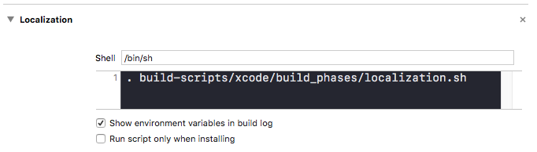
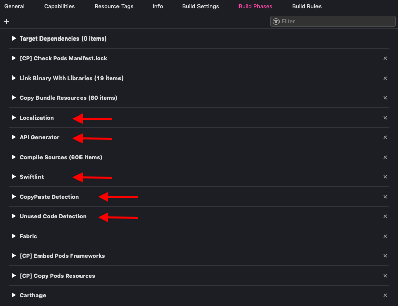
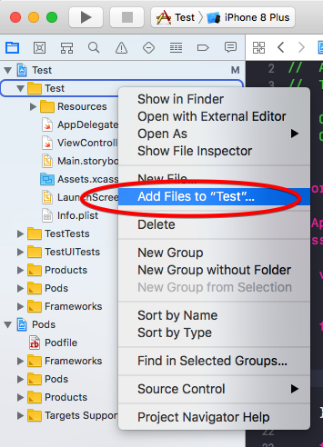
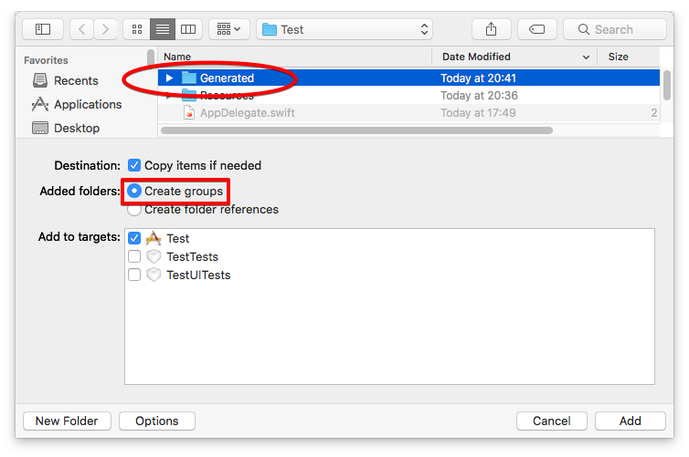
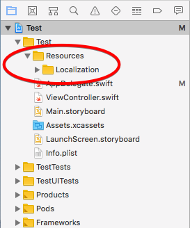
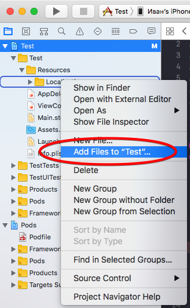
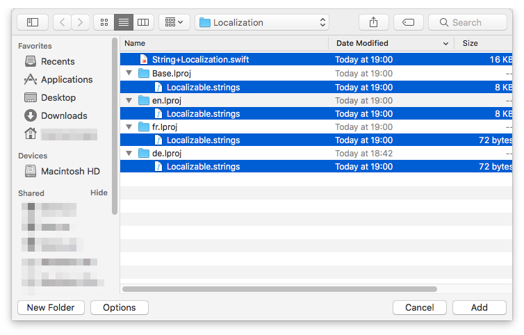

# iOS Build Scripts

## Репозиторий со скриптами

Все скрипты расположены в репозитории [BuildScripts](https://github.com/TouchInstinct/BuildScripts/tree/master/xcode) в папке xcode. Каждый скрипт располагается в отдельном файле с расширением \*.sh или \*.php. Скрипты расположены в папках build_phases и aux_scripts в зависимости от своего предназначения - скрипты билд фаз и вспомогательные скрипты соответственно.

## Добавление build phase в проект

Чтобы добавить скрипт в проект, создайте build phase и напишите в поле для скрипта следующее:
```
. build-scripts/xcode/build_phases/<название скрипта>.sh <параметр>
```
Например, для того, чтобы добавить скрипт для локализации, напишите:

<div align="center"></div>

Необходимо добавить в проект следующие билд фазы:
- Localization (localization.sh)
- API Generator (api_generator.sh)
- Swiftlint (swiftlint.sh)
- CopyPaste Detection (copy_paste_detection.sh)
- Unused Code Detection (unused.sh)

<div align="center"></div>

## Api Generator build phase

> Для исполнения апи генератора должна быть установлена **Java**

Билд фаза апи генератора загружает jar файл по ссылке, сохраняет его как api-generator.jar в папку Downloads внутри папки проекта, и выполняет его. Папку Downloads необходимо добавить в gitignore.
Для загрузки файла используется скрипт download_file.sh.

Создайте билд фазу, назовите ее API Generator, пропишите в ней:
```
. build-scripts/xcode/build_phases/api_generator.sh generator_version
```

`generator_version` - версия апи генератора, которую вы хотите использовать.
Доступные версии апи генератора перечислены [здесь](https://dl.bintray.com/touchin/touchin-tools/ru/touchin/api-generator/).

Соберите проект. Нажмите правой кнопкой по папке проекта и выберите "Add Files to...":

<div align="center"></div>

В открывшемся окне выберите папку Generated, нажмите Options, убедитесь, что в поле Added folders выбрано Create groups. Нажмите Add.

<div align="center"></div>

## Localization build phase

Создайте билд фазу, назовите ее Localization, пропишите в ней:
```
. build-scripts/xcode/build_phases/localization.sh
```

После создания билд фазы необходимо добавить в проект папку Resources, затем в Resources добавить папку Localization.

<div align="center"></div>

Соберите проект. Если указанные выше папки не существуют, появится соответствующая ошибка. Если все прошло успешно, необходимо добавить сгенерированные файлы в проект.

Нажмите правой кнопкой по папке Localization и выберите "Add Files to...":

<div align="center"></div>

Раскройте все папки \*.lproj, выделите файлы \*.strings и файл String+Localizations.swift, нажмите Add.

<div align="center"></div>

## Swiftlint build phase

Создайте билд фазу, назовите ее Swiftlint, пропишите в ней:
```
. build-scripts/xcode/build_phases/swiftlint.sh
```

Добавьте в Podfile:
```
pod 'SwiftLint'
```

## Copy Paste Detection build phase

Создайте билд фазу, назовите ее CopyPaste Detection, пропишите в ней:
```
. build-scripts/xcode/build_phases/copy_paste_detection.sh
```

Выполните в терминале следующую команду, чтобы установить [PMD](https://pmd.github.io/):
```
brew install pmd
```

PMD содержит Copy/Paste Detector, на основе которого работает данная билд фаза.

## Unused Code Detection build phase

Создайте билд фазу, назовите ее Unused Code Detection, пропишите в ней:
```
. build-scripts/xcode/build_phases/unused.sh
```
Также через пробел можно указать регулярные выражения для исключения файлов из проверки. Например, чтобы исключить из проверки папку *Appearance* и все файлы, оканчивающиеся на *Extensions.swift*, пропишите:

```
. build-scripts/xcode/build_phases/unused.sh  Appearance/ *Extensions.swift
```

## Скрипт для загрузки файлов

Это вспомогательный скрипт. Его не нужно подключать как билд фазу. В случае возникновения потребности, вы можете его использовать в других скриптах.

Скрипт используется для загруки апи генератора, но может быть использован для загрузки любого файла.
Просто вызовите его в своем скрипте с необходимыми параметрами. 

Скрипт принимает два параметра:
1. Имя файла. С этим именем файл будет сохранен в папке Downloads.
2. Ссылка на файл.

Пример вызова скрипта:
```
. build-scripts/xcode/aux_scripts/download_file.sh "my_file.txt" "https://<адрес>/text_file.txt"
```

## Documentation Generator build phase

Создайте билд фазу, назовите ее Documentation Generator, пропишите в ней:
```
. build-scripts/xcode/build_phases/documentation_generator.sh
```

В папке проекта создайте папку Certificates. В этой папке создайте папки, соответствующие конфигурациям проекта, например: Standard, Enterprise, Store. В каждой из этих папок создайте по две папки: Certificates и Profiles.

Допустим, у вас в приложении два таргета: само приложение и виджет. В таком случае создайте в папке Profiles две папки под каждый таргет: App и Widget. В каждую из этих папок сложите соответствующие профайлы.

Теперь займемся папкой Certificates. Для каждой конфигурации эта папка должна содержать как минимум одну папку App. Если у вас в приложении есть пуши, то добавьте еще папку Push. В каждую из папок App и Push добавьте соответствующие сертификаты (имеется в виду приватный ключ для сертификата).

Также в каждую папку c профайлом положите файл description.txt, в него запишите bundle id для соответствующей конфигурации. Например, для Certificates/Standard/Profiles/App/description.txt содержимое файла будет: "Bundle ID: ru.touchin.appname".

Если сертификат для какой-то конфигурации имеет пароль, вы также создаете файл с именем description.txt и кладете в соответствующее место. Например, для Certificates/Standard/Certificates/Push/description.txt содержимое файла будет: "Пароль: 123".

Файл description.txt может содержать произвольную информацию. Но для пароля и bundle id придерживайтесь приведенных примеров. Для всего остального - пишите обычным текстом без перевода строк.

Таким образом, иерархия корневой папки Certificates будет выглядеть примерно так, как показано ниже. Обратите внимание, что именование сертификатов и профайлов следует определенному соглашению. Вам НЕ нужно вручную их переименовывать. Скрипт при генерации readme переименовывает файлы в соответветсвии с соглашением автоматически.

```
AppName-ios
└─Certificates
  ├─ Standard
  │  ├─ Certificates
  │  │  ├─ App
  │  │  │  └─ AppNameAppStandardCert.p12
  │  │  └─ Push
  │  │     ├─ AppNamePushStandardCert.p12
  │  │     └─ description.txt
  │  └─ Profiles
  │     ├─ App
  │     │  ├─ AppNameAppStandardProfile.mobileprovision 
  │     │  └─ description.txt 
  │     └─ Widget
  │        └─ AppNameWidgetStandardProfile.mobileprovision
  ├─ Enterprise
  │  ├─ Certificates
  │  │  ├─ App
  │  │  │  └─ AppNameAppEnterpriseCert.p12
  │  │  └─ Push
  │  │     └─ AppNamePushEnterpriseCert.p12
  │  └─ Profiles
  │     ├─ App
  │     │  └─ AppNameAppEnterpriseProfile.mobileprovision  
  │     └─ Widget
  │        └─ AppNameWidgetEnterpriseProfile.mobileprovision
  ├─ Store
  │  ├─ Certificates
  │  │  ├─ App
  │  │  │  └─ AppNameAppStoreCert.p12
  │  │  └─ Push
  │  │     └─ AppNamePushStoreCert.p12
  │  └─ Profiles
  │     ├─ App
  │     │  └─ AppNameAppStoreProfile.mobileprovision  
  │     └─ Widget
  │        └─ AppNameWidgetStoreProfile.mobileprovision
  └─ ...
```

Соберите проект, скрипт сгенерирует файл README.md в папке Certificates с описанием и ссылками на сертификаты и профайлы.

Если вы не можете найти сертификат или профайл для какого-то таргета какой-то конфигурации, обратитесь к iOS-лиду.
