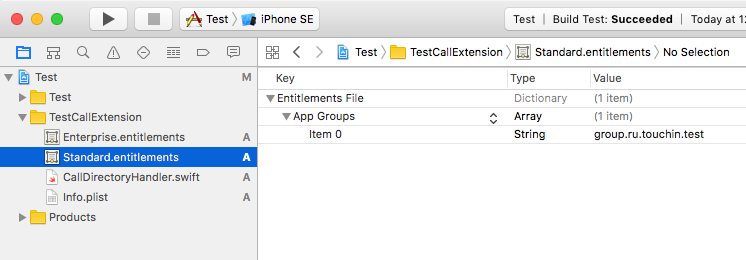

# Использование CallKit для определения номеров
В руководстве приняты следующие соглашения и определения:

**Test** – название проекта в Xcode
<br>**Extension** – Call Directory Extension
<br>**Расширение** – Swift extension

## Добавление Call Directory Extension в проект

> Первым делом добавим в проект **Call Directory Extension** и сгенерируем для него *provisioning profiles*. На данном этапе содержимое *extension'а* нас не интересует. К нему вернемся позже.

1. В меню **Xcode** выберите *File > New > Target...* В разделе *Application Extension* выберите *Call Directory Extension*, нажмите *Next*.
<div align="center"></div>
<br>

2. В поле *Product Name* введите название для extension'а, например **TestCallExtension**, нажмите *Finish*.
<div align="center"></div>
<br>

3. В появившемся алерте нажмите *Activate*.
<div align="center"></div>
<br>

4. В [аккаунтах разработчика](https://developer.apple.com/account/) необходимо создать *App IDs* с *Name* **TestCallExtension** и соответствующие им *Provisioning Profiles* для обоих конфигураций.

   | Account      | Конфигурация | ID                              | Provisioning Profile               |
   | ------------ | ------------ | ------------------------------- | ---------------------------------- |
   | Development  | Standard     | ru.touchin.test.call-extension  | TestCallExtensionDevProfile        |
   | Distribution | Enterprise   | сom.touchin.test.call-extension | TestCallExtensionEnterpriseProfile |

   
   Сгенерируйте *Provisioning Profiles* и добавьте их в *TARGET* **TestCallExtension**.

5. В *Project navigator* кликните по проекту **Test**, выберите **TestCallExtension** среди *TARGETS*. Введите в *Bundle Identifier* **ru.touchin.test.call-extension**, чтобы удовлетворить **Xcode**.
<div align="center"></div>
<br>

6. Перейдите на вкладку *Build Settings* введите в поиск *bundle identifier*, раскройте пункт *Product Bundle Identifier* и введите идентификаторы в соответствии с конфигурациями.
<div align="center"></div>
<br>


## Создание App Group

> Хранить телефонные номера и имена контактов будем в файле. Для того, чтобы доступ к файлу имели как приложение, так и extension, создадим App Group.

1. Вернитесь в [аккаунт](https://developer.apple.com/account/). Откройте *App Groups* из раздела *Identifiers*. Нажмите *Add*.
2. Введите **TestGroup** в поле *Description*, заполните поле *ID* в соответствии с таблицей. Нажмите *Continue > Register > Done*.

   | Account      | Конфигурация | ID                     |
   | ------------ | ------------ | ---------------------- |
   | Development  | Standard     | group.ru.touchin.test  |
   | Distribution | Enterprise   | group.com.touchin.test |

<div align="center"></div>
<br>

3. Включите созданную *App Group* в *App IDs* приложения и extension'а.

4. Перегенерируйте *Provisioning Profiles* приложения и extension'а и обновите *provisioning profiles* в **Xcode**.

5. Настроим *App Groups* в **Xcode**.
   <br>5.1. В *Project navigator* кликните по проекту **Test**, выберите **TestCallExtension** среди *TARGETS*, перейдите на вкладку *Capabilities*, найдите *App Groups* и включите. В *Project navigator* в папке **TestCallExtension** появится файл **TestCallExtension.entitlements**.
   <br>5.2. Однако, нам необходимо создать файлы *.entitlements* для каждой конфигурации. Поэтому откройте папку **TestCallExtension** в **Finder**, скопируйте файл **TestCallExtension.entitlements** в эту же папку. Назовите один из файлов – **Standard.entitlements**, второй – **Enterprise.entitlements**.
   <br>5.3. Вернитесь в **Xcode**, удалите файл **TestCallExtension.entitlements** и добавьте **Standard.entitlements** и **Enterprise.entitlements**.
   <div align="center"></div>

   <br>5.4. Откройте файл **Standard.entitlements**, нажмите *+* напротив *App Groups*, введите value – *group.ru.touchin.test*.
   Откройте файл **Enterprise.entitlements**, нажмите *+* напротив *App Groups*, введите value – *group.com.touchin.test*.
   <div align="center"></div>

   <br>5.5. В *Project navigator* кликните по проекту **Test**, выберите **TestCallExtension** среди *TARGETS*, перейдите на вкладку *Build Settings*, введите в поиск *entitlements*, раскройте пункт *Code Signing Entitlements*, для *Standard* конфигурации измените значение на **TestCallExtension/Standard.entitlements**, для *Enterprise* – на **TestCallExtension/Enterprise.entitlements**.
   <div align="center"></div>


## Хранение номеров и имен

> Данные будут храниться в файле. Представленная далее структура файла приводится в иллюстративных целях и может быть заменена более эффективной.

   ```
   [String: Телефон],[String: Имя]\n
   79134058697,Иванов Петр Петрович\n
   79640982354,Сергеев Иван Николаевич\n
   79982434663,Николаев Андрей Михайлович\n
   ```

   Вместо запятой используйте символ, который с высокой вероятностью не будет введен пользователем, например, "\u{D7FF}".

   Записывая данные в файл имейте в виду, что когда вы будете читать их в extension'е (об этом немного позже), номера не должны повторяться и должны быть отсортированы в порядке возрастания. В противном случае – *extension* упадет. Таким образом, лучше сразу записывать данные в отсортированном виде. 


## Call Directory Extension

1. Откройте **CallDirectoryHandler.swift**, найдите следующую функцию:
   ```swift
   private func addIdentificationPhoneNumbers(to context: CXCallDirectoryExtensionContext) throws {
        // Retrieve phone numbers to identify and their identification labels from data store. For optimal performance and memory usage when there are many phone numbers,
        // consider only loading a subset of numbers at a given time and using autorelease pool(s) to release objects allocated during each batch of numbers which are loaded.
        //
        // Numbers must be provided in numerically ascending order.
        let phoneNumbers: [CXCallDirectoryPhoneNumber] = [ 18775555555, 18885555555 ]
        let labels = [ "Telemarketer", "Local business" ]

        for (phoneNumber, label) in zip(phoneNumbers, labels) {
            context.addIdentificationEntry(withNextSequentialPhoneNumber: phoneNumber, label: label)
        }
   }
   ```
   > Функция *addIdentificationPhoneNumbers* выполняется каждый раз, когда пользователь включает идентификацию вызовов в настройках системы, а также когда вызываетcя функция *reloadExtension* в коде приложения (использование этой функции обсуждается в последующих разделах).

2. Убедимся, что extension работает. 
   <br>2.1. Удалите текущие номера из массива *phoneNumbers* и добавьте туда свой, очистите массив *labels* и запишите туда свое имя:
   ```swift
   let phoneNumbers: [CXCallDirectoryPhoneNumber] = [ 79819810349 ]
   let labels = [ "Анастасия Малышева" ]
   ```
   <br>2.2. Поставьте приложение на устройство.
   <br>2.3. Перейдите в *Настройки > Телефон > Блокировка и идентификация вызова*. Переведите переключатель в состояние ВКЛ для вашего приложения.
   <br>2.4. Позвоните на устройство со своего номера, номер должен определиться.
   <div align="center"></div>

3. Подготовим extension для работы с нашей структурой файла. Перепишите функцию *addIdentificationPhoneNumbers* следующим образом:
   ```swift
   private func addIdentificationPhoneNumbers(to context: CXCallDirectoryExtensionContext) throws {
       guard let phoneEntriesFilePath = FileManager.default.phoneEntriesFile?.path,
             let reader = LineReader(path: phoneEntriesFilePath) else {
           return
       }

       var lastPhone: Int64 = 0
       for line in reader {
           autoreleasepool {
               var components = line.trimmingCharacters(in: .whitespacesAndNewlines).components(separatedBy: "\u{D7FF}")
               let phone = Int64(components[0]) ?? 0
               let name = components[1]
               if phone != lastPhone {
                   context.addIdentificationEntry(withNextSequentialPhoneNumber: phone, label: name)
               }
               lastPhone = phone
           }
       }
   }
   ```
   *FileManager.default.phoneEntriesFile* – путь к файлу с телефонами и именами (ниже еще вернемся к нему)<br>
   *LineReader* – класс для построчного чтения текстовых файлов, можете найти [тут](http://stackoverflow.com/a/40855152). 

   В двух словах как это работает. Построчно читаем файл. Каждая строчка, как можно было видеть в разделе, описывающем структуру файла, это телефон и имя, разделенные символом "\u{D7FF}". Наша задача разделить строку на компоненты, преобразовать строку с номером в число и передать функции *addIdentificationEntry* в качестве параметров.
   В данной реализации отстутсвует проверка успешного приведения строки к Int64. Она осуществляется в том месте, где происходит запись в файл.

   Если захотите использовать другую структуру файла и написать свою реализацию функции, необходимо иметь в виду следующие вещи. Мы очень ограничены в ресурсах на время выполнения этой функции. Конкретных данных на этот счет нет, но если использовать 10 Мб оперативной памяти, то extension падает. Представители 2GIS [пишут](https://habrahabr.ru/company/2gis/blog/323050/), что лимит – 5 Мб. В общем, чем меньше ресурсов используете, тем лучше.

   Выше упоминалось о том, что номера должны быть отсортированы в порядке возрастания. Это обязательное условие. У вас нет ни ресурсов, ни времени, чтобы отсортировать номера прямо здесь. Также говорилось, что не должно быть дублей номеров. В данной реализации, если мы встречаем дублирующий номер, мы просто его не добавляем.

   Вернемся к *phoneEntriesFile*. Создайте расширение для FileManager и добавьте туда следующие свойства:
   ```swift
	extension FileManager {

	    var appGroupContainer: URL? {
	        guard let bundleIdPrefix = Bundle.main.prefix else {
	            return nil
	        }
	        return containerURL(forSecurityApplicationGroupIdentifier: "group.\(bundleIdPrefix).touchin.test")
	    }

	    var phoneEntriesFile: URL? {
	        return appGroupContainer?.appendingPathComponent("phoneEntriesFile")
	    }

	}

   ``` 
   *appGroupContainer* – то, ради чего мы делали *App Group*. Это то место, где будет храниться наш файл, который будет доступен и приложению и extension'у<br>
   *phoneEntriesFile* – собственно путь к этому файлу

   Также нам понадобится *extension* для *Bundle*:
   ```swift
	extension Bundle {

	    var prefix: String? {
	        return bundleIdentifier?.components(separatedBy: ".").first
	    }

	}
   ```
   Свойство prefix вернет нам "ru" или "com" в зависимости от текущей конфигурации. 


## Запись данных для определителя

Для удобства создадим *typealias*, описывающий каждую запись файла:
```swift
typealias Phone = (Int64, String)
```
Также нам понадобится класс, который запишет наши данные в файл:
```swift
class CallKitService {

    static let shared = CallKitService()
    private init() {}

    func save(phones: [Phone]) {
        let sorted = phones.sorted(by: { phone1, phone2 in
            return phone1.0 < phone2.0
        })
        writeCallKitFile(phones: sorted)
    }

    fileprivate func writeCallKitFile(phones: [Phone]) {
        if let fileUrl = FileManager.default.phoneEntriesFileURL {
            var string = ""

            for phone in phones {
                autoreleasepool {
                    string += String(phone.0) + "\u{D7FF}" + phone.1 + "\n"
                }
            }
            do {
                try string.write(to: fileUrl, atomically: true, encoding: .utf8)
            } catch { }
        }

        if let bundleIdPrefix = Bundle.main.prefix {
    		CXCallDirectoryManager.sharedInstance.reloadExtension(withIdentifier: "\(bundleIdPrefix).touchin.test.call-extension")
    	}
    }

}
```
Использовать следующим образом:
```swift
CallKitService.shared.save(phones: phones)
```
Сперва записи будут отсортированы, а затем записаны в файл. Вам нужно лишь подать на вход массив объектов *Phone*.


## Обновление данных для определителя

Если в процессе использования приложения поменялись какие-то даннные, будь то номера или имена, или произошло добавление/удаление контакта, то необходимо перезаписать файл и вызвать функцию *reloadExtension*.
```swift
CXCallDirectoryManager.sharedInstance.reloadExtension(withIdentifier: String)
```

Параметр *withIdentifier* – это *bundle identifier* extension'а. А как известно, у нас их (идентификаторов) два. То есть мы не можем просто написать "ru.touchin.test.call-extension" или "com.touchin.test.call-extension". Префикс bundle'а зависит от текущей конфигурации, ранее мы написали extension для *Bundle* со свойством *prefix* для его получения. 
Когда захотите обновить данные для определителя, выполните следующий код:
```swift
if let bundleIdPrefix = Bundle.main.prefix {
    CXCallDirectoryManager.sharedInstance.reloadExtension(withIdentifier: "\(bundleIdPrefix).touchin.test.call-extension")
}
```

Рассмотрим ситуацию, когда в нашем приложении мы можем редактировать имена и телефоны, добавлять новые или удалять старые контакты. Разумеется, мы хотим, чтобы в определителе номеров эти данные также изменились. Добавим расширение для нашего *CallKitService*:
```swift
extension CallKitService {

    func update(oldPhones: [String],
                newPhones: [String],
                oldFullName: String? = nil,
                newFullName: String) {
        var array = [String]()

        autoreleasepool {
            guard let phoneEntriesFilePath = FileManager.default.phoneEntriesFileURL,
                let string = try? String(contentsOf: phoneEntriesFilePath) else {
                    return
            }
            array = string.components(separatedBy: "\n")
        }

        array.remove(at: array.count - 1)
        var phones = [Phone]()
        for entry in array {
            autoreleasepool {
                var components = entry.components(separatedBy: "\u{D7FF}")
                phones.append((Int64(components[0]) ?? 0, components[1]))
            }
        }

        for phone in oldPhones {
            guard let oldPhone = phone.validPhoneNumber else {
                continue
            }

            var index = phones.binarySearch { $0.0 < oldPhone }

            while phones[index].1 != oldFullName ?? newFullName {
                index += 1
            }

            phones.remove(at: index)
        }

        for phone in newPhones {
            guard let newPhone = phone.validPhoneNumber else {
                continue
            }

            var index = phones.binarySearch { $0.0 < newPhone }

            if index < phones.count {
                while phones[index].0 == newPhone {
                    index += 1
                }
            }

            let entry = (newPhone, newFullName)
            phones.insert(entry, at: index)
        }

        writeCallKitFile(phones: phones)
    }

}
```
Реализацию бинарного поиска можно взять [тут](http://stackoverflow.com/a/33674192).
Как это работает? Сначала мы считываем данные из существующего файла в массив. Затем удаляем из массива старые данные и добавляем новые. В конце пишем данные в файл, заменяя его, и вызываем *reloadExtension*.

Параметры функции:
<br>*oldPhones* – массив, содержащий номера контакта до редактирования
<br>*newPhones* – массив, содержащий номера контакта после редактирования
<br>*oldFullName* – имя контакта до редактирования (пригодится для случая, когда одновременно были отредактированны и имя и телефон)
<br>*newFullName* – имя контакта после редактирования

То есть сначала мы находим и удаляем oldPhones. То есть все телефоны контакта до того момента, как он был отредактирован.
Затем находим место для вставки (нам нужно поддерживать номера отсортированными) и вставляем newPhones, то есть все телефоны контакта, которыми он обладает на момент после редактирования.

Допустим, у контакта были два номера 79999999999 и 78888888888, он отредактировал первый. Теперь у него следующие номера - 79999999911 и 78888888888.
<br>oldPhones = [79999999999, 78888888888]
<br>newPhones = [79999999911, 78888888888]

Сначала удалим первые два, потом добавим вторые два. Может возникнуть вопрос. Второй-то номер мы не меняли, зачем производить лишние действия – удалять, а затем добавлять неизмененный номер? Дело в том, что пользователь может за одно редактирование добавить номера, удалить и отредактировать. И отслеживать то, какой был добавлен, какой удален, какой отредактирован, усложнило бы реализацию.