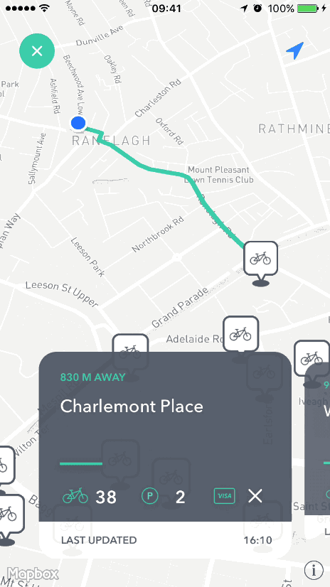
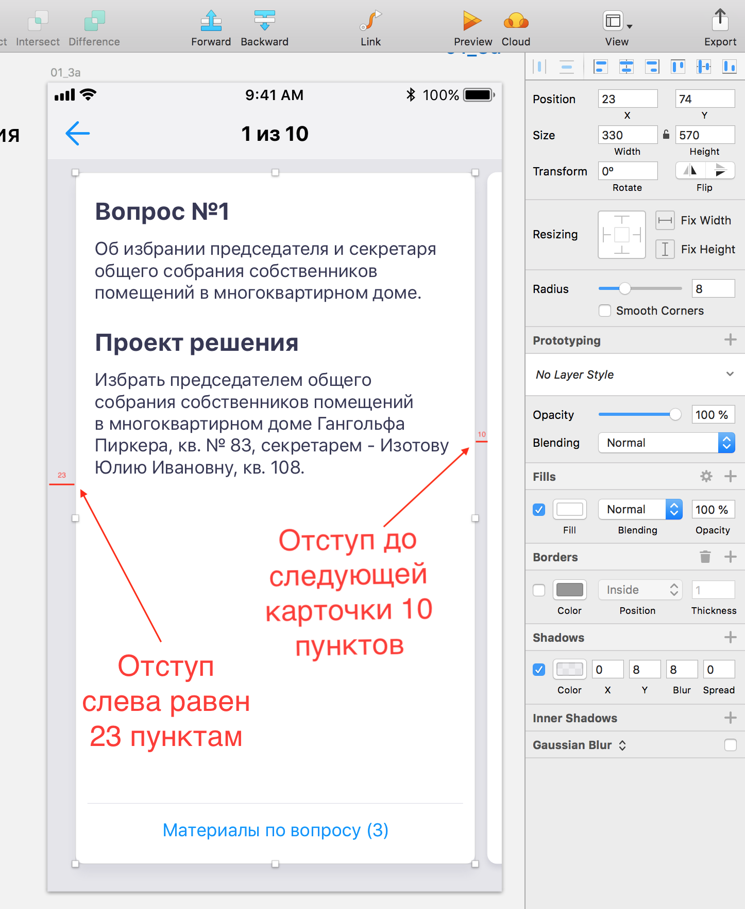

# Carousel. Или настройка карточного интерфейса в проекте

Пример представлен ниже.

 

## Проблема

Когда дизайнеры рисуют такой карточный интерфейс, когда карточка **занимает не весь экран**, и **состояние первой карточки отличается от последующих**, тут возникает проблема того, как это скроллить и центрировать. 

В остальных случаях одинаковых карточек, проблема не возникает, и можно смело использовать `isPagingEnabled = true`.

## Решения

Вот Вы столкнулись с такой проблемой и смогли быстро найти следующие решения (список не полный, но довольно исчерпывающий):

- Переписать(`override`) какой-либо метод либо в делегате коллекции, либо в layout коллекции. Пробовали, ничего путного не вышло, вышло точнее, но скроллинг для пользователя был ужасный.
- Сделать волшебные отступы на каждую ячейку и на всю секцию. Тоже пробовали, пошло по плохому лейауту, в итоге оно будет съезжать

Наиболее приятным решением для пользователя выступает невидимое `UIScrollView`, которое кладется поверх коллекции с включенным `paging`(флингом) по размеру карточки.

## Реализация

- подключить **ScalingCarousel**:
	- подключить как [библиотеку](https://github.com/superpeteblaze/ScalingCarousel) принятым способом на проекте (пусть будут CocoaPods)
	- скопировать в проект три файла библиотеки. Это более предпочтительный способ, поскольку придется поправить прозрачность или размеры при уходе карточки с экрана.
- унаследоваться от `ScalingCarouselCell`
- установить свойство `contentView` в `mainView` класса `ScalingCarouselCell` через код или ксиб
- добавить на `mainView` еще `UIView`, которая и будет вашей карточкой из дизайна. Будем называть **innerView**
- посчитать размеры и установить их

# Расчет размера
	
- Допустим в дизайне отступ слева до первой карточки будет **X**, а между карточками **Y**

- Свойство `inset` на `ScalingCarouselView` принимается равным **= X - (Y / 2)**
- Отступы от краев **innerView** до родительской `UIView` принимаются равными **= Y / 2**
- Расчет окончен

## Пример

Принимаем, что **X = 23, Y = 10**

- Свойство `inset` на `ScalingCarouselView` будет равно **18**
- Отступы слева и справа для **innerView** будут по **5**

 

