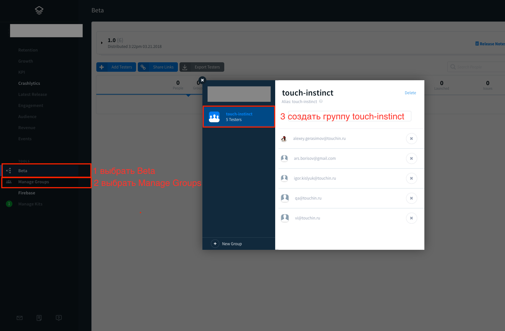

Fabric можно настроить при помощи десктопного приложения или без него. Оба способа займут примерно одинаковое время.

Приложения в Fabric привязываются к организации. У каждой организации имеется уникальный API Key и Build Secret.

## Создание организации в Fabric

Вне зависимости от выбранного способа установки для начала необходимо создать новую организацию в настройках Fabric. Для этого нужно:

- Авторизоваться на сайте [Fabric.io](https://fabric.io/)
- Зайти в раздел _Settings → [Organizations](https://fabric.io/settings/organizations)_
- Нажать на кнопку _+ Add_, ввести имя организации, нажать _Enter_ на клавиатуре
- После этого пригласить в созданную организацию обязательно **технического директора, менеджера проекта, руководителей команд разработки**

## Подключение к проекту с помощью десктопного приложения Fabriс

##### 1. Установить десктопное приложение Fabric 
Скачать его можно [здесь](https://www.fabric.io/downloads/apple). После скачивания запустить приложение и авторизоваться в нем.

##### 2. Выбрать нужный воркспейс
В приложении в правом верхнем углу выбрать _+ New App_, выбрать воркспейс проекта, нажать на кнопку _Next_

___Важно!__ В проекте должны быть настроены [pod](Guides/Cocoapods_Usage_StyleGuide.md)'ы, иначе в дальнейшем фреймворки Crashlytics и Fabric будут добавлены непосредственно в проект. Выбирать на этом шаге нужно именно воркспейс, а не проект._

##### 3. Выбрать организацию
В появившемся списке организаций выбрать нужную, нажать кнопку _Next_

##### 4. Установить Kit
Нажать на кнопку _Install_ напротив _Crashlytics_.

##### 5. Выбрать установку через Podfile

Для установки pod'ов:
- Добавить в Podfile 

```
pod 'Fabric'
pod 'Crashlytics'
```
- Запустить команду 
```
pod install --repo-update
```
- Нажать на кнопку _Next_ в приложении Fabric

##### 6. Добавить скрипт запуска в Build Phases

- Скопировать команду, сгенерированную приложением
- Открыть проект в _Xcode_
- В _Project navigator_ кликнуть по названию проекта, выбрать target - текущий проект, вкладка _Build Phases_ 
- Нажать на __+__ в левом верхнем углу, выбрать _New Run Script Phase_
- Назвать скрипт __Fabric__, в текст вставить скопированную команду

Пример команды:
```
"${PODS_ROOT}/Fabric/run" d92f7e2cc6513cee3832d1653f813a8143f94e64 449cd12373d290be68eacb16224344d8d9a95c994612964f803a2ae32638dfc5
```

__Важно!__ Если вы создавали проект через скрипт, то build phase уже была создана. Единственное, что необходимо сделать на этом шаге, это заменить текст скрипта на тот, что сгенерировал fabric, и перетащить build phase __Fabric__ в самый конец.

- Запустить проект

##### 7. Инициализировать Fabric

В файле __AppDelegate.swift__

- Импортировать библиотеки
``` swift
import Fabric
import Crashlytics
```
- В методе _application didFinishLaunchingWithOptions_ инициализировать Fabric
``` swift
func application(_ application: UIApplication, didFinishLaunchingWithOptions launchOptions: [UIApplicationLaunchOptionsKey: Any]?) -> Bool {
      Fabric.with([Crashlytics.self])
      return true
}
```

##### 8. Запустить проект 
После запуска проект отобразится в приложении Fabric. Нажать на кнопку _Done_ для завершения настройки проекта.

## Подключение к проекту через Cocoapods

##### 1. Установить [pod](Guides/Cocoapods_Usage_StyleGuide.md)'ы Fabric и Crashlytics

Для этого:
- Добавить в Podfile 

```
pod 'Fabric'
pod 'Crashlytics'
```
- Запустить команду 
```
pod install --repo-update
```

##### 2. Добавить скрипт запуска в Build Phases

- В _Project navigator_ кликнуть по названию проекта, выбрать target - текущий проект, вкладка _Build Phases_ 
- Нажать на __+__ в левом верхнем углу, выбрать _New Run Script Phase_
- Назвать скрипт __Fabric__, в текст вставить
```
"${PODS_ROOT}/Fabric/run" API_Key Build_Secret
```
заменив __API_Key__ и __Build_Secret__ на необходимые ключи

__Важно!__ Если вы создавали проект через скрипт, то build phase уже была создана. Единственное, что необходимо сделать на этом шаге, это заменить __API_KEY_FROM_FABRIC__ и __Build_Secret__ на ключи из fabric, и перетащить build phase __Fabric__ в самый конец.

##### 3. Обновить Info.plist

- Выбрать в _Project navigator_ файл Info.plist, кликнуть по нему правой кнопкой мыши и выбрать _Open as_ → _Source Code_
- Вставить в Info.plist следующие строки, заменив __API_Key_Number__ непосредственно на ключ API Key
``` xml
  <key>Fabric</key>
  <dict>
    <key>APIKey</key>
    <string>API_Key_Number</string>
    <key>Kits</key>
    <array>
      <dict>
        <key>KitInfo</key>
        <dict/>
        <key>KitName</key>
        <string>Crashlytics</string>
      </dict>
    </array>
  </dict>
```

__Важно!__ Если вы создавали проект через скрипт, то в Info.plist уже были добавлены нужные строки. Единственное, что необходимо сделать на этом шаге, это заменить __API_KEY_FROM_FABRIC__ на  ключ из fabric.

##### 4. Инициализировать Fabric

В файле __AppDelegate.swift__

- Импортировать библиотеки
``` swift
import Fabric
import Crashlytics
```
- В методе _application didFinishLaunchingWithOptions_ инициализировать Fabric
``` swift
func application(_ application: UIApplication, didFinishLaunchingWithOptions launchOptions: [UIApplicationLaunchOptionsKey: Any]?) -> Bool {
      Fabric.with([Crashlytics.self])
      return true
}
```

##### 5. Запустить проект 

После запуска удостовериться, что он появился в [списке проектов](https://fabric.io/settings/apps) в настройках Fabric.

## API Key и Build Secret

Оба ключа можно найти в настройках Fabric, выбрав в [списке организаций](https://fabric.io/settings/organizations) нужную. 
Под названием организации будут ссылки API Key и Build Secret, при клике на которые отобразится выбранный ключ. 

Кроме того, все указанные скрипты с необходимыми ключами можно скопировать [отсюда](https://fabric.io/kits/ios/crashlytics/install), предварительно убедившись, что выбрана нужная организация.

## Настройка приложения на портале

- **Обязательно** после создания **каждого приложения** создать группу `touch-instinct` и добавить в нее тестирововщиков, менеджеров, разработчиков – всех участников процесса разработки

<div align="center"></div>
