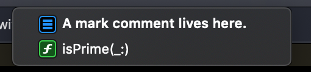
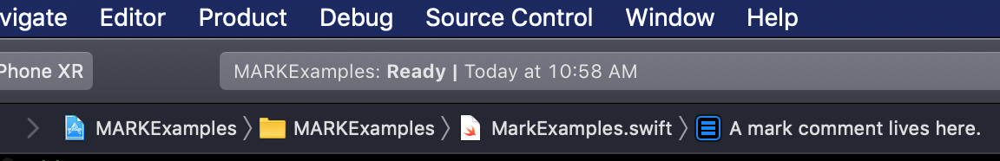

# Гайд по базовому оформлению файла

### Содержание
* [Композиция файла](#Композиция)
* [Нейминг](#Нейминг)
* [Расстановка меток](#Расстановка-меток)
* [Константы](#Константы)
* [Отступы](#Отступы)
* [Пример оформленного файла](#Пример-оформленного-файла)

## Композиция файла
Композиция любого файла (будь то файл контроллера, ячейки, или любого другого `view`) выстраивается в соответствии со следующей рекомендацией к порядку переменных, методов и расширений.

```swift
private let
private var
let
var
init()
override func ()
func ()
private func ()

extension
private extension
```
Внутри `extension` придерживаемся тех же правил.

## Нейминг

Для ознакомления с принятым внутри компании код-стайлом и неймингом лучше всего обратиться к [The Official Touch Instinct Swift Style Guide](https://github.com/TouchInstinct/team/blob/master/iOS/CodeStyles/Code-Style-Swift.md#naming). 

## Расстановка меток

Метки - `// MARK: - Mark Name` - в Swift работают так же, как `#pragma mark -` в Objective-C и служат для удобства навигации и поиска раздела кода внутри файла, внутри проекта и в т.ч. на `GitHub`. Для этого можно воспользоваться quick jump bar'ом и увидеть более подробную информацию о коде.

**Пример метки**

    // MARK: - A mark comment lives here.

    func isPrime(_ value: UInt) -> Bool { return true }



Марк также отображается в самом quick jumb bar'е в Xcode:



В наших проектах наиболее часто используются следующие метки:
```swift
// MARK: - Properties
// MARK: - Views
// MARK: - Init
// MARK: - Functions
// MARK: - Life Cycle
// MARK: - Configuration
// MARK: - Public
// MARK: - Private
// MARK: - Constants
// MARK: - InitializableView
// MARK: - ConfigurableView
```

## Константы

Константы в коде используются во избежание так называемых «magic numbers», то есть магических чисел, неизвестно откуда взявшихся и не понятно на что влияющих.

1. Если речь идёт о *глобальной константе*, которая многократно встречается на нескольких экранах, - она выносится в список глобальных констант - `Constants` (они, как правило, описаны в отдельном файле).<br>
Например, такой константой может быть горизонтальный отступ от края экрана, стандартный размер иконки или высота разделителя ячеек в таблице и т.д., в зависимости от макетов.
```swift
// MARK: - Layout Constants
enum Constants {
    /// 16 pt
    static let defaultCornerRadius: CGFloat = 16  

}
```
<br>

2. Если константа используется только *на одном экране* (в одном файле), но при этом *несколько раз*, она выносится в локальное расширение `Constants`.
```swift
// MARK: - Constants
private extension Constants {
    static let inputViewHeight: CGFloat = 60
}
```

* В расширение `Constants` также выносятся *неочевидные значения констант* (которые не обозначены на макете и вычисляются через другие, также вынесенные в `enum`).
    > Вспомогательные константы *могут не использоваться напрямую в коде*, а служить только для вычисления значения неочевидной константы.<br>
    Вынос magic numbers в константы делается для того, чтобы был понятен ход мысли при вычислениях, что позволит быстро изменить те или иные размеры и отступы при необходимости.

```swift
private extension Constants {

    // вспомогательные константы, используемые для вычисления accessoryIconInsets
    // не используются напрямую в коде
    static let iconBottomInset: CGFloat = 16
    static let iconSize: CGFloat = 16
    
    // неочевидная константа, которая не обозначена на макете
    static let accessoryIconInsets = UIEdgeInsets(top: inputViewHeight - iconSize - iconBottomInset,
                                                  left: 30,
                                                  bottom: iconBottomInset,
                                                  right: 0)
}
```
<br>

3. Исключением являются константы, используемые единожды внутри файла: они записываются числом (например, размер иконки по макету).
```swift
iconImageView.snp.makeConstraints { make in
    make.size.equalTo(16)
}
```
<br>

Помимо структуры Constants, константы можно добавлять в `extension CGFloat / Int / String` etc. Зачастую, это удобнее.

```swift
extension CGFloat {
    static let iconWidth: CGFloat = 16
}
```
    
## Отступы

В общем случае для расстановки корректных отступов в файле можно использовать последовательные сочетания клавиш `command + a`, `control + i`. Но есть и исключения.<br>

**Пример 1.** Выравнивание при помощи `control + i` даёт следующий результат:
```swift
viewModel.feeService.getSendingFee()
    .observeOn(MainScheduler.instance)
    .subscribe(onSuccess: { [weak self, walletType] response in
        self?.onResultsSendingFeeState(result: response, walletType: walletType)
        }, onError: { [weak self] error in
            self?.onErrorSendingFeeState(error: error)
    })
    .disposed(by: disposeBag)
```
Однако, код более читаем со следующими отступами:
```swift
viewModel.feeService.getSendingFee()
    .observeOn(MainScheduler.instance)
    .subscribe(onSuccess: { [weak self, walletType] response in
        self?.onResultsSendingFeeState(result: response, walletType: walletType)
    }, onError: { [weak self] error in
        self?.onErrorSendingFeeState(error: error)
    })
    .disposed(by: disposeBag)
```
<br>

**Пример 2.** Выравнивание при помощи `control + i`:
```swift
[
    autoexchangeAction,
    hideAction,
    cancelAction
    ]
    .compactMap { $0 }
    .forEach { alert.addAction($0) }
```
И более предпочтительный вариант выравнивания:
```swift
[
    autoexchangeAction,
    hideAction,
    cancelAction
]
.compactMap { $0 }
.forEach { alert.addAction($0) }
```

## Пример оформленного файла

```swift
import UIKit
import LeadKit
import SnapKit

final class AssistantHeaderView: UIView, ConfigurableView {

    // MARK: - Views

    private let headerLabel = UILabel()
    private let businessAssistantLabel = UILabel()
    private let callToActionLabel = UILabel()

    override class var requiresConstraintBasedLayout: Bool {
        return true
    }

    // MARK: - Init

    override init(frame: CGRect) {
        super.init(frame: frame)
        initializeView()
    }

    required init?(coder aDecoder: NSCoder) {
        fatalError("init(coder:) has not been implemented")
    }

    func configure(with viewModel: AssistantHeaderViewModel) {
        headerLabel.text = viewModel.header
        businessAssistantLabel.text = viewModel.buisnessAssistant
        callToActionLabel.attributedText = viewModel.callToAction.attributedStringWithLineSpacing(2)
        setNeedsUpdateConstraints()
    }
}

// MARK: - InitializableView
extension AssistantHeaderView: InitializableView {

    func addViews() {
        addSubviews(headerLabel, businessAssistantLabel, callToActionLabel)
    }
    
    func configureAppearance() {
        backgroundColor = .clear

        headerLabel.textColor = .vtbGray
        businessAssistantLabel.textColor = .vtbDarkBlue
        callToActionLabel.textColor = .vtbDarkBlue

        headerLabel.textFont = .montserratExtraLightFont(ofSize: 28)
        businessAssistantLabel.textFont = .montserratBoldFont(ofSize: 28)
        callToActionLabel.textFont = .rubikRegularFont(ofSize: 12)

        businessAssistantLabel.adjustsFontSizeToFitWidth = true

        callToActionLabel.numberOfLines = 0
    }
    
    func configureLayout() {
        headerLabel.snp.remakeConstraints { make in
            make.top.leading.trailing.equalToSuperview()
        }

        businessAssistantLabel.snp.remakeConstraints { make in
            make.top.equalTo(headerLabel.snp.bottom).offset(5)
            make.leading.trailing.equalToSuperview()
        }

        callToActionLabel.snp.remakeConstraints { make in
            let emptyText = callToActionLabel.text?.isEmpty ?? true
            let offset = emptyText ? 0 : Constants.largeInset
            make.top.equalTo(businessAssistantLabel.snp.lastBaseline).offset(offset)
            make.leading.trailing.equalToSuperview()
            make.bottom.equalToSuperview()
        }
    }
}
```

# Заключение

Соблюдение этих несложных правил позволит сократить время на код-ревью, а главное - повысит качество нашего кода.