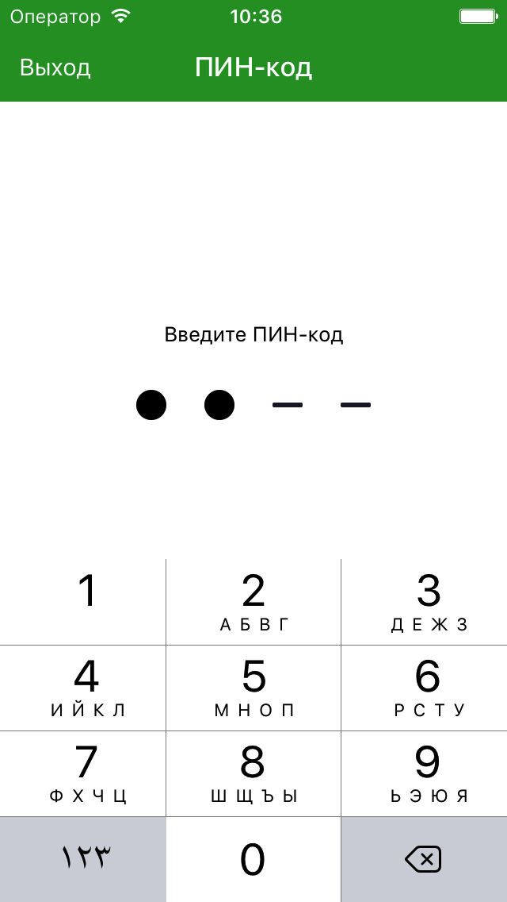

# Реализация входа в приложение по PIN-коду



- [Как добавить в проект](#Как-добавить-в-проект)
  - [Подключение cocoa pod](#Подключение-cocoa-pod)
- [Как использовать](#Как-использовать)
  - [Сервис хранения пин кода и TouchId](#Сервис-хранения-пин-кода-и-TouchId)
  - [Реализация View Contorller](#Реализация-View-Contorller)
  - [Реализация View Model](#Реализация-View-Model)
- [Пример реализации](#Пример-реализации)


## Как добавить в проект
### Подключение cocoa pod
Для добавления в проект нужно подключить pod LeadKitAdditions версии 0.0.12 или выше:

```ruby
pod LeadKitAdditions, '~> 0.0.12'
```

## Как использовать
Для реализации входа по PIN-коду в приложении необходимо использовать несколько базовых классов из LeadKitAdditions и 2 сервиса, отвечающие за безопасность хранения PIN-кода и за вход по TouchId.
### Сервис хранения пин кода и TouchId
Предложенная реализация позволяет использовать для входа в приложение PIN-код и TouchId.
#### PIN-код
Для входа по PIN-коду можно реализовать свое решение или использовать базовый класс `BasePassCodeService`. В данном базовом классе реализовано все необходимое и его можно сразу применять. Он позволяет хранить в Keychain непосредственно сам код, а также флаг, показывающий, включил ли пользователь вход по TouchId или же отказался от него. Дополнительно в нем реализована проверка на первый запуск приложения после установки. Так можно не беспокоиться за то, что PIN может сохраниться после переустановки. Интерфейс `BasePassCodeService` включает переменную класса
```swift
class var keychainService: String
```
Она позволяет получить идентификатор сервиса Keychain в котором хранится PIN-код. `BasePassCodeService` состоит из основных методов и переменных, дающих управление над сохраненными данными
```swift
// Показывет, есть ли сохраненный PIN-код
var isPassCodeSaved: Bool
// показывает, активирован ли вход по TouchId
var isTouchIdEnabled: Bool
// сохраняет новый пароль
func save(passCode: String?)
// проверяет строку на соответствие сохраненному PIN-коду
func check(passCode: String) -> Bool
// удаляет все информацию связанную с модулем
func reset()
```
#### TouchId
Второй класс - `TouchIDService`. Включает в себя проверку на присутствие модуля TouchId на устройстве и запрос на отображение алерта для проверки соответствия пальца. Интерфейс:
```swift
var canAuthenticateByTouchId: Bool
func authenticateByTouchId(description: String, authHandler: @escaping TouchIDServiceAuthHandler)
```
### Реализация View Contorller
Для реализации View Controller необходимо отнаследоваться от `BasePassCodeViewController`. Реализация базового класса предполагает наличие xib или storyboard с интерфейсом экрана ввода PIN-кода. Контроллер обязательно должен содержать Label для заголовка, Label ошибки и горизонтальный StackView. **Необходимо не забыть проставить связи для них всех!**

Для конфигурации базового контроллера необходимо переопределить несколько методов и свойств.
```swift
// Обязательные для переопределения

// текст, который будет показываться в Alert при просьбе приложить палец к сканеру отпечатка
var touchIdHint: String
// картинка для состояний введена/не введена цифра
func imageFor(type: PinImageType) -> UIImage
// локализованное описание ошибки для отображения в UI
func errorDescription(for error: PassCodeError) -> String
// заголовок подсказывающий, что необходимо сделать на каждом этапе
func actionTitle(for pinControllerState: PassCodeControllerState) -> String

// Дополнительно для конфигурации (необходимо вызывать super...)!!!
// Функция, которая вызывается в случае ошибки. Самая популярная ошибка - превышен лимит попыток.
func showError(for error: PassCodeError)
// Вызывается при скрытии ошибок
func hideError()
// Вызывается при переходе между состояниями
func configureUI(for passCodeControllerState: PassCodeControllerState)
```

Контроллер поддерживает протокол `ConfigurableController`, который используется для конфигурации начальных настроек. **При переопределении методов протокола не забыть вызвать super...**

Полезно создать `extension` для `PinImageType`, `PassCodeError`, `PassCodeControllerState`.
```swift
extension PinImageType {
    var image: UIImage
}

extension PassCodeError {
    var errorDescription: String
}

private extension PassCodeControllerState {
    var actionTitle: String
}
```

### Реализация View Model
Для реализации ViewModel необходимо отнаследоваться от базового класса `BasePassCodeViewModel`. Этот класс инкапсулирует всю логику смены состояний базового контроллера. Присутствуют обязательные и опциональные методы для переопределения.
```swift
// Обязательные для переопределения

// Проверка на валидность введенного кода
func isEnteredPassCodeValid(_ passCode: String) -> Bool
// Успешный вход по TouchId или Pin или успешное создание или изменение пинкода
func authSucceed(_ type: PassCodeAuthType)
// Необходимость сохранить информацио о том, что юзер активировал вход по TouchId.
func activateTouchIdForUser()

// Дополнительно для конфигурации (необходимо вызывать super...)!!!

// Свойство отвечающее за доступность TouchId для входа. Как правило состоит из проверки `isTouchIdEnabled` в `BasePassCodeService` и `canAuthenticateByTouchId` в `TouchIDService`.
var isTouchIdEnabled: Bool // Default false
```

## Пример реализации
[Пример реализации](https://github.com/TouchInstinct/Styleguide/blob/master/IOS/Guides/PinCode/example) в котором опущена вся реализация не касающаяся пин кода.
