# Выкладываем приложение в AppStore

- [Intro](#intro)
- [Icon](#icon)
- [Make an ipa](#make-an-ipa)
- [Upload to App Store](#upload-to-app-store)
- [Required information](#required-information)
- [Itunesconnect guide](#itunesconnect-guide)

## Intro

Возможны два варианта:

1. Приложение выкладывает заказчик. Тогда от него нужен провижен и сертификат, с помощью которых мы подписываем ipa и отдаем ему.
2. Приложение выкладываем мы сами. Тогда нам тоже нужен провижен и сертификат или доступ к developer.apple.com аккаунта заказчика. Также потребуется доступ к itunesconnect аккаунта заказчика.

## Icon

Для публикации необходимо добавить иконку с разрешением 1024pt.

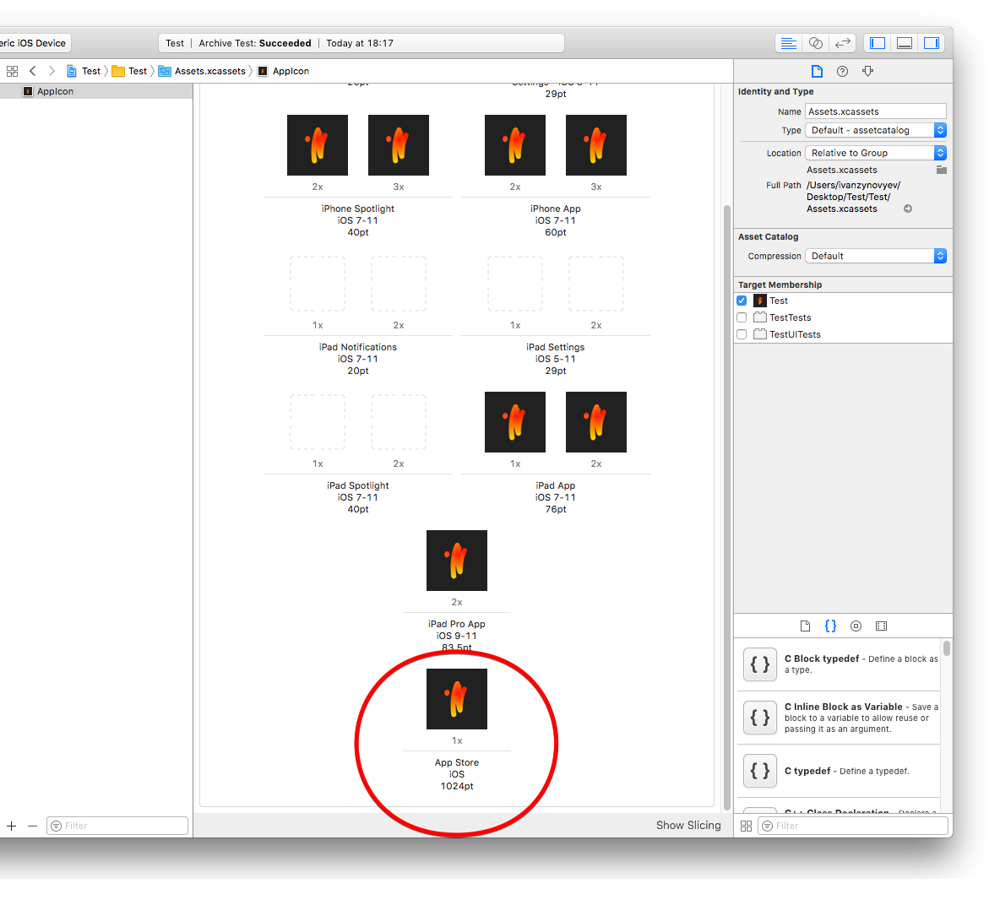

## Make an ipa

Настраиваем профайл для конфигурации, в которой собирается архив (по-умолчанию Release). Для этого импортируем профайл:

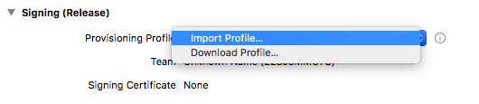

Затем собираем архив, для этого в xCode делаем Product -> Archive (архив недоступен при сборке для симулятора, выберите Generic iOS device). 

1. После сборки архива выбираем билд и нажимаем кнопку "Distribute App", выбираем первый пункт (App Store Connect) и жмем "Next":

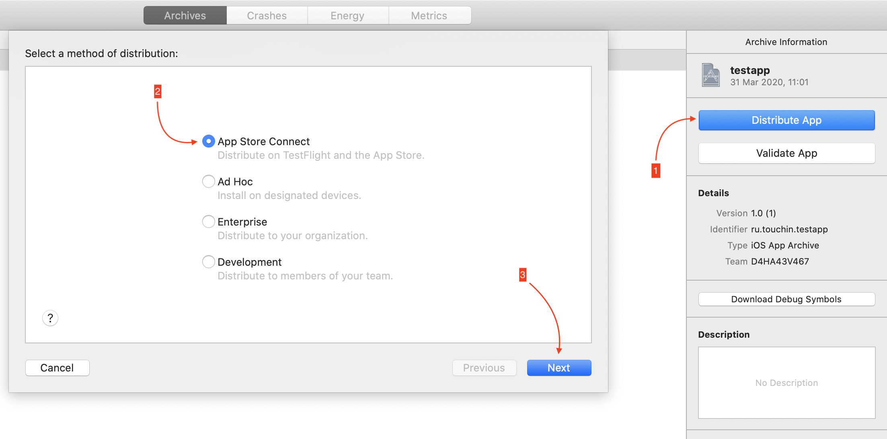

2. Далее необходимо выбрать пункт Export и нажать "Next":

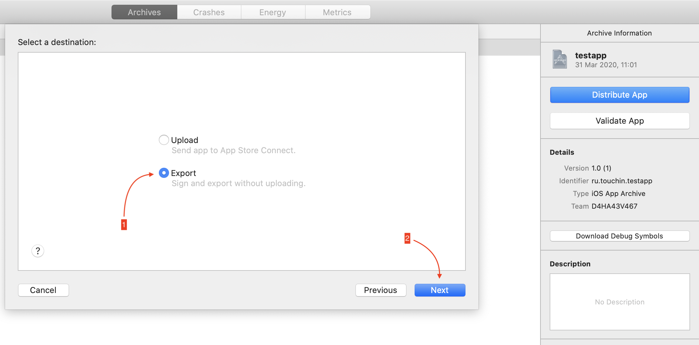

3. В следующем окне оставляем все как есть и жмем "Next":

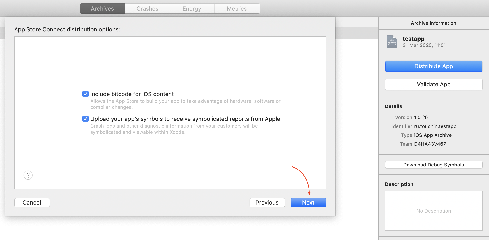

4. Выбираем пункт Manually manage signing и жмем "Next":

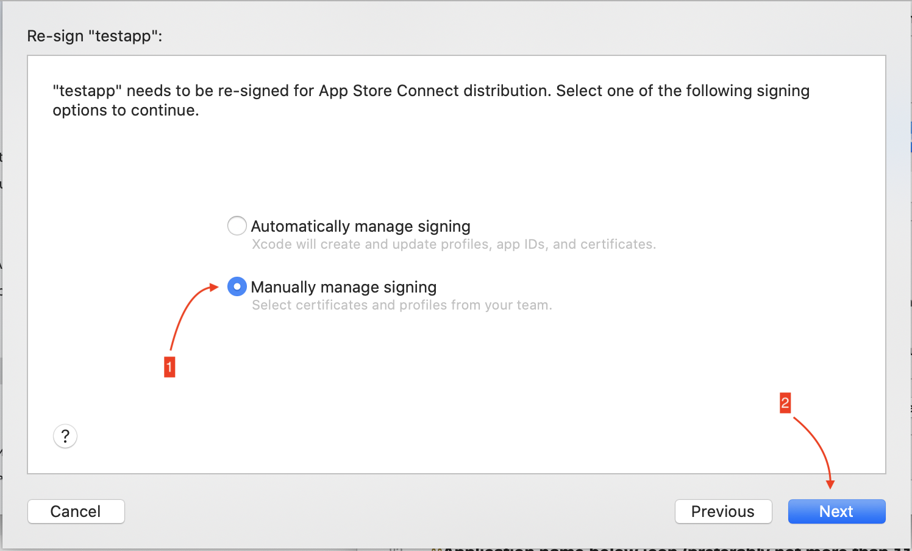

5. Далее необходимо в выпадающем списке выбрать профайл и нажать "Next":

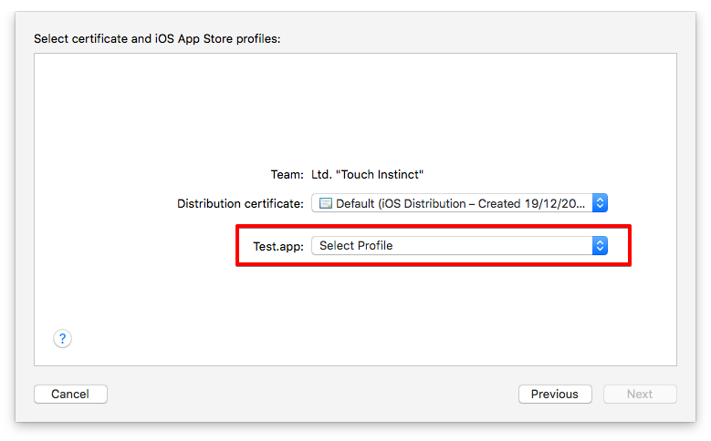
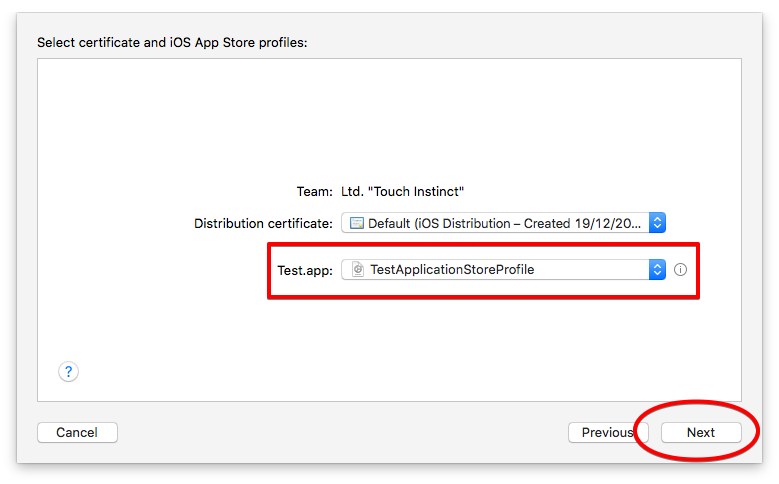

6. Затем, нажимаем "Export":

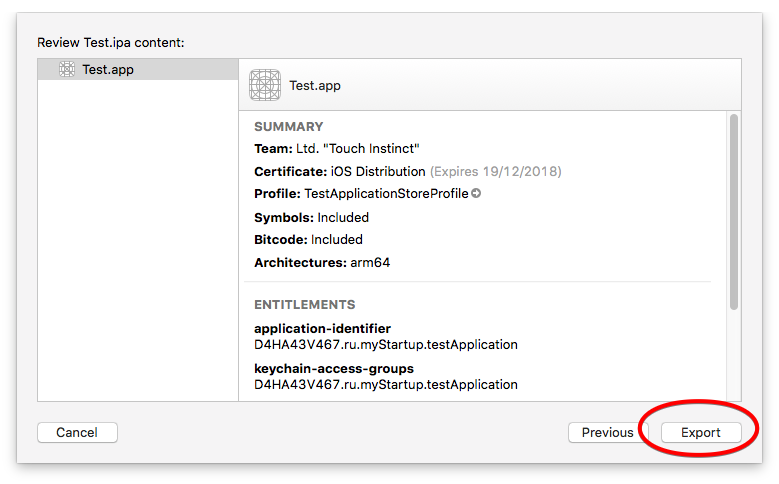

7. Затем пользователю будет предложено сохранить ipa файл в указанной папке:

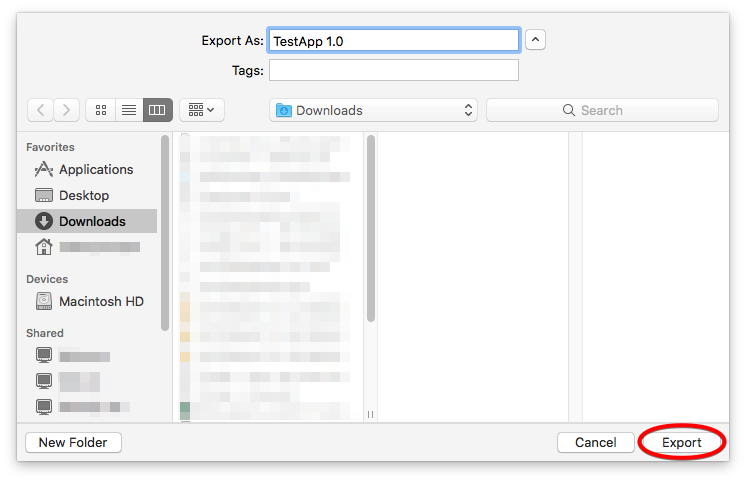

## Upload to App Store

1. Для того, чтобы собрать архив и сразу загрузить его в App Store, необходимо проделать первый шаг из раздела [Make an ipa](#make-an-ipa).

2. Далее необходимо выбрать пункт Upload и нажать "Next":

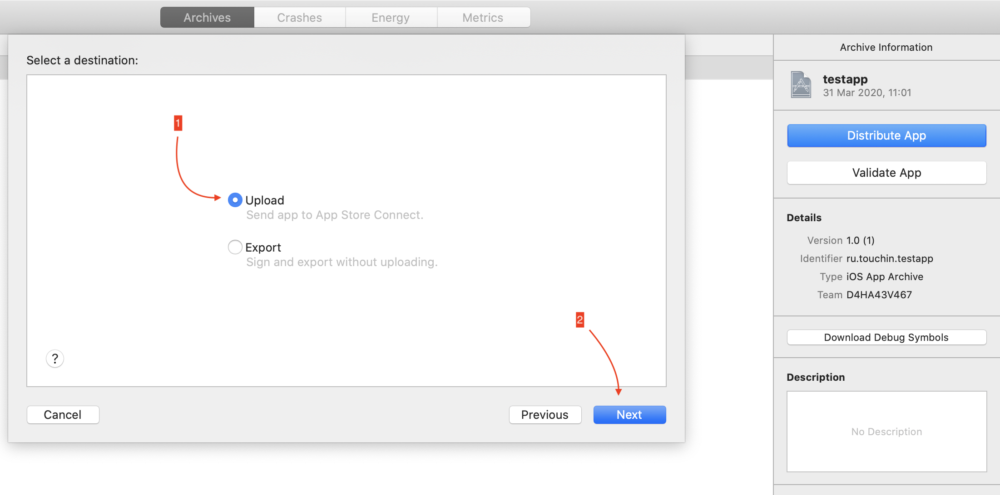

3, 4 и 5 шаги аналогичны таковым в разделе [Make an ipa](#make-an-ipa).

6. Нажмите "Upload":

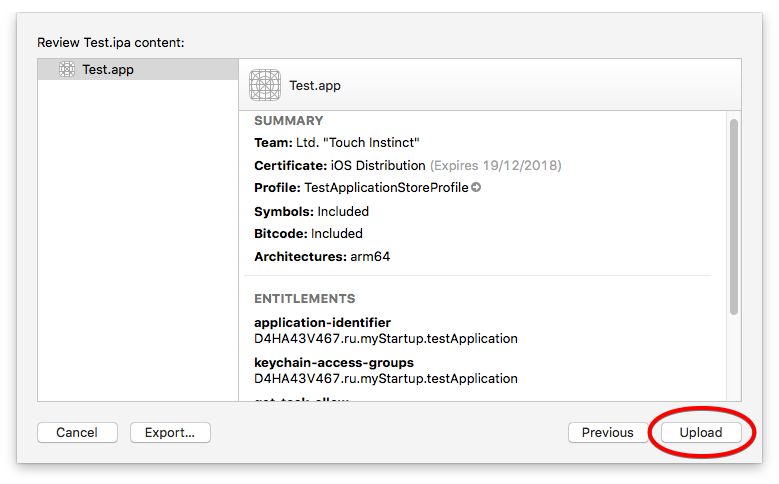

7. Начнется загрузка:

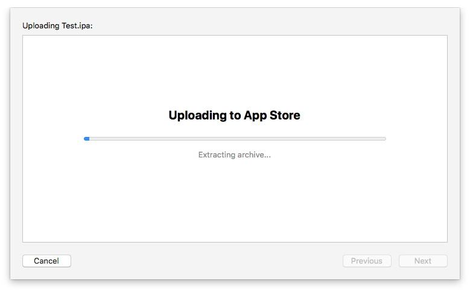

8. Когда загрузка завершится, нажмите "Done":

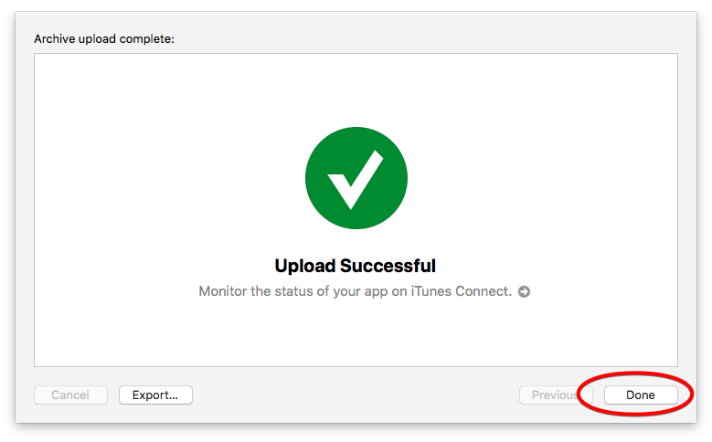

## Required information

- **Application name for app store.** Название приложения в магазине.
- **Application name below icon (preferably not more than 11 characters).** Название приложения, которое будет отображаться у пользователей на устройствах (под иконкой приложения).
- **Keywords (up to 100 characters).** Ключевые слова для поиска в магазине.
- **Application description (up to 4000 characters).** Подробное описание приложения, отображается на странице приложения в сторе.
- **E-mail Support.** Почта, на которую смогут написать пользователи, обращаясь за поддержкой.
- **Developer (company name).** Наименование компании, которая разработала продукт, отображается на странице приложения в сторе.
- **Category.** Категория, к которой относится приложение. Имеется ввиду по классификации apple, возможна также подкатегория.
- **Version.** Номер версии приложения, отображается на странице приложения в сторе.
- **Developer’s website.** Ссылка на страницу разработчика в интернете (см. пункт "Developer (company name)"). Также отображается на странице приложения в сторе.
- **Privacy Policy.** Если приложение собирает информацию о пользователях, есть логин с использованием сторонних сервисов, встроенные покупки, то нужно указать ссылку на документ, описывающий политику конфиденциальности компании разработчика. В иных случаях - не обязательно. Перейти по ссылке можно со страницы приложения в сторе.
- **Screenshots.** Нужно приложить скриншоты приложения, которые будут отображаться в результатах поиска и на странице приложения в сторе. Также, возможно добавить видео (30 секунд). Необходимо сделать до 5 снимков экрана для каждого поддерживаемого девайса.  Включая iPad и часы.
- **Application Icon.** Иконка приложения в сторе. Jpen или png без слоев разрешением от 72 dpi.
- **Copyright.** Наименование субъекта, которому принадлежат права на приложение. Отображается на странице приложения в сторе.
- **Support url.** Линк, по которому пользователи могу обратиться за поддержкой (см. E-mail Support).
- **App review contact information.** Контактное лицо для связи на случай, если в процессе ревью приложения возникнут вопросы.
- **User for demonstration.** Информация о тестовом пользователе, для того чтобы ревьюер приложения мог возпользоваться (и провести ревью) всеми частями приложения.
- **Review notes.** Дополнительная информация, которая может пригодиться на ревью, например, специфичные настройки.
- **EULA.** Нужно указать в случае, если соглашение отлично от *Apple's Standard License Agreement*, в противном случае можно использовать его.
- **What's New in this Version.** Если приложение выкладывается не впервые, то нужно указать что изменилось по-сравнению с предыдущей версией. Отображается на странице приложения в сторе.
- **Age limits.** Возрастной рейтинг приложения.

## Itunesconnect guide

[Выкладываем приложение в App Store](https://habrahabr.ru/company/touchinstinct/blog/345336/)
