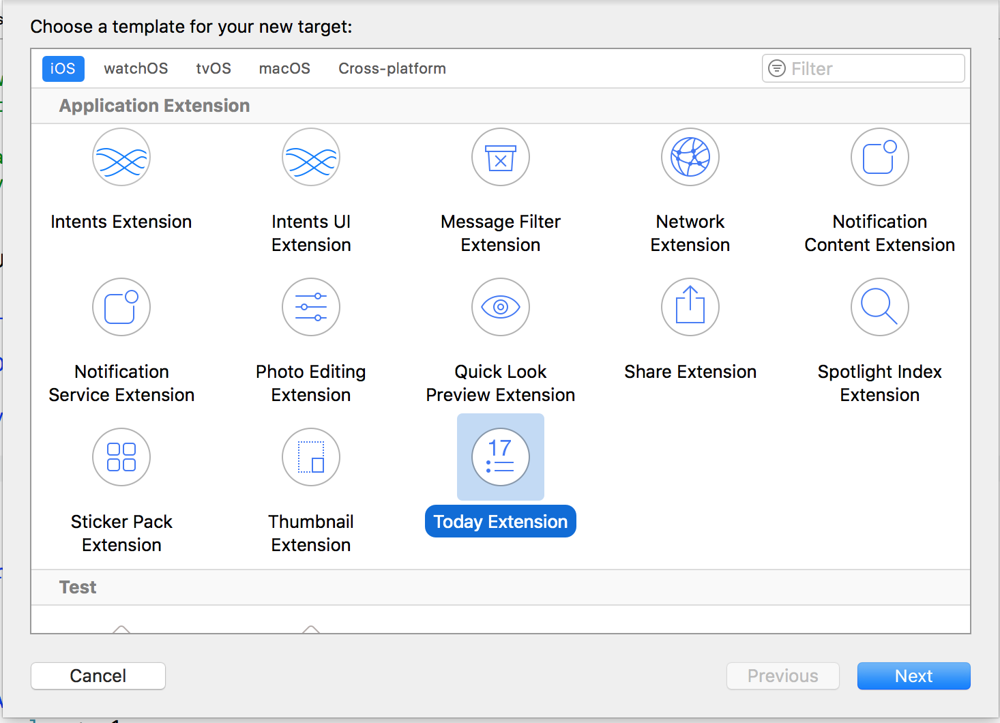
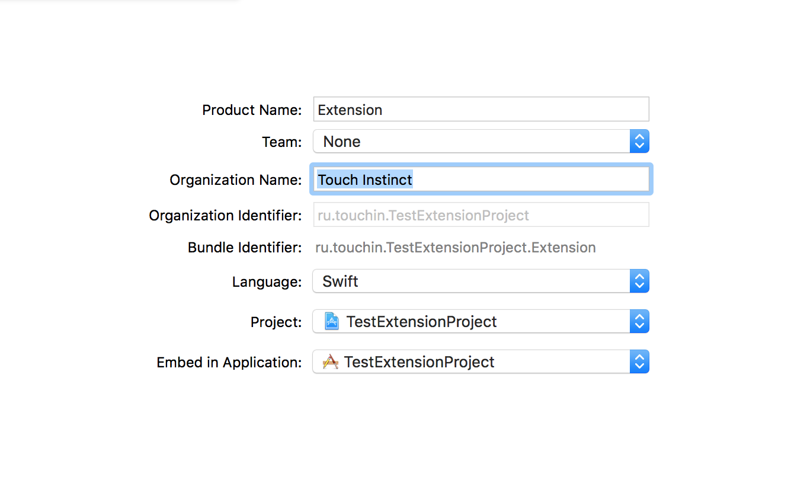
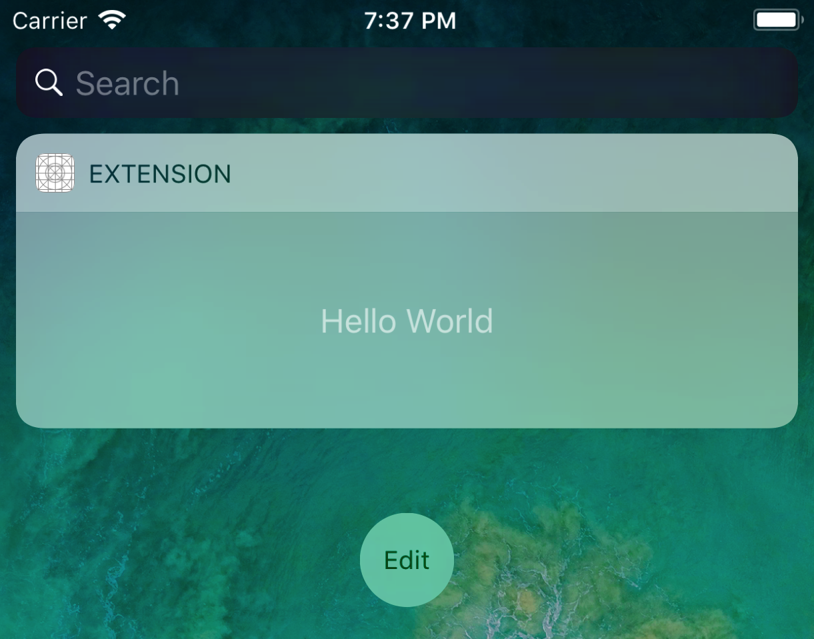
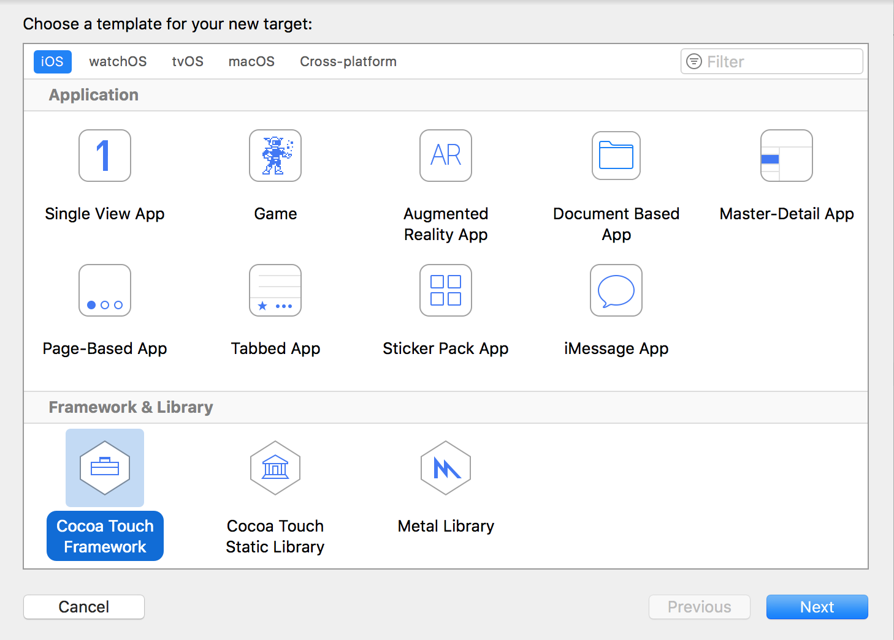
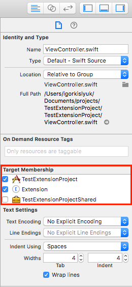
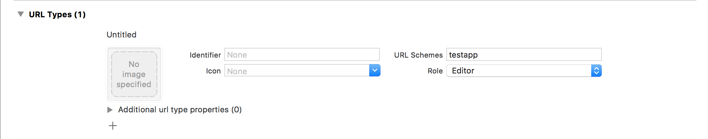

# Today Extension

### Соглашения о именовании

**Расширение** = Today Extension

### Оглавление

- [Features](#features)
- [Today Extension](#today-extension)
- [Code sharing](#code-sharing)
- [UI Configuration](#ui-configuration)
- [Data transfer](#data-transfer)
- [Links](#links)

## Features

- **Лимит памяти 16 MB**
- Избегать использования `UIScrollView`
- Не подтягивает `pod`-ы из основного таргета
- Рекомендуется сразу создавать общее хранилище кода, `framework` при добавлении расширения в проект
- Имеет возможность загружать данные из сети, поддержка анимаций.
- При наличии большого количества Today Extension необходимо явно указывать какое выбирать для показа по 3D-доступу с домашнего экрана
- При регистрации **НАДО**, чтобы **bundle id расширения соотвествовал bundle id основного приложения с дополнительной точкой** и любым количеством символов.
- Стандартная, а также минимальная высота расширения 110 пунктов, максимальная высота ограничена примерно 90% высоты экрана. В режиме расширения, можно указать любую в доступных границах.

## Today Extension

1. В меню **Xcode** выберите *File > New > Target...* В разделе *Application Extension* выберите *Today Extension*. <div align="center"></div>
2. Настраиваем параметры.<div align="center"></div>
3. Здесь самое важное состоит в **выборе названия**, потому что оно будет отображаться сверху `Today Extension`. <div align="center"></div>
4. Активировать предложенную схему.
5. Запускаем проект, смотрим. Может возникнуть глюк и придется подождать, при возникновении проблемы смело перезапускайте Xcode / Simulator.

## Code sharing

Для переиспользования кода стоит руководствоваться двумя способами:

- Существующие менеджеры зависимостей. Рекомендуется [Cocoapods](https://cocoapods.org). Для этого добавьте описание для `Target Today Extension` в `Podfile`, и пропишите необходимые зависимости. Пример ниже. P.S. также можно пользоваться [abstract target](https://guides.cocoapods.org/using/the-podfile.html), если в них есть необходимость

```ruby
target 'Extension' do
  # Comment the next line if you're not using Swift and don't want to use dynamic frameworks
  use_frameworks!

  # Pods for Extension
  pod 'RxSwift'

end
```

- Создание общего фреймворка. Для этого пользуемся тем же меню *File > New > Target...* и выбираем раздел *iOS > Cocoa Touch Framework*. <div align="center"></div> <br> Выставляем необходимые параметры (по умолчанию фреймворк импортируется в решение с основным iOS-приложением), добавляем общий код (выставляя уровень доступа) и делаем подключение через команду `import`.

- Использование файла для нескольких таргетов. Для этого необходимо выставить галочку, в свойствах файла. Пример ниже.
<div align="center"></div> <br>

## UI Configuration

- Верстка происходит в storyboard. Возможно показывать дополнительные контроллеры.
Попытка завести работу с `*.xib` не удалась, приложение падает на старте без описания ошибки (iOS SDK 11.1, Xcode 9.2). Стоит использовать сторибоард и не тратить время на `*.xib`.

- Расширение может иметь кнопку скрыть, раскрыть (доступно только с 10 версии iOS). Для использования режима с возможностью переключения необходимо обратиться к контексту `Today Extension`, это почти как `UIApplication.shared` для iOS приложений. Пример ниже.

```swift
extensionContext?.widgetLargestAvailableDisplayMode = .expanded

func widgetActiveDisplayModeDidChange(_ activeDisplayMode: NCWidgetDisplayMode, withMaximumSize maxSize: CGSize) {
 let expanded = activeDisplayMode == .expanded
 preferredContentSize = expanded ? CGSize(width: maxSize.width, height: 200) : maxSize
}
```

## Data transfer

**ВАЖНО** Для использования совместного хранилища необходимо настроить App Group. [Пример настройки](../CallKit/CallKit-Call-Identification-Guide.md#Создание-app-group).

Общие шаги настройки:
- создать App ID для приложения (если нет) с включенным App Groups
- создать App ID для расширения с включенным App Groups
- создать группу с идентификатором (group.com.touchin / group.ru.touchin)
- настроить группу для приложений
- сгенерировать provision profiles
- в зависимости от количества схем повторить вышеуказанные шаги, произвести настройку `entitlements`

Доступ к общим данным может осуществляеться через:

- общий UserDefaults. Пример ниже

```swift
UserDefaults(suiteName: "GROUP_NAME")
```

- общее файловое хранилище, для этого получается адрес хранилища. Пример ниже

```swift
func containerURL(forSecurityApplicationGroupIdentifier: "GROUP_NAME")
```

Для открытия / запуска приложения непосредственно из расширения, необходимо:

- зарегистрировать тип ссылки, который будет использоваться для приложения. <div align="center"></div>

- произвести вызов метода из главного `ViewController`-а расширения

```swift
guard let url = URL(string: "YOUR_URL_SCHEME://") else {
 return
}

extensionContext?.open(url, completionHandler: nil)
```

- обработка ссылки в главном приложении

```swift
func application(_ application: UIApplication, open url: URL, sourceApplication: String?, annotation: Any) -> Bool {
 if url.scheme == "YOUR_URL_SCHEME"
 {
 // handling...
 }
 return true
}
```

## Links

- [Extensions in iOS 10](https://hackernoon.com/app-extensions-and-today-extensions-widget-in-ios-10-e2d9fd9957a8)
- [Today Extension](https://www.raywenderlich.com/150953/today-extension-tutorial-getting-started)