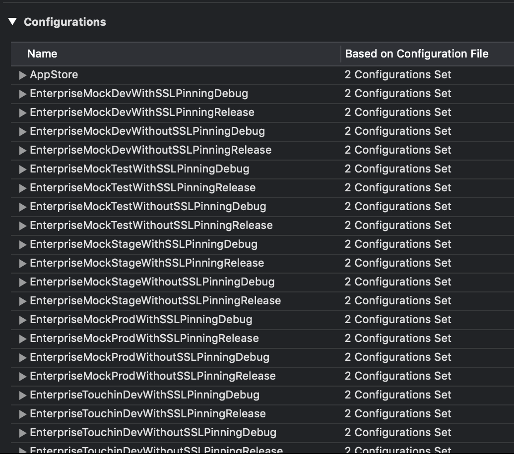
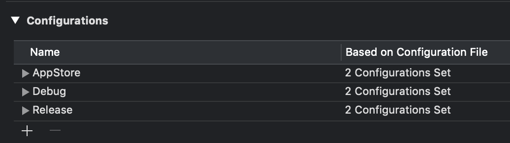
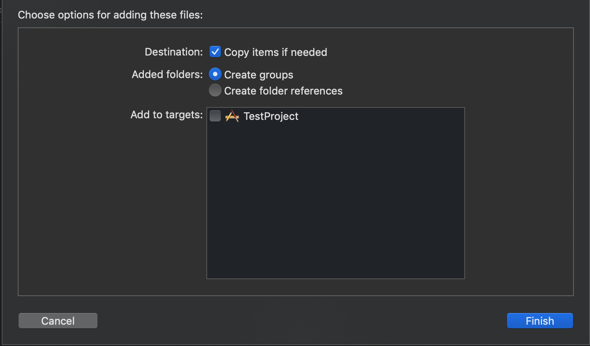
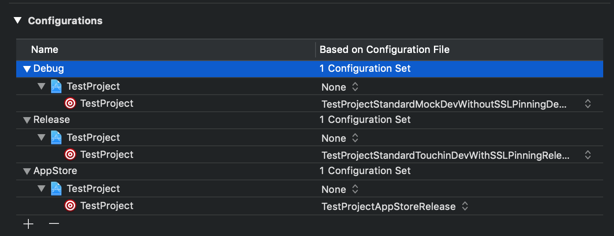

# Генератор конфигурационных файлов для Xcode

Данная инструкция поможет разобраться со скриптом, позволяющим сгенерировать все конфигурационные файлы для проекта. Такая система позволит избавиться от множества конфигов, мешающих стабильной работе и без того не самой стабильной IDE (Xcode), а также поможет стандартизировать конфигурации на разных проектах.

## Где взять скрипт?

На текущий момент скрипт лежит в репозитории [buildScripts](https://github.com/TouchInstinct/BuildScripts), который является сабмодулем на всех наших проектах (на данный момент скрипт находится в ветке **origin/feature/experimential\_configuration\_select**, позднее будет в мастере). Папка **config_generator** со всеми нужными файлами лежит по пути *build-scripts/xcode*.

## Что там за файлы?

Давайте поподробнее рассмотрим все файлы, лежащие внутри папки:

* `custom_settings.json` - файл с кастомными настройками, зависящими от проекта
* `target_xcconfig.mustache` - шаблон конфигурационного файла, созданный для работы утилиты *Mustache*
* `gen_configurations.py` - скрипт на питоне, данный скрипт генерирует конфигурационные шаблоны с данными, при чем генерирует он только общую информацию, необходимую на каждом проекте
* `render_xcconfigs.rb` - скрипт на руби, собирающий в себе данные из файла с настройками, шаблонные данные из скрипта на питоне и, с помощью утилиты *Mustache* преобразует все это в конфигурационные файлы

## А что на выходе?
Результатом работы скрипта является папка ***TargetConfigurations***, заполненная конфигурационными файлами с расширением `.xcconfig`. Для каждого таргета в соответствии с нашим стайлгайдом создается минимум 97 конфигов, поэтому каждый конфигурационный файл имеет префиксом название таргета.

Каждый конфиг содержит все необходимое, описаное в [гайде](Xcode_Build_Configurations_Guide.md), в том числе пользовательские ключи, которые необходимо привести к стандартному формату. Вот пример такого файла:

```makefile
#include "Pods/Target Support Files/Pods-TestProject/Pods-TestProject.release.xcconfig"

SWIFT_ACTIVE_COMPILATION_CONDITIONS = ENTERPRISE TOUCHIN TEST WITHOUTSSLPINNING RELEASE
DEBUG_INFORMATION_FORMAT = dwarf-with-dsym
VALIDATE_PRODUCT = YES
ENABLE_TESTABILITY = NO
CODE_SIGN_IDENTITY = iPhone Distribution
GCC_OPTIMIZATION_LEVEL = s
SWIFT_OPTIMIZATION_LEVEL = -O
SWIFT_COMPILATION_MODE = wholemodule
CODE_SIGN_ENTITLEMENTS = TestProject/Enterprise.entitlements
PRODUCT_BUNDLE_IDENTIFIER = com.touchin.TestProject
DEVELOPMENT_TEAM = 228J5MMU7S
PROVISIONING_PROFILE_SPECIFIER = com.touchin.TestProject

CODE_SIGN_STYLE = Manual
```

А главная прелесть генерации - для создания такого файла потребовалось указать только назание таргета и путь к *entitlements* файлу, остальные настройки скрипт сгенерировал автоматически.

## Как работать со скриптом?

### Основные шаги:
* [Настройки](#Настройки)
* [Запуск скрипта](#Запуск-скрипта)
* [Подготовка проекта](#Подготовка-проекта)
* [Добавление конфигов в проект](#Добавление-конфигов-в-проект)
* [Установка конфигов в проект](#Установка-конфигов-в-проект)
* [Завершение установки](#Завершение-установки)

### Настройки

Для генерации конфигурационных файлов нужно верно заполнить файл с настройками ***custom_settings.json***. Рассмотрим его поподробнее:

```json
{
    "targets": [
        {
            "YOUR_TARGET_NAME": {
                "Standard": {
                    "PROVISIONING_PROFILE_SPECIFIER": "DEV_PROVISIONING_NAME",
                    "PRODUCT_BUNDLE_IDENTIFIER": "DEV_BUNDLE_ID",
                    "CODE_SIGN_ENTITLEMENTS": "DEV_ENTITLEMENTS_PATH"
                },

                "Enterprise": {
                    "PROVISIONING_PROFILE_SPECIFIER": "ENTERPRISE_PROVISIONING_NAME",
                    "PRODUCT_BUNDLE_IDENTIFIER": "ENTERPRISE_BUNDLE_ID",
                    "CODE_SIGN_ENTITLEMENTS": "ENTERPRISE_ENTITLEMENTS_PATH"
                },

                "AppStore": {
                    "DEVELOPMENT_TEAM": "STORE_PROVISIONING_NAME",
                    "PRODUCT_BUNDLE_IDENTIFIER": "STORE_BUNDLE_ID",
                    "CODE_SIGN_ENTITLEMENTS": "STORE_ENTITLEMENTS_PATH"
                }
            }
        }
     ]
}
```
Настройки представляют собой массив `targets[]`, содержащий в себе все таргеты проекта, как пару `"ИмяТаргета": "Настройки"`. Настройки представляют собой список обязательных конфигов **Standard**, **Enterprise** и **AppStore**. В каждом конфиге содержатся пары ключ-значение для конфигурационных файлов указанного типа. Обязательными являются только те пары, которые на данный момент нельзя сгенерировать скриптом:

* `PRODUCT_BUNDLE_IDENTIFIER` обязателен только для **AppStore**, для остальных опционален, нужен только, если *bundle id* не соответствует [гайду по неймингу](Naming_Agreement.md)
* `CODE_SIGN_ENTITLEMENTS` (указывать только, если они имеются в проекте, иначе не требуется)
* `DEVELOPMENT_TEAM` для **AppStore**
* `PROVISIONING_PROFILE_SPECIFIER` (временно, пока не проведена стандартизация на всех проектах)

Подробнее о нейминге можно прочесть [здесь](Naming_Agreement.md).

Все остальные пары явлются либо опциональными, либо генерируемыми. Например, *bundle id* стандартизирован и описан в [гайде](Create_New_Project_Guide.md), поэтому для **Dev** и **Enterprise** конфигов писать его не требуется, он будет выбран автоматически, но в том случае, если *bundle id* на вашем проекте не удволетворяет общим требованиям, необходимо явно указать его во всех конфигах. Если на вашем проекте еще не существуют значения для сборки под AppStore, оставьте значения пустыми или заполните их тестовыми данными, когда придет время - нужно будет поправить эти значения.

Также в список можно добавлять любые кастомные значения, которые вы бы хотели добавить в выделенный конфиг, например *url* тестового сревера или любой конфигурационный параметр. Сделать это можно просто добавлением пары ключ-значение в список выделенного конфига, например:

```json
"Standard": {
	"TEST_URL": "touchin.ru",
	"ENABLE_BITCODE": "NO"
}
```
При этом нужно добавлять данное поле для всех настроек и всех таргетов, так как иначе можно получить непрозрачную логику в вашем проекте.

Если в вашем проекте несколько таргетов, то нужно добавить в массив настройки для всех таргетов, доступных для запуска. Также нужно не забыть добавить пути к *entitlements* файлам, иначе при сборке будет сбой в выборе *AppGroup* параметра.

К сожалению, на данный момент нельзя также гибко настраивать количество серверов в конфиге (но работа в данном направлении ведется), для данной настройки необходимо открыть ***gen_configurations.py*** и вручную редактировать массив серверов `server_environment_options`, добавив в него новые значения. Удялять минимальные значения запрещается, так как их регламентирует [стайлгайд](Xcode_Build_Configurations_Guide.md).

### Запуск скрипта

Для запуски скрипта необходимо заполнить все настройки, открыть **Terminal**, перейти в папку со скриптами и запустить скрипт командой `ruby render_xcconfigs.rb`. Ничего создавать самому не нужно, скрипт сам создаст нужную директорию и новые файлы. Как уже было сказано, результатом работы скрипта будет новая папка в корне рабочей директории скрипта ***TargetConfigurations*** со всеми нужными конфигами внутри.

### Подготовка проекта

Первое, что нужно сделать - это убедиться, что в вашем проекте есть 3 конфига (**Debug**, **Release** и **AppStore**), остальные лишние - их можно удалить. Для этого необходимо зайти в настройки проекта, выбрать ваш проект и вкладку *Info*. Проще всего это сделать, если удалить все неунжные конфиги, кроме одной уникальной (оставить одну с суффиксом *Release*, одну с суффиксом *Debug* и конфиг *AppStore*), а затем переименовать их.

**Было:** 

**Стало:**

Тоже самое нужно проделать с **Podfile**:

```ruby
project 'Your_Project', {
  	'Release' => :release,
  	'Debug' => :debug,
  	'AppStore' => :release
}
```

### Добавление конфигов в проект

Для добавления конфигов в проект нужно перенести папку ***TargetConfigurations*** в корень проекта, а затем добавить в проект уже в самом *Xcode*, сделать это можно, перетащив папку в корень проекта, не добавляя при этом в конкретный таргет, это важно.



### Установка конфигов в проект

Для того, чтобы установить новые конфиги, нужно все в той же вкладке *Info* в настройках проекта выбрать необходимый файл для основных конфигураций в проекте из выпадающего списка. Дальнейшая смена конфигурации будет так же происходить в настройках проекта на вкладке *Info*.



Для каждого таргета нужно выбрать соответствующий ему конфигурационный файл. Для одной конфигурации нужно в разные таргеты поставить конфигурационные файлы, отличающиеся только названием таргета. Например: нельзя ставить в конфиг **Debug** для одного таргета *FirstTargetStandardTouchinDevWithoutSSLPinningDebug*, а для другого *SecondTargetStandardCustomerTestWithSSLPinningDebug* и так далее)

### Завершение установки

Для завершения установки нужно удалить все настройки внутри *Xcode*, переопределяющие настройки из конфигурационных файлов. Для этого нужно открыть любой конфигурационный файл, затем перейти во вкладку *Build Settings* и выбрать фильтр **Customized**. В списке настроек нужно удалить те настройки, которые называются также, как и настройки из конфигурационного файла.

## Заключение

Если все шаги были выполнены верно, в результате вы получите чистый проект, который не будет слишком сильно грузить Xcode, при этом в проекте останутся все 97 (а может быть и больше) стандартизированных конфигов, которые позволят привести настройку всех проектов в единый формат.
