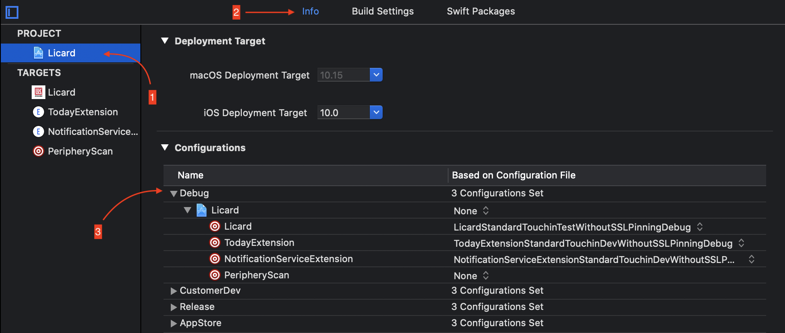
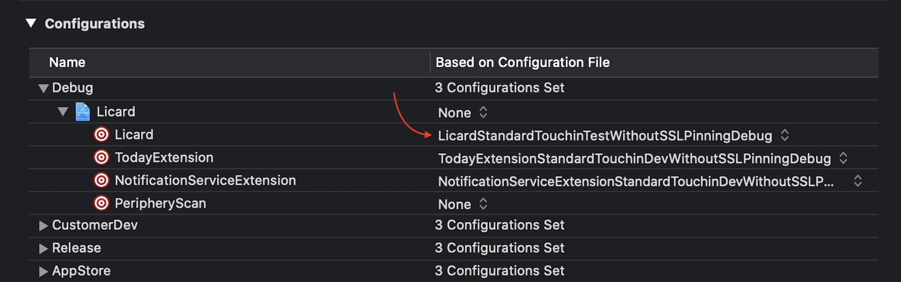
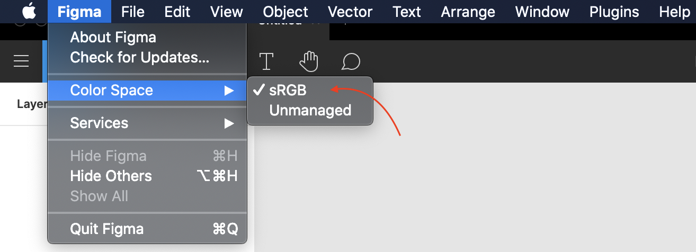

# Без 5 минут iOS'ник

Привет! Это сборник советов для начинающего iOS разработчика, чтобы быстро и легко влиться в процессы компании.

## Разделы

- [👪 Общее](#общее)
	- [Чаты](#чаты)
	- [К кому обращаться с вопросами?](#к-кому-обращаться-с-вопросами)
	- [Ресурсы тача](#ресурсы-тача)  

- [🕒 Оценка задач](#оценка-задач)
	- [Главное](#главное)
	- [Книги](#книги)

- [⌨️ Github](#github)
	- [Оформление pull request'а](#оформление-pull-requestа)
	- [Проверка pull request'а](#проверка-pull-requestа)
	- [Common](#common)
	
- [⚒️ Xcode](#xcode)
	- [Как запустить проект](#как-запустить-проект)
	- [Конфигурации](#конфигурации)
	- [Обновление](#обновление)
	- [Автоматизация установки](#автоматизация-установки)
	- [Ошибки при миграции](#ошибки-при-миграции)
	
- [⚡ RxSwift](#rxswift)

- [⚪ Carthage](#carthage)
	- [Carthage update](#carthage-update)

- [🍏 Fastlane](#fastlane)
	- [SyncCodeSigning](#synccodesigning)

- [🏢 Сборки и TeamCity](#сборки-и-teamcity)
	
- [🎨 Figma](#figma)
	- [Корректное отображение цвета в макетах](#корректное-отображение-цвета-в-макетах)

## Общее

### Чаты
Перед тем, как начать работать над проектом, попроси тимлида добавить тебя во все необходимые чаты в telegram. 
Обычно для каждого проекта есть свой набор чатов, касающихся разработки:
- Чат проекта: `<Project name>.Internal`. Здесь сидят менеджеры, разработчики, дизайнеры, тестировщики и обычно обсуждаются и решаются общие вопросы по проекту.
- iOS-чат проекта: `<Project name>.iOS.Internal`
- Чат по [common репозиторию](/general/commonRepo.md) проекта: `<Project name>.Common.Internal`\
Последние два используются для запроса проверки и обсуждения [pull request'ов](#pull-request).

### К кому обращаться с вопросами?
- Куратор(ментор):
	- Технические вопросы по проекту
- Менеджер проекта:
	- Вопросы по проекту в целом и по отдельным задачам в частности
	- Если нет задач
- Тестировщик:
	- Вопросы по багам: перепроверка бага, дополнительная информация по воспроизведению и тд.
	- Вопросы по сборке билда: обычно, если надо уточнить [конфигурацию](/general/AppDistributionGuide.md#%D0%BC%D0%B0%D1%82%D1%80%D0%B8%D1%86%D0%B0-%D0%B2%D1%8B%D0%B1%D0%BE%D1%80%D0%B0-%D1%81%D0%BF%D0%BE%D1%81%D0%BE%D0%B1%D0%B0-%D0%BF%D0%BE%D1%81%D1%82%D0%B0%D0%B2%D0%BA%D0%B8)
- Дизайнер:
	- Вопросы по макетам
- DevOps: 
	- Если не работает интернет в офисе, не можешь подключиться к VPN и т.д.
- HR:
	- Вопросы, не касающиеся разработки
- Тимлид:
	- Остальные вопросы

### Ресурсы тача
В нашей компании часто проходят различные встречи, митапы iOS разработчиков, многие из которых записываются. Всё это можно найти на Dropbox: `it@touchin.ru / XWcsnBhAC3whf6G`.  
Больше полезных аккаунтов - в разделе [QA](/qa/passwords.md).

## Оценка задач

### Главное

Вообще уже существует [статья](/general/estimations.md) по тому, что такое оценка, зачем нужна и т.д. Однако там нет практических советов, поэтому привожу их здесь. Начнем с общих:

- Если ты никогда ничего не оценивал и даже понятия не имеешь, сколько времени понадобится для решения той или иной задачи, то сразу предупреди об этом менеджера проекта. Это убережет как тебя, так и всю команду от переработки и потраченных нервов. 
- В таких случаях, обычно, либо твой ментор, либо лид команды даст свою оценку на задачу с поправкой на твои знания и навыки.
- Когда ты начнешь более или менее вливаться в проект, то уже можешь примерно представлять временные затраты на задачу. Но они будут *очень далеки от правды*! Поэтому смело умножай оценку *в два раза*, т.е. было 2 часа - стало 4 и т.д.  
- В случае разработки новой фичи не забывай, что в оценку входит не только время на её реализацию, но и время прохождения code review, починка связанных с ней багов.
- Помни: пусть оценка будет немного больше, но ты успеешь всё сделать в срок, чем доделывать всё в спешке и под стрессом.

От общих советов перейдем к частным - как формировать оценку по *багу*:

- Внимательно читай описание бага. Редко, но всё же можно не заметить какого-либо условия или неправильно трактовать из-за невнимательности - не надо так - тратишь своё же время.
- Открой проект и попробуй воспроизвести баг. Если не получается и в багрепорте не указана версия iOS, то уточни её у тестировщика и возвращайся к первому пункту. В крайнем случае попроси перепроверить баг - иногда и со стороны QA может быть ошибка.
- Если баг выявлен, то попытайся локализовать проблему. Найди участок кода, где может быть или же есть ошибка.
- На этом этапе попробуй продумать, как бы решил эту проблему.
- Если решение пришло быстро, либо же есть *понимание* того, как баг можно починить, то переходи к последнему пункту, иначе - читай дальше.
- Когда совершенно непонятно, что могло стать причиной некорректного поведения приложения, то поступай так:
	- Напиши менеджеру, что есть трудности с определением причины бага и потребуется время на её поиск.
	- В таких случаях, лучше накинь к пока предположительной оценке 2 часа, если совсем незнакомый код - 3 часа.
- Теперь, когда получено общее представление о проблеме, можешь выдвигать оценку. По личному опыту могу сказать, что в среднем на баг уходит *от 2 до 4 часов*, в худшем - *от 4 до 6 часов*. Ты можешь cкорректировать итоговую оценку на основе полученных знаний на прошлых шагах.

### Книги 
	
Если захочется почитать что-нибудь по оценке, то переходи по [ссылке](/Coding/Books.md#Task-estimation).

## Github

### Оформление pull request'а

В дополнение к [статье](/Coding/CodeReview.md) с требованиями к code review: 
- Если в процессе разработки при общении с коллегами в telegram появились уточнения, новые требования или пояснения к задаче/багу, то не стесняйся прикреплять к описанию pull request'а скриншот сообщения/переписки с именем собеседника. В дальнейшем это облегчит поиск причин, почему та или иная деталь сделана так и кто ответственен за нее. Кроме того, будет классно, если прикрепишь эти артефакты в комментарии к тикету в джире.

### Проверка pull request'а

- Если ты сделал PR, то, чтобы смержить изменения в проект, необходимо получить approve от другого разработчика.
- Форма для запроса проверки: <теги людей, у которых просишь проверку> <ссылка на pull request>.\
  Пример: `@loupehope https://github.com/TouchInstinct/Styleguide/pull/412`\
- Если PR касается [common репозитория](/general/commonRepo.md), то надо запрашивать проверку от:
	- Андроид разработчика, если изменения не касаются API
	- Бекенд и андроид разработчиков, если изменения касаются API
- Если тебе довелось проверить чей-то pull request, то в случае, если ты поставил approve, напиши в чате проекта *+*, иначе - о необходимости доработки. 
- Если твой pull request апрувнули, то напиши в чатике спасибо. Мелочь, а приятно:)

### Common
Чтобы редактировать json файлы в common репозитории, используй программу [Sublime](http://www.sublimetext.com/3) из списка необходимого для iOS разработчика [софта](Developer_Tools.md). Эта программа позволит избежать проблем при форматировании текста, например, с отступами при вставке/удалении новых строк локализации или моделей API.

## Xcode

### Как запустить проект

Почти на каждом проекте в Touch Instinct имеется исполняемый файл `setup.command`. Нажми на него и подожди окончания операции. После открой проект через `<Project>.xcworkspace` - установка завершена.  

По факту `setup.command` представляет из себя набор команд, которые необходимо выполнить для настройки проекта:
```
# Устанавливаем необходимые пакеты через Homebrew
brew bundle

# Устанавливаем ruby зависимости.
# Cocoapods and Fastlane
bundle install

# Обновляем репозиторий подов.
bundle exec pod repo update

# Запускаем установку подов.
bundle exec pod install

# Запускаем установку зависимостей через carthage
bundle exec carthage bootstrap --platform iOS --cache-builds
```
**Важно**

Если на проекте нет подобного исполняемого файла, то последовательно в консоли выполни команды, перечисленные выше. При этом последняя команда является опциональной, так как не везде используется Сarthage.

### Конфигурации
Если тебе необходимо собрать проект на какой-нибудь конфигурации, например, Touchin Test, то делай следующее:

- Нажми на файл проекта. В появившейся колонке справа выбери из раздела *PROJECT* - необходимый проект. Далее откроется соответствующее окно - проверь, что находишься во вкладке *Info*. Теперь разверни раздел *Configurations*, а в нем - *Debug*.  



- Появится список: слева - таргеты проекта, а справа - их конфигурации. Теперь, чтобы её поменять, достаточно нажать на конфигурацию данного таргета и из появившегося списка выбрать нужный.  



**Важно**

Чтобы приложение работало корректно после смены конфигурации, необходимо *удалить* приложение с устройства/симулятора, на котором оно установлено, и только потом ставить сборку.

### Обновление

Обновление Xcode в компании происходит по определенному [процессу](/IOS/Xcode_updation.md). Но никто не запрещает локально работать на любой версии, главное, чтобы связанные с переходом изменения не попали в Github.

### Автоматизация установки

Чтобы процесс скачивания и установки Xcode не занимал много времени, предлагаю воспользоваться советами из данной [статьи](https://blog.kulman.sk/faster-way-to-download-and-install-xcode/).

### Ошибки при миграции

После обновления Xcode на новую версию при сборке проекта ты можешь получить следующую ошибку:  
```
Module compiled with Swift 5.x.x cannot be imported by the Swift 5.x.x compiler...
```
Это значит, что на проекте используются зависимости, установленные через *Carthage*. Для устранения этой ошибки необходимо заново собрать эти зависимости. Для этого открой в консоль и в папке с проектом введи команду:
```
bundle exec carthage bootstrap --platform iOS --cache-builds
```
После завершения операции нажми на `<Project>.xcworkspace` и запусти компиляцию.
Если после повторной сборки проблема сохранилась, то удали проект с компьютера и скачай его *заново*. Затем повтори процедуру из раздела - [Как запустить проект](#как-запустить-проект).

**Важно**

Не надо запускать проект после обновления Carthage зависимостей через стартовое меню Xcode, в котором предлагается выбрать недавние проекты!

## RxSwift

### RxSwift - это не та штука, с которой ты разберешься за вечер.
- Этой [статьи](https://medium.com/ios-os-x-development/learn-and-master-%EF%B8%8F-the-basics-of-rxswift-in-10-minutes-818ea6e0a05b) 
недостаточно, чтобы понять, что это за framework и как с ним работать. Прими, как факт, и переходи к 
следующему пункту.
- Сначала убедись, что ты понимаешь, как использовать map, filter, reduce и т.д. Если надо напомнить, то иди [сюда](https://medium.com/@abhimuralidharan/higher-order-functions-in-swift-filter-map-reduce-flatmap-1837646a63e8).
- Потом прочитай [статью](https://medium.com/ios-os-x-development/learn-and-master-%EF%B8%8F-the-basics-of-rxswift-in-10-minutes-818ea6e0a05b) - на
английском либо эту [статью](https://habr.com/ru/post/423603/) на русском. 
- Желательно полистать данную [книжку](https://store.raywenderlich.com/products/rxswift).
- Видео, которые помогут узнать основы и понять суть:
  - [One ring to rule them all - лучшие практики RxSwift](https://www.youtube.com/watch?v=4hxNLaasBfI&list=PLrrjuVcsVZhj_mkKTZ6lVLN7UeH6JMxWj&index=15&t=1s) - на русском
  - [RxSwift - Debunking the Myth of Hard](https://www.youtube.com/watch?v=I-npe1z6HbA) - на английском
  - [RxSwift & MVVM: Your First Steps](https://www.youtube.com/watch?v=6KXqa4iLCUM) - практика
- Если тебя уже назначили разработчиком на какой-нибудь проект, то посмотри реализацию какого-нибудь контроллера. Обычно они находятся в папке Controllers и постарайся понять, как организовано взаимодействие ViewModel'и и ViewController'а. Если тебе что-то непонятно, то не стесняйся спросить своего ментора или любого другого iOS разработчика.
- Далее тренируйся что-то писать самостоятельно, больше погружайся в тему и не стесняйся спрашивать помощи. Чем быстрее ты поймешь, что и как надо писать, тем лучше будет для тебя.

**Важно**

Старайся использовать Rx только тогда, когда это совсем необходимо.

## Carthage

### Carthage update
Если выполнение `carthage update` не приводит к обновлению используемых на проекте зависимостей, то воспользуйся этой командой - `rm -rf ~/Library/Caches/org.carthage.CarthageKit`. 

## Fastlane

### SyncCodeSigning
Если при подтягивании новых сертификатов с помощью команды `fastlane SyncCodeSigning` получаешь ошибку, либо после строки 
`If cloning the repo takes too long, you can use the clone_branch_directly option in match.` ничего не происходит, то
в консоли необходимо выполнить команду `cd ~/.ssh/; ssh-add`.

## Сборки и TeamCity
Если попросили поставить сборку, то тебе сюда - [CI и BuildServer](/general/setupBuildGuide.md).

## Figma

### Корректное отображение цвета в макетах
Чтобы при работе с Figm'ой не было проблем с тем, что цвет какого-либо элемента имеет один цвет, а по факту на устройстве отображается другой, хотя hex-код одинаковый, необходимо в настройках *Figma -> Color Space* выбрать *sRGB*:


