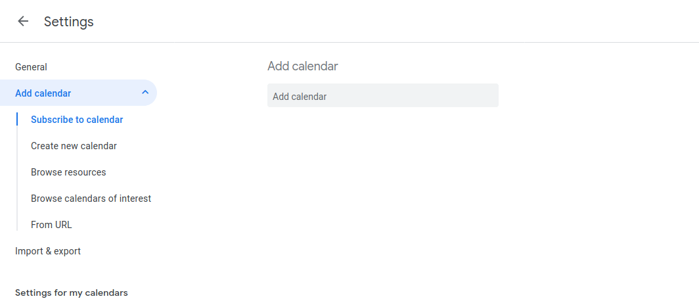

# Гайд по установке CardDav

## iOS

Зайти в Настройки -> Пароли и учетные записи:

Нажать "Добавить учетную запись":

"Другое":

"Учетная запись CardDav":

Ввести в поля следующие данные:

**Сервер:** https://carddav.svc.touchin.ru

**Пользователь:** логин от вашего внутреннего аккаунта

**Пароль:** пароль от вашего внутреннего аккаунта

**Описание:** Touchin

Нажать "Далее".

Готово! :)

## Android
Ставим приложение:

https://play.google.com/store/apps/details?id=org.dmfs.carddav.sync

Заходим в настройки аккаунтов, там добавляем CardDav аккаунт с данными, указанными выше.

Для того, чтобы работало на android 10, нужно включить автозапуск:

Настройки -> Приложения -> Разрешения -> Автозапуск

## Windows Phone 8.1
Инструкция на буржуйском [здесь](https://www.reddit.com/r/windowsphone/comments/23o89h/setting_up_carddav_and_caldav_on_windows_phone_81), с иллюстрациями автора.

## MacOS
Заходим в приложения Контакты и Календарь, там добавляем CardDav и CalDav аккаунты с данными, указанными выше.

## Windows 10 Hack (На Windwos 8 должно быть похоже)
В приложении "Почта" или "Календарь" откройте **Параметры** в нижнем левом углу.

В разделе **Управление учетными записями** выберите **Добавить учетную запись**, затем выберите _iCloud_.

Укажите любые (существующие / несуществующие) почту и пароль, нажмите **Вход** и **Готово**.
В списке с учетными записями появится, только что созданная, учетная запись с предупреждением, нажмите на неё, откроется окно, в котором необходимо ввести, указанные выше (в начале статьи) логин и пароль.

Далее, нажмите **Изменить параметры синхронизации почтового ящика**, прокрутите до конца окна и нажмите **Дополнительные параметры почтового ящика**.
Заполняем поля _Сервер контактов (CardDAV)_ и _Сервер календаря (CalDAV)_, ссылками указанными выше, и жмем **Готово** и **Сохранить**

Список контактов появится в приложении **Люди**

## Web
https://jira.touchin.ru/infcloud/

**Пользователь:** touchin

**Пароль:** touchinp

## Google Calendar

Заходим по ссылке https://calendar.google.com/calendar/b/1/r/settings/addcalendar?tab=mc1&pli=1 с рабочего Google аккаунта.

Вводим в поле `Add calendar` touchin.ru_5kasv0us8jsqrrbs36gleam20o@group.calendar.google.com

Нажимаем <kbd>Enter</kbd>.

Так у вас в календаре появится новый график отпусков.
