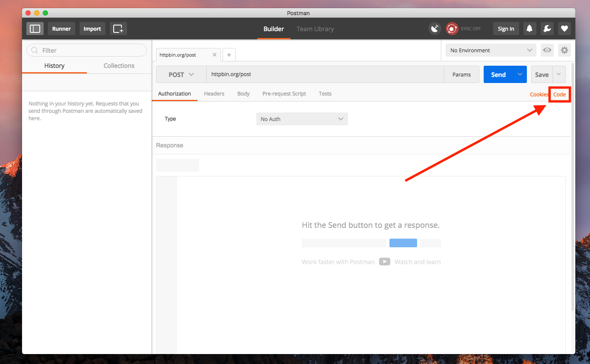
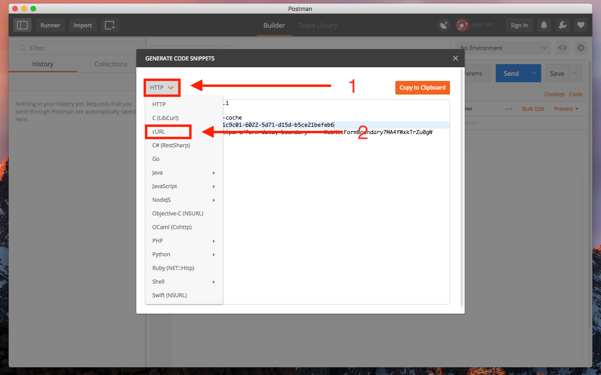
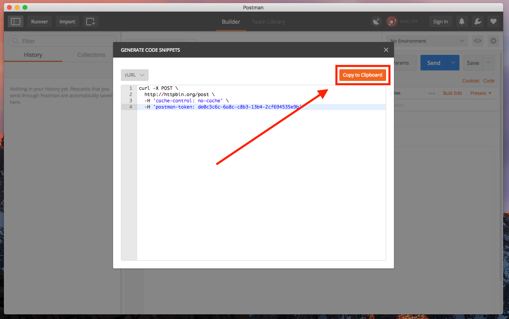
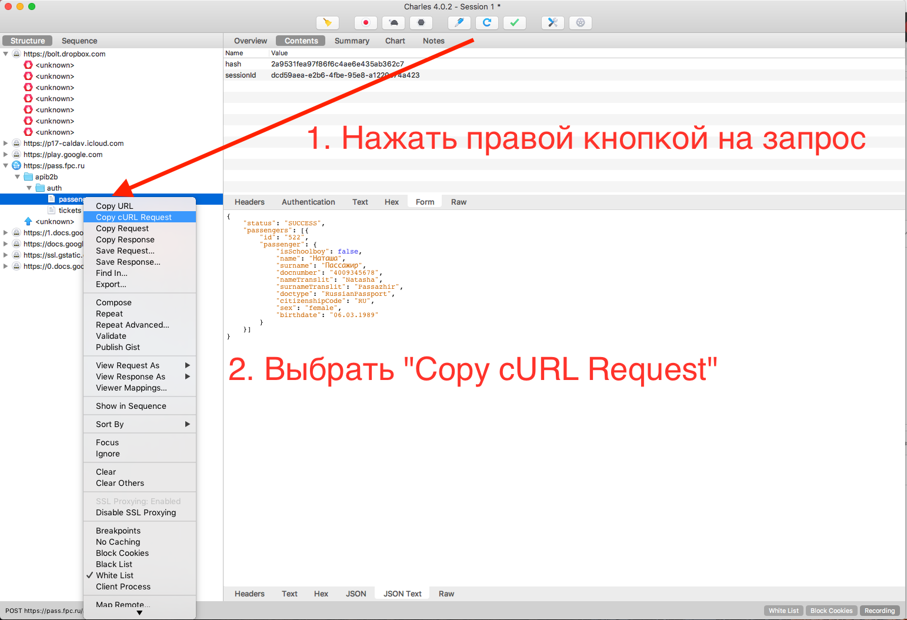
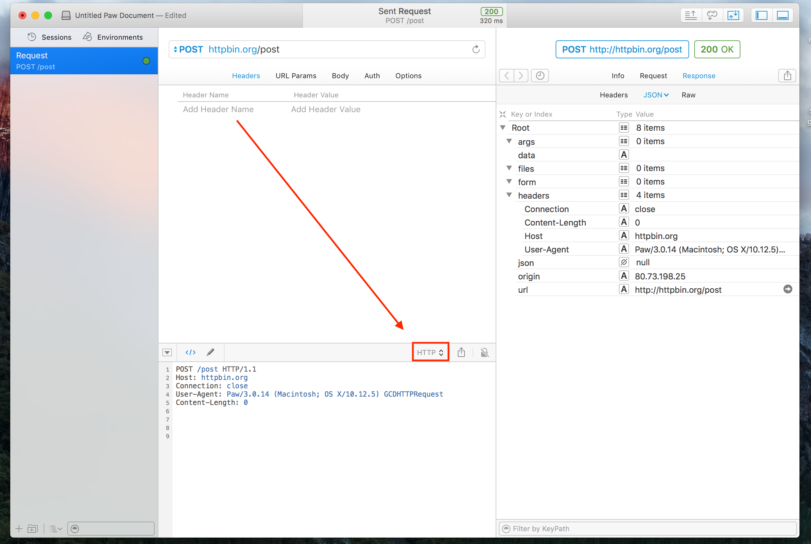
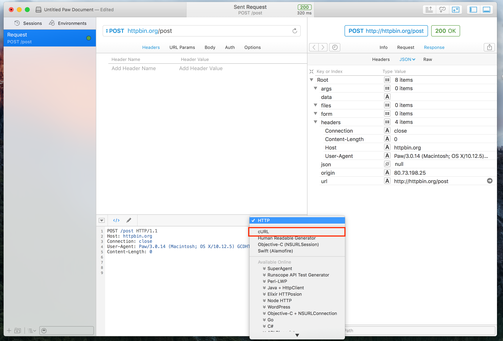
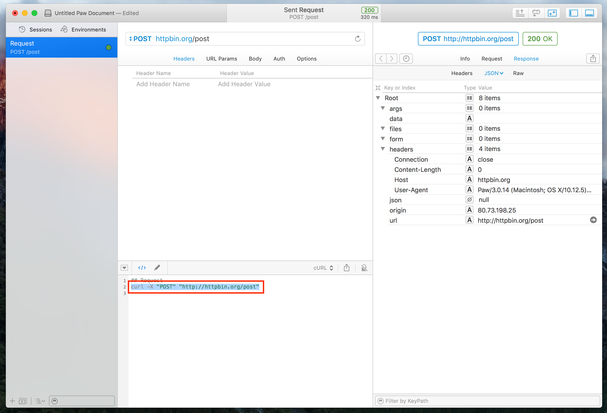

# cURL для самых маленьких

## Назначение

**cURL** - универсальный формат передачи запросов и ответов к серверу. Позволяет на любой платформе однозначно выполнить команду, понять проблему, а не перекидываться обвинениями.

## Установка

### Пользователям MacOS (программа предустановлена, переходите к следующему шагу)

### Пользователям Windows 10

1. Перейти на [этот сайт](http://www.paehl.com/open_source/?Welcome). 
2. Выбрать пункт меню слева - `CURL X.X.X`, где `X` - текущая версия программы
3. Выбрать вторую (2) ссылку с названием - `Download WITH SUPPORT SSL`
4. Файл появится в загрузках
5. Переместите файл `curl.exe` в папку `C:\Program Files (x86)`
6. Нажмите **Пуск**
7. Начните набирать **Изменение системных переменных**. В результатах поиска кликните по **Изменение системных переменных среды**
8. Внизу окна кликните по кнопке **Переменные среды...**. 
9. В системных переменных найдите переменную `Path`, выделите ее и нажмите **Изменить**. 
10. В поле **Значение переменной** допишите `;C:\Program Files (x86)\Curl\`
11. Нажмите `Ok`, `Ok`, `Ok`

### Пользователям Linux (Ubuntu, Debian)

- Откройте терминал и выполните эту команду

```shell
sudo apt-get install curl
```

- Введите пароль и дождитесь окончания установки.

## Работа с cURL из командной строки

После установки с помощью этой программы можно выполнять запросы в сеть. Для этого необходимо указывать специальные флаги. [Полный список](http://osxh.ru/terminal/command/curl) параметров команды на русском.

Наиболее частые, которые Вам могут понадобиться приведены ниже:

- Чтобы указать тип запроса (чаще всего GET или POST), добавьте к запросу `-X ТИП_ЗАПРОСА`. Например

```sh
curl -X GET "http://httpbin.org/get?a=2"
```

- Чтобы указать необходимые заголовки, добавьте к запросу `-H "НАЗВАНИЕ_ЗАГОЛОВКА"`. Например

```sh
curl -X GET "http://httpbin.org/get" -H "User-Agent:curl/1.0"
```

- Чтобы указать тело запроса, добавьте к запросу `-d`. Например

```sh
curl -X POST "http://httpbin.org/post" -d '{"program": "curl", "version": 1}' -H "Content-Type: application/json"
```

**Для пользователей Windows** необходимо экранировать кавычки через обратный слэш. Запрос будет выглядеть так

```sh
curl -X POST "http://httpbin.org/post" -d "{\"program\": \"curl\", \"version\": 1}" -H "Content-Type: application/json"
```

Если тело запроса оказывается **больше, чем пара параметров**, следует использовать следующий формат. Создать файл тела запроса (например, `request.json`). После чего в параметре данных указать `-d @request.json`. Символ собаки обязателен. Файл должен находиться в этой же папке, иначе укажите путь к файлу. В противном случае **cURL** отправит пустое тело запроса.

Данный подход позволяет избежать экранирования параметров, которое необходимо для пользователей Windows. Полный пример выглядит следующим образом

```sh
curl -X POST "http://httpbin.org/post" -H "Content-Type: application/json" -d @request.json
```

### Непонятные символы (неверная кодировка)

В случае если Вы пользуетесь **Windows**, и в ответе приходят непонятные символы, то Вам следует сменить кодировку (на **Unicode**) и выполнить запрос еще раз. Смена кодировки производится следующей командой

```sh
chcp 65001
```

## Работа с cURL из программ

### Postman

- Указать необходимые параметры для запроса.
- Нажать `Code`



- Выбрать в ниспадающем списке `cURL`



- Нажать `Copy to clipboard`



### Charles

1. Нажать правой кнопкой на запрос.
2. Выбрать `Copy cURL Request`



### Paw

- Выбрать список экспорта



- Выбрать `cURL`



- Скопировать все, кроме **первой** строки




## Ваш cURL готов - отдавайте его дальше