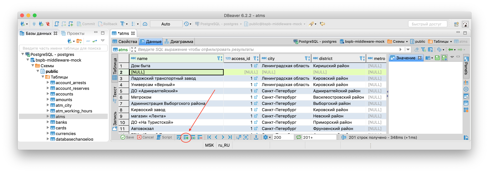

# DBeaver cheat sheet
**DBeaver** — это универсальный клиент для работы с различными системами управления базами данных. Для начала необходимо [скачать](https://dbeaver.io/download/) и [установить](https://dbeaver.com/docs/wiki/Installation/) DBeaver. Для работы программы на компьютере должна быть установлена [JRE](https://www.oracle.com/technetwork/java/javase/downloads/jre8-downloads-2133155.html) версии 1.8+.

### Содержание
* [Подключение к базе данных](#Подключение-к-базе-данных)
* [Подготовка к работе](#Подготовка-к-работе)
* [Базовые операции с данными](#Базовые-операции-с-данными)
* [Фильтр](#Фильтр)

Для тех, кто хочет копнуть глубже: [DBeaver user guide](https://dbeaver.com/docs/wiki/). 

## Подключение к базе данных
**Шаг 1**. Нажимаем `+`.

**Шаг 2**. Выбираем `PostgreSQL`, нажимаем `Далее >`.

**Шаг 3**. Настраиваем соединение с `PostgreSQL` согласно [документации](../services.md). 
Например, для базы `development` поля заполняются следующим образом:
* хост - `10.234.11.223`
* база - `postgres`
* пароль - `qwerty`

В этом же окне поставим галочку `Показать все базы данных`. Это делается для того, чтобы иметь доступ ко всем базам, доступным внутри компании. Если этого не сделать, в клиент добавится лишь пустая база с именем postgres.

**Шаг 4**. Открываем нужную базу данных и таблицу.
Как правило, при наличии нескольких баз для одного проекта, для разработки используется **база с суффиксом `-mock`**. В данном случае, база данных `sberbank-calculator` - исключение из правила. :)

## Подготовка к работе
Дальнейшее рассмотрение будем проводить на примере базы данных `bspb-middleware-mock` и таблицы `atms`.
На вкладке `Свойства` представлено описание полей таблицы.

Рядом находится вкладка `Данные`. В панели справа отображается значение выбранного поля. Отображение значения поля можно настроить: для этого необходимо нажать на кнопку в панели справа.

Наиболее наглядными являются типы `Text` и `JSON`. Также рекомендуем установить галочку напротив `Word Wrap` - это позволит вместить длинные значения полей в ширину боковой панели. 
`Администрация выборгского района` отображается как `Text`, а вот как выглядит `JSON`-отображение выбранного значения.

## Базовые операции с данными
Редактировать уже существующие данные можно тремя способами: 
1. Двойным нажатием на нужное поле;
2. В боковой панели справа;
3. Кнопкой `Редактировать ячейку` внизу через форму (этот вариант рассмотрим чуть позже).

Все несохранённые изменения отображаются следующим образом: подсветка изменённого поля, звёздочка возле названия таблицы, а также “активный” вид кнопок в нижней панели.

Сохранить внесённые изменения можно, нажав на кнопку `Save`. Соответственно, отменить изменения можно нажатием на соседнюю кнопку `Cancel`. **При этом данные обновляются на удалённой (remote) базе**, и кнопки в нижней панели принимают “неактивный” вид.

В **панели быстрых действий** внизу формы есть следующие кнопки:
1. Редактировать ячейку;
2. Добавить новую запись;
3. Копировать текущую запись;
4. Удалить текущую запись.

**Редактирование ячейки**, как уже говорилось, возможно производить тремя способами, и один из них - через форму, содержащую всю информацию о выбранном поле, в том числе и его значение, которое можно редактировать и при необходимости выставлять в NULL.

**Добавление новой записи** производится сразу после выбранной текущей. Для успешного сохранения новой записи необходимо *заполнить все обязательные поля*.

**Копирование текущей записи** производится также вставкой копии сразу после выбранной текущей записи. Для успешного сохранения новой (скопированной) записи необходимо *обеспечить уникальность полей*, на которых стоит соответствующее ограничение (чаще всего такими полями являются всевозможные идентификаторы).

И, наконец, **удалить текущую запись** можно, нажав на последнюю кнопку в панели быстрых действий.

## Фильтр
На каждом столбце помимо типа и названия поля присутствует значок фильтра со стрелками.

При *однократном нажатии на стрелку*, записи в таблице фильтруются по убыванию значений в выбранном поле. При *последующем нажатии* - по возрастанию, а если *нажать ещё раз* - данные принимают исходный вид.

При нажатии на сам *значок фильтра*, появится форма, содержащая перечень всевозможных значений данного поля. Для городов в нашей таблице список следующий.

Двойным нажатием выберем любое значение и получим отфильтрованную (по данному полю) таблицу.
Применяемые к данным таблицы фильтры можно увидеть в строке сверху.

Также фильтры можно очистить, нажав на соответствующую кнопку справа (и сохранить, если нужно - за это отвечает соседняя кнопка).

Нажатие на следующую в ряду кнопку вызовет окно `Настройки сортировки и фильтрации`, в котором отображаются все применяемые к таблице фильтры.

Здесь же можно вносить изменения в запрос. Фильтры сработают, как только изменения вступят в силу - после нажатия кнопки `ОК`.
