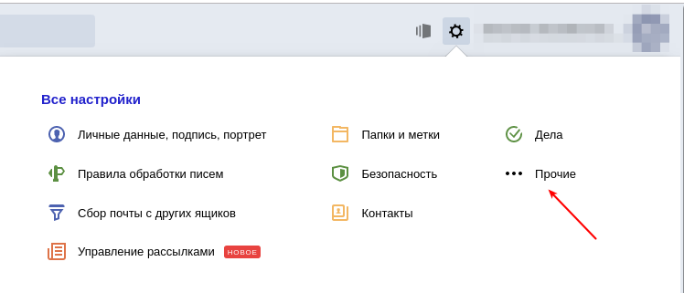
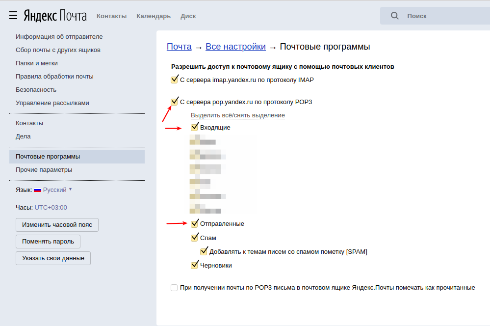
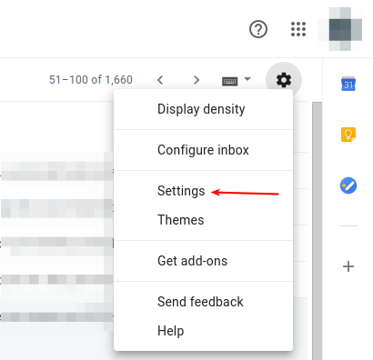
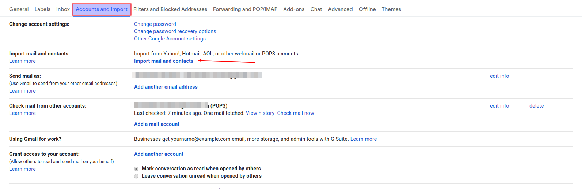
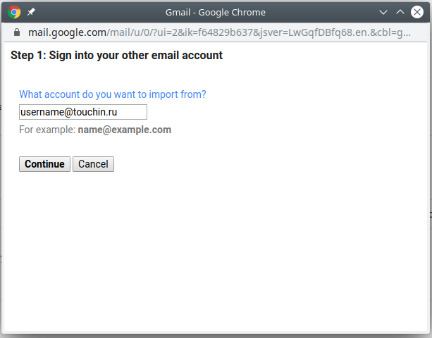
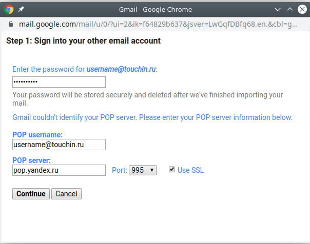

# Гайд по миграции писем из почты Яндекса в Google

Заходим в настройки Яндекс-почты:

В разделе `почтовые программы` включаем поддержку протокола pop3 и выбираем папки,
которые хотим получать по этому протоколу:

Заходим в настройки Gmail:

Переходим на вкладку `Accounts and Import` нажимаем ссылку `Import mail and contacts`

Вводим почтовый адрес:

Заполняем настройки как на картинке, почтовый аккаунт указываем свой

Нажимаем `Continue`

Перенос почты происходит не сразу и может занимать до 2х дней
