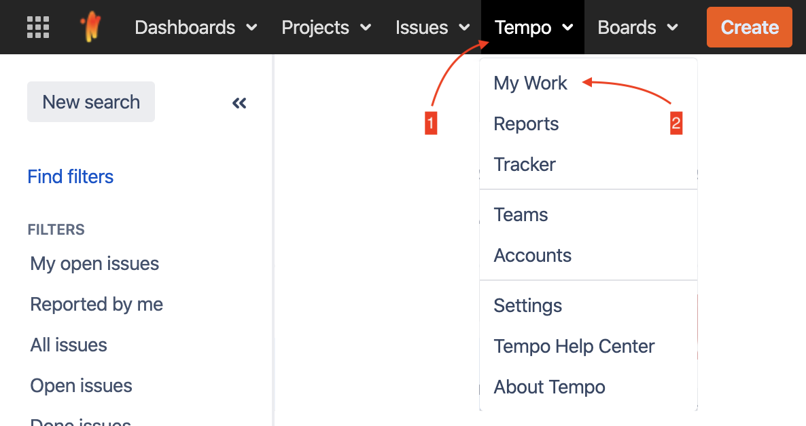
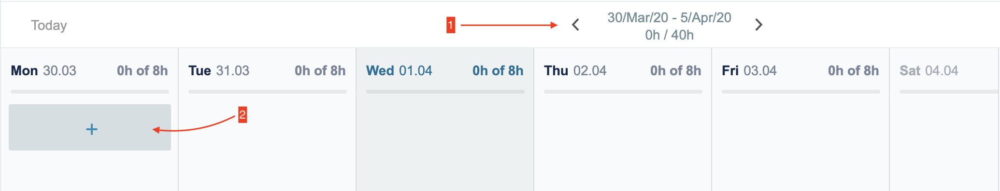
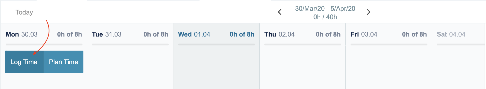
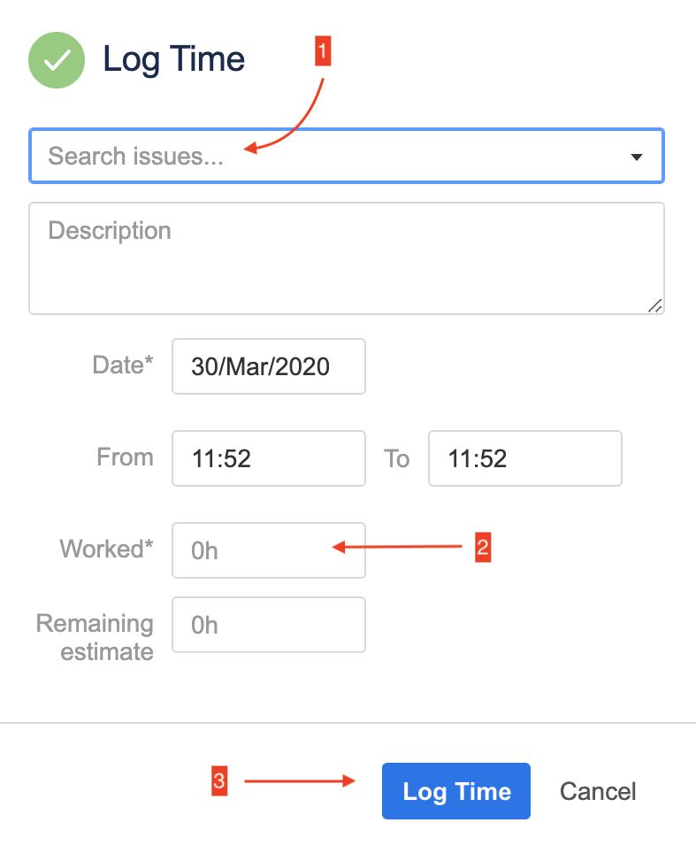
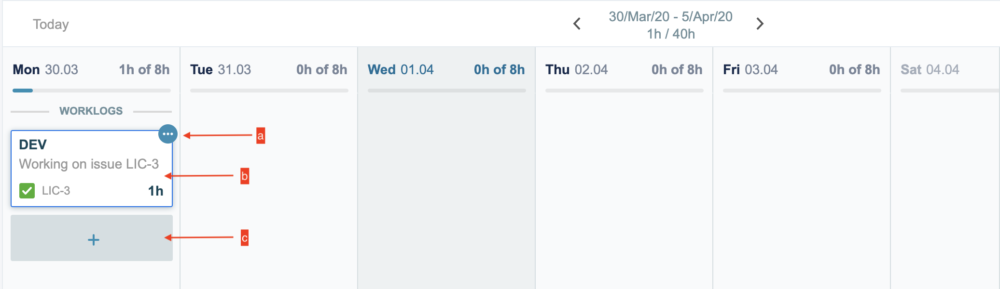

# Трекание времени в Jira

## Куда трекать

Трекание времени в jira должно осуществляться не на задачу, над которой вы работали, а на специально созданную таску в джире для учета времени. Она соответствует проекту в целом. В каждом проекте есть несколько служебных тасок: **DEV**, **QA**, **DESIGN**, **MANAGEMENT**. Пример:

- *ХХХ-Y - DEV*
- *ХХХ-Y - QA*

где **XXX** - наименование проекта в Jira, **Y** - индекс таски, присвоенный при создании (*чаще всего от 1 до 4*).

Если вы работаете на каком-то проекте, то все время надо трекать туда.

Также есть несколько служебных тасок в проекте Internal: 
* **HOLIDAY** (для государственных праздников) 
* **VACATION** (отпуска и отгулы)
* **ILLNESS** (больничные)
* **PRESALE** (оценки и предпродажи)
* **MARKETING** (конференции и статьи).

## Сколько трекать

По трудовому договору мы все работаем по 8 часов в день. Поэтому в среднем у вас должно выходить затрекано не меньше 8 часов в день. 

- Если полезной деятельности реально было меньше, то остальное можно потратить на самообразование (Internal EDUCATION), но за это время потом могут спросить, что же полезного вы изучили (не очень формально), либо не делать ничего (затрекать в Internal IDLE), но это вариант для ленивых.
- Так же можно, по необходимости, в какой-то день проработать и затрекать 6, а в другой, например, 10 (если менеджер проекта не против). Здесь желательно, чтобы за период "неделя" выходило в сумме 40. Другие варианты обговариваются с техническим директором.
- Если у вас потрачено реально больше, чем 8 часов в день, то есть 2 варианта: либо это ваше личное неуспевание в план, либо это существенное изменение скоупа задач и плана. Если менеджер проекта согласен, что это был второй вариант, то вы трекаете реально затраченное время. Если не согласен – то трекаете 8 часов в день (в среднем).

## Как трекать

1. Переходим на сайт и в верхней плашке нажимаем «Tempo». Затем в вывалившемся меню выбираем «My Work»:

  

2. На открывшейся странице выбираем необходимую неделю, по умолчанию - текущая. И наводим курсор на конкретный день недели:

3. Нажимаем на «Log Time»:

4. В появившемся окне вводим необходимые данные:
  - В первое поле - идентификатор [таски](#куда-трекать)
  - В поле Worked - количество отработанных [часов](#сколько-трекать)   
  Затем нажимаем «Log Time»:
  

5. Далее можно сделать следующее:  
  **a.** Удалить блок с временем: необходимо навести курсор на блок, нажать на многоточие и затем выбрать пункт «Delete».  
  **b.** Редактировать данные: нажимаем на нужный блок, появляется похожее окно как в 4 пункте, в котором меняем необходимые нам данные, и завершаем кнопкой «Update».  
  **c.** Добавить новый блок с временем: опять наводим на необходимый день недели, а затем - на блок с `+` и повторяем пункты 1 - 4.
  
  

## Лидам

В таску MANAGEMENT конкретного проекта время учитывать в случаях работ, связанных с этим проектом, таких, как: участие в митингах проекта, код-ревью, оценках, планировании.

В таску DEV (QA) конкретного проекта время учитывать в случае реализации задач по разработке (тестировании) этого проекта, в том числе фикса багов.

В случае внутренних работ, таких как: статический анализ, base library, исследовательских работ и т.д.:
- Создать самому задачу в проекте INTERNAL
- Добавить единый префикс отдела [QA] "Название задачи", [IOS] "Название задачи", [Ad] "Название задачи" 
- Обязательно заводить такую задачу при ее весе от 4 часов, либо повторяющемся действии
