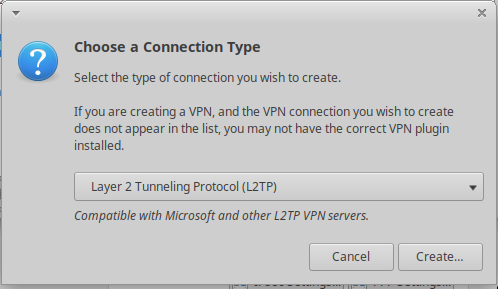
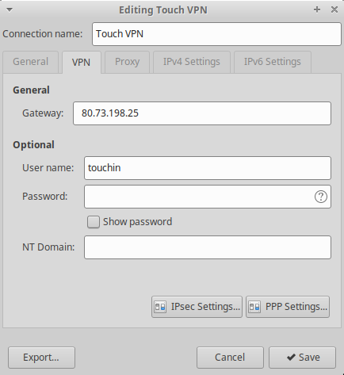
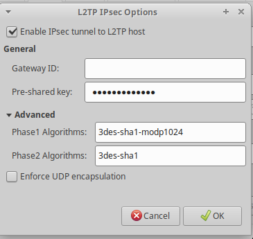
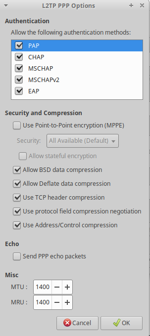

# Гайд по настройке VPN

#### Если вдруг вам нужен VPN в офис, то вот: [Инструкция](http://www.vpngate.net/en/howto_l2tp.aspx)

У каждого пользователя свой логин/пароль, который высылается на почту сотруднику при приеме на работу

```
server: 80.73.198.25
login: ***
password: ***
shared-secret: touchinstinct
```

### Настройка в linux

Добавляем поддержку L2TP в NetworkManager

``` bash
sudo add-apt-repository ppa:nm-l2tp/network-manager-l2tp  
sudo apt-get update  
sudo apt install network-manager-l2tp
sudo apt install network-manager-l2tp-gnome
```

Меняем x2ltpd на x2ltpd с libpcap:

``` bash
sudo apt remove xl2tpd  
sudo apt install libpcap0.8-dev

wget https://github.com/xelerance/xl2tpd/archive/v1.3.6/xl2tpd-1.3.6.tar.gz  
tar xvzf xl2tpd-1.3.6.tar.gz  
cd xl2tpd-1.3.6  
make  
sudo make install  
```

Перезапускаем NetworkManager

``` bash
/etc/init.d/network-manager restart
```
Устанавливаем `ike-scan` для определения алгоритмов шифрования

``` bash
sudo apt install ike-scan
ike-scan 80.73.198.25

# Starting ike-scan 1.9.4 with 1 hosts (http://www.nta-monitor.com/tools/ike-scan/)
# 80.73.198.25    Main Mode Handshake returned HDR=(CKY-R=c7b95c537d7094af) SA=(Enc=3DES Hash=SHA1 Auth=PSK Group=2:modp1024 LifeType=Seconds LifeDuration(4)=0x00007080) VID=afcad71368a1f1c96b8696fc77570100 (Dead Peer Detection v1.0)

# алгоритмы 1 фазы: 3des-sha1-modp1024
```

Отключаем `strongswan` если включен

``` bash
sudo systemctl stop strongswan
sudo systemctl disable strongswan
```









