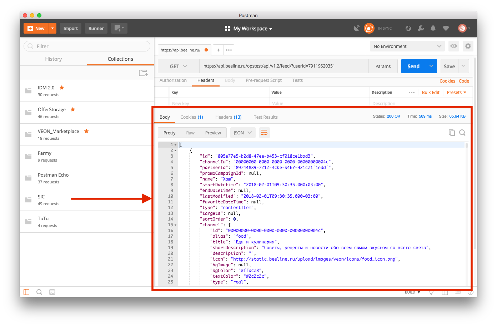

## Вступление
Postman – это мощный набор инструментов тестирования API. Позволяет полностью протестировать работу сервера, пока клиент еще не написан. Обладает синхронизацией коллекции запросов, рекомендуется использовать со своим аккаунтом.

Основные возможности:
* отправка запросов;
* создание коллекции запросов;
* Enviroments - набор переменных, которые можно использовать в запросах;
* Скрипты на js, которые используются для:
  * скрипты выполняющиеся перед запросом - например, для добавления текущего времени к запросу или добавления рандомной строки/числа в какую-либо из переменных запроса;
  * тестов - например, для автоматической проверки типов данных переменных в ответе или кода ответа;
  * сохранения переменной из ответа в Enviroments - например, для автоматического сохранения полученного токена в Enviroments, для дальнейшего использования в других запросах.

## Отправка запросов

1. Выбрать требуемый тип запроса.


2. Ввести URL.


3. Тап на Send. В нижней части окна появится ответ на запрос.


### Параметры, хэдеры, тело запроса

#### Параметры
Параметры запроса можно указать тапнув по кнопке Params - откроется блок ввода параметров. Также, параметры указанные в URL автоматически отобразятся в этом блоке.


#### Хэдеры
Хэдеры перечисляются также как и параметры запроса, во вкладке Headers.

#### Тело запроса или как отправить json в POST запросе?
Чтобы отправить json:
1. Открываем вкладку Body запроса;
2. Выбираем raw;
3. В выпадающем списке выбираем JSON;
4. Вводим в поле требуемый json и жмем SEND.


## Коллекции запросов
### Создание коллекции запросов
1. Тап на New;
2. Выбираем Collection;
3. Вводим название коллекции;
4. Также можно добавить правила авторизации, скрипты и переменные, которые будут использоваться для всех запросов в коллекции;
5. Сохраняем необходимые запросы в эту коллекцию.

### Запуск всей коллекции на выполнение
Postman позволяет автоматически выполнить все запросы коллекции, с выполнением всех скриптов/тестов у этих запросов.

Для этого:


1. Жмем на стрелку для открытия всей инфы о коллекции;
2. Жмем Run;
3. В открывшемся окне указываем необходимые параметры, такие как кол-во итераций, задержку между запросами и т.д.;
4. Жмем Run.
В результатах отображается инфа по выполнению всех запросов, успешное/неуспешное прохождение тестов и т.д. 

## Enviroments
Enviroments - коллекции переменных, которые хранятся в парах "ключ-значение".

Примеры использования:
1. URL сервера. Удобно задавать его переменной, так как в случае смены урлы - потребуется всего лишь изменить значение переменной, а не замену урлы в каждом запросе;
2. Данные для логина - можно сделать несколько разных enviroments с разными аккаунтами. Для переключения между аккаунтами потребуется только смена текущего Enviroment'a;
3. Токены - удобно хранить различные токены в Enviroments. Ниже будет рассмотрено автоматическое добавление токена в Enviroments, при получении ответа на запрос.

### Интерфейс Enviroments 


1. Отображение активного Enviroment'a и выпадающий список доступных Enviroments;
2. Отображение всех переменных активного Enviroment'a;
3. Кнопка Manage enviroments, открывающая меню управления.

### Создание Enviroment'a 
1. Тап на Manage enviroments;
2. Тап на Add;
3. Вводим название Enviroment'a и пары ключ-значение;
4. Тап на Add для сохранения Enviroment'a.

### Использование переменных из Enviroment'a в запросах
Для использования добавленных переменных из Enviroment'a в запросах, требуется:
1. Выбрать требуемый Enviroment в качестве активного;
2. Сослаться на нужную переменную в запросе, добавляя в любое место в запросе название переменной, заключенной в двойные фигурные скобки.

Пример:

В качестве переменной сохранен URL адрес сервера - baseUrl : https://touchin.ru/

Чтобы выполнить запрос по адресу https://touchin.ru/portfolio/ , URL запроса запишем в виде {{baseUrl}}/portfolio/ 

Ссылка на переменную может быть в любом поле запроса - в URL, хэдерах, поле авторизации, body запроса.


Если название переменной в запросе оранжевого цвета - она есть в активном enviroment'e, если красного - отсутствует в активном enviroment'e.

### Глобальные переменные
В Postman'e можно создать глобальные переменные, не привязанные к какому-либо из Enviroment'ов. Например, это может быть удобно, когда мы используем Enviroment'ы под различные данные аккаунтов, а адрес сервера заносим в глобальные переменные, чтобы не дублировать его в каждом из Enviroment'ов.

Для создания глобальных переменных:
1. Тап на Manage enviroments;
2. Тап на Globals;
3. Добавляем глобальные переменные и жмем Save.

## Скрипты 
Скрипты пишутся на JavaScript и делятся на 2 типа:
1. Выполняющиеся перед отправкой запроса - Pre-requested Script;
2. Выполняющиеся после получения ответа - Tests.

### Pre-requested Script
Для добавления скрипта, пишем его в поле Pre-requested Script запроса.
Например, для того чтобы в параметрах запроса отправить текущую дату, можно сделать так:
1. В параметрах запроса добавляем переменную {{timestamp}};
2. В поле Pre-requested Script пишем скрипт:
```
pm.environment.set("timestamp", new Date());
```
Суть скрипта - перед отправкой запроса создается переменная с именем timestamp в активном Enviroment'e и в нее записывается результат функции new Date().

### Tests
Для добавления скрипта, пишем его в поле Tests запроса.
Например, добавим к запросу 2 скрипта:
1. Первый скрипт - проверяем что ответ вернулся со статусом 200;
2. Второй скрипт - проверяем что ответ вернулся менее чем за 200мс.
```
pm.test("response is ok", function () {
    pm.response.to.have.status(200);
});

pm.test("Response time is less than 200ms", function () {
    pm.expect(pm.response.responseTime).to.be.below(200);
});
```
У ответа есть вкладка Test results, в которой отображается вся информация о проведенных тестах:


Другие примеры тестов можно посмотреть на сайте [Postman](https://www.getpostman.com/docs/v6/postman/scripts/test_examples) или нагуглить. 

### Сохранение переменной из ответа в Enviroments
По сути это тоже самое, что и предыдущий пункт, но суть использования несколько иная. Скрипты для сохранения переменных из ответа так же пишутся в поле Tests.

Например, на запрос логина, сервер нам присылает токен, который нам нужно использовать в других запросах.

Ответ сервера:
```
{
    "access_token": "c16bd115-2060-47e8-bc83-c2abbc17322c",
    "expires_in": 18000,
}
```
Для того, чтобы сохранить значение access_token в Enviroments, нужно выполнить следующий тест:
```
var data = JSON.parse(responseBody);
postman.setEnvironmentVariable("token", data.access_token);
```
Скрипт парсит ответ сервера, ищет в нем access_token и записывает его в переменную token в Enviroments.
