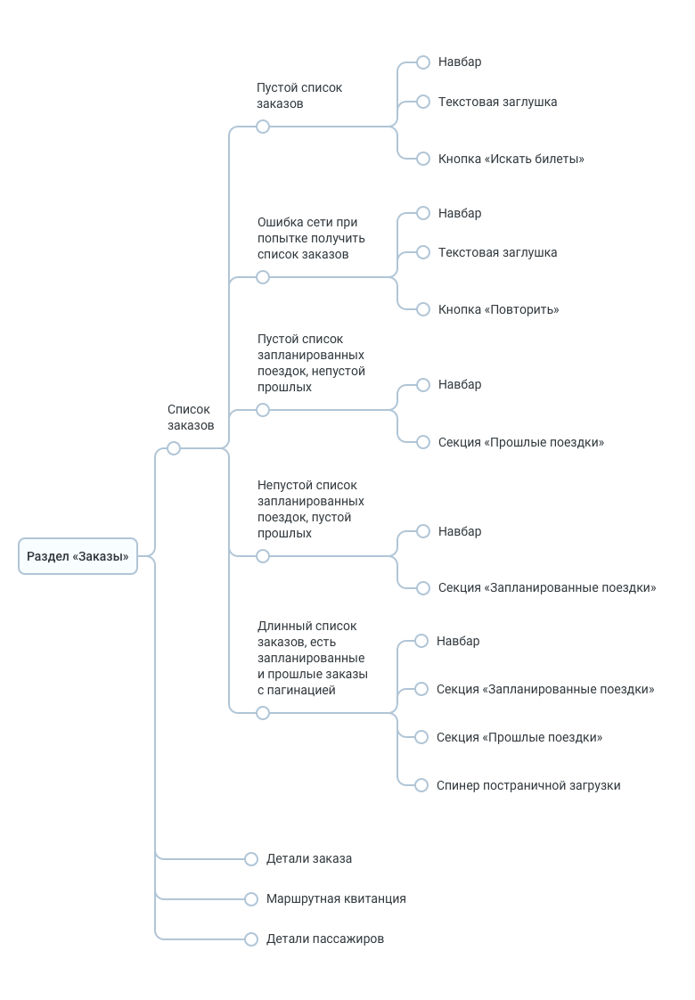
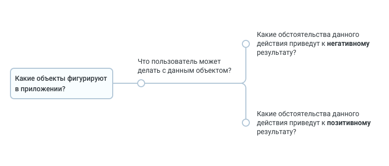
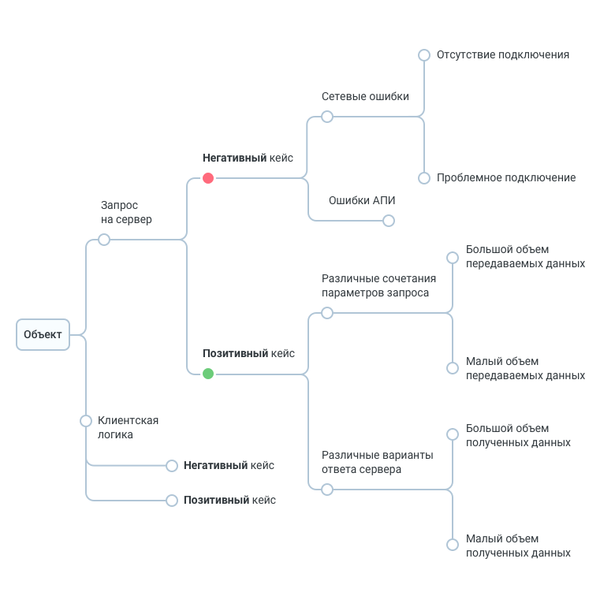
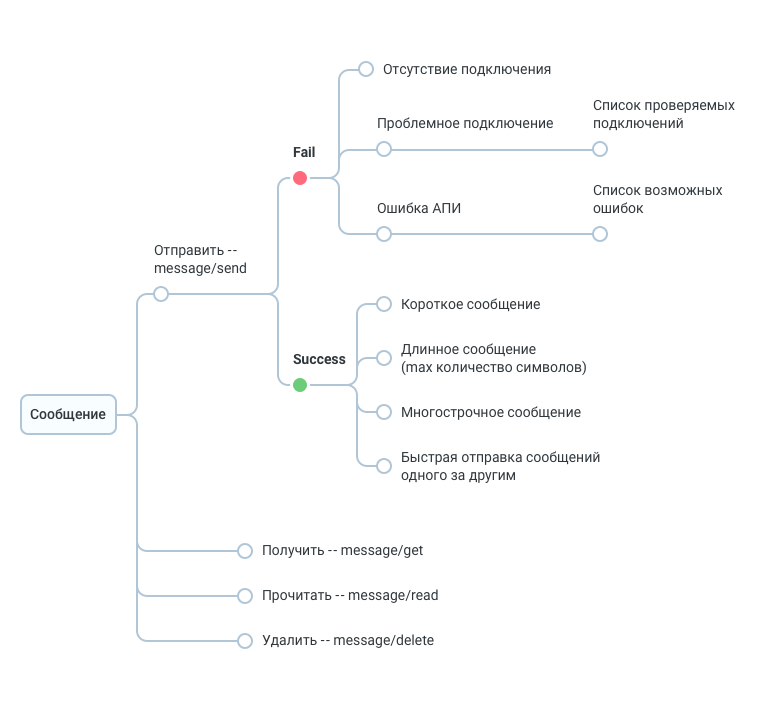
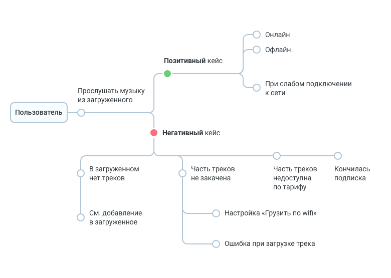

# Формат чек листов

1. Вся тестовая документация представляет собой дерево, узлами которого являются Folders и Issues типа Test.
2. Issues могут содержаться на всех уровнях дерева. Все предки Issue должны быть Folders.
3. Folders не могут находиться на последнем уровне дерева. Все предки Foulders должны быть Folders.
4. Issue может содержать таблицу Test Details.

    a. Test Data заполнять НЕ нужно – все, что сюда можно было бы написать, будет содержаться в дереве.

    b. Не должно быть ситуации, в которой в одной строке таблицы заполнен только Expected Result или только Test Step.

5. Каждому Issue следует выставлять актуальный приоритет.
6. При проектировании тестовой документации рекомендуется придерживаться следующих паттернов:

    a. декомпозиция по экранам приложения

    b. декомпозиция по объекту/действию
    
    c. декомпозиция по use-кейсам
    
7. Выбор паттерна следует производить для каждой конкретной фичи, не обязательно описывать все приложение по одному паттерну.
8. Расположение кейсов внутри одного уровня дерева должно соответствовать удобному порядку прохождения этих кейсов тестировщиком. Стоит понимать, что:

    a. информация о требованиях должна последовательно поступать тестировщику, прогоняющему чек-лист
    
    b. чаще всего негативные сценарии короче и являются тупиковыми, поэтому их стоит располагать раньше позитивных сценариев

## Экраны приложения

1. Декомпозиция по экранам приложения – источником знаний является навсхема. 
2. Первый уровень дерева составляет список кейсов навсхемы, который обычно соответствует разделам приложения. 
3. Второй уровень дерева – список экранов каждого раздела.
4. Третий уровень дерева – к каждому экрану подвешиваем список его состояний. 
5. В каждом узле дерева, начиная с третьего уровня, может содержаться чек-лист в табличном формате, описывающий каждый элемент дизайна и способы взаимодействия с ним. 

    a. Если элементы дизайна сложные и имеют много состояний или на экране есть повторяющиеся элементы, можно декомпозировать еще глубже. 

6. Содержимое тикета Test:
  
    a. В summery кратко описано состояние экрана.
    
    b. В description при необходимости указано подробное описание состояния (ожидаемого результата), а также ссылки на макеты для всех платформ. Обязательно прикладывать макеты ссылками, чтобы при внесении правок в макеты приходилось меньше правок вносить в чек-листы.
    
    c. Если данный кейс характерен для конкретной платформы и является исключительным, необходимо отметить платформу в Details.
    
    d. Чек-лист на проверку состояния экрана следует поместить в секцию Test Details.
#### Критерии для выбора такого паттерна:
   - UI является приоритетным для заказчика
   - минимум бизнес-логики на клиенте
   - для приложения характерны кастомные элементы дизайна и анимации, сложные жесты
   - на проекте нет других задокументированных требований кроме навсхемы
#### Пример

## Объекты/действия
1. Декомпозиция по объектам/действиям – источником знаний является документация АПИ и требования к клиентской бизнес-логике. 
2. Негативные и позитивные кейсы разбиваем по разным веткам. 
3. Желательно, чтобы элементы одного уровня дерева отвечали на один вопрос, но можно оставить это ограничение только для одного уровня иерархии.
4. Каждый следующий уровень дерева уточняет предыдущий.
    
    a. Данную схему можно использовать как карту для исследовательского тестирования и для смоук-теста. Степень подробности тестирования можно регулировать, отсекая при прогоне уровни дерева, поскольку каждый следующий уровень уточняет предыдущий. При углублении в ветвь дерева — углубляешься в функциональность.
    
  

    
5. Содержимое тикета Test:
    
    a. В summery кратко описано проверяемое конечное условие.
    
    b. Description ожидаемый результат кейса (ветки).
    
    c. Если данный кейс характерен для конкретной платформы и является исключительным, необходимо отметить платформу в Details.
    
    d. Секцию Test Details оставляем пустой.
#### Критерии выбора такого паттерна:
   - цель — протестировать функциональность
   - сложная бизнес-логика
   - частые правки дизайна
   - стратегия тестирования на проекте подразумевает сочетание скриптового и исследовательского тестирования
#### Пример
 
 

## На базе Use cases
1. Декомпозиция по use-кейсам:
    
    a. какие действующие лица могут участвовать в процессе работы с приложением – первый уровень дерева
    
    b. какие цели они могут перед собой ставить – второй уровень дерева. 
2. Третий и далее уровни – декомпозиция входных условий, которые могут повлиять на отработку сценария по достижению текущей цели. 
    
    a. Их так же стоит делить на позитивные и негативные. 
3. Далее к каждому листу подвешиваем сценарный чек-лист на проверку функциональности, отвечающей за достижение цели.

4. Содержимое тикета Test:
    
    a. В summery кратко описано проверяемое конечное условие.
    
    b. Description оставляем пустым.
    
    c. Если данный кейс характерен для конкретной платформы и является исключительным, необходимо отметить платформу в Details.
    
    d. Чек-лист на проверку текущего сценария нужно поместить в секцию Test Details.
#### Критерии выбора такого паттерна:
   - для заказчика приоритетом является корректная работа определенных пользовательских сценариев
   - приложение содержит экраны, на которых пользователь проведет много времени, потребляя контент
   - приложение содержит фичи, заключающиеся в отработке линейного сценария
   - стратегия тестирования на проекте подразумевает скриптовое тестирование   
   - простая бизнес-логика, легко покрываемая use-кейсами
#### Пример

